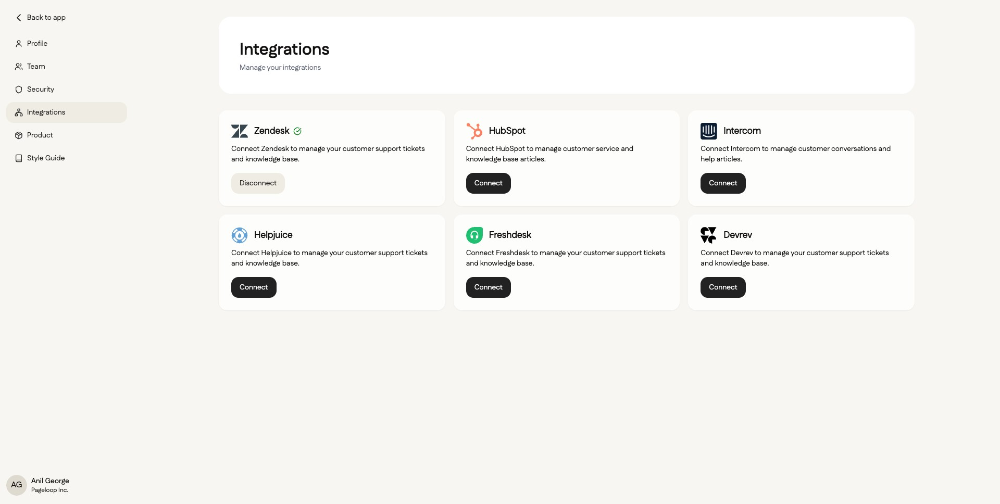

Connecting your Zendesk help center allows Pageloop to read your knowledge base articles, scan them for inconsistencies, and suggest updates. This guide walks you through the steps to set up the integration.

asdasd

asdasd

<Callout type="warning">
  **Note:** To connect Zendesk, you must have administrative permissions (OAuth access) for your Zendesk instance.
</Callout>

# Connecting Your Zendesk Account

You can connect your Zendesk account either from the initial Setup Checklist or from the Integrations page in your settings

## From the Setup Checklist

<Callout type="info">
  If you are setting up your Pageloop account for the first time, you can connect Zendesk directly from the dashboard.
</Callout>

1. On the main dashboard, locate the **Setup Checklist** and click **Connect Knowledge Base**, or select **Zendesk** from the list of help centers.

2. A **Connect Zendesk** window will appear. Enter your organization's Zendesk subdomain in the text field. The subdomain is the unique part of your Zendesk URL (for example, `your-company` from `your-company.zendesk.com`).

3. Click **Connect**. You will be redirected to Zendesk to log in and authorize Pageloop to access your account.

4. After granting access, you will be returned to the Pageloop dashboard. The **Connect Knowledge Base** step will be marked as complete, confirming a successful connection.

## From the Integrations Page

If you have already completed the initial setup or need to connect later, you can do so from your settings.

1. Navigate to **Settings** and then select **Integrations** from the side menu.

2. Find Zendesk in the list of available integrations and click **Connect**.

3. Follow the prompts to enter your Zendesk subdomain and authorize the connection, as described in the steps above.

# Verifying and Managing the Integration

You can verify that Zendesk is connected or disconnect it at any time from the Integrations page.

1. Navigate to **Settings** > **Integrations**.

2. A green checkmark next to Zendesk indicates that the integration is active. From here, you can click **Disconnect** to remove the integration.

   <Frame>
     
   </Frame>

|       |               |   |
| ----- | ------------- | - |
| Hello | How           |   |
| Check | How are you C |   |
|       |               |   |

# Read-Only Access

Pageloop only requests read-only access to your Zendesk account. This permission allows us to analyze your existing articles for outdated content but does not permit us to make any changes without your approval through the Pageloop platform.

<Callout type="info">
  # Callout
</Callout>

<Callout type="info">
  asdasdasd
</Callout>

```
title: job?.title || 'New Article',
```

### Hello

Paragraph

The document states that the 'Connect Knowledge Base' step is marked as complete after a successful connection. However, the release notes clarify that the entire setup checklist is removed from the dashboard upon completion.

The document states that the 'Connect Knowledge Base' step is marked as complete after a successful connection. However, the release notes clarify that the entire setup checklist is removed from the dashboard upon completion.

- asdasdaasda

- adsadsasd

---

Start now

### Hello

How are you doing

Check this

<Frame>
  
</Frame>
