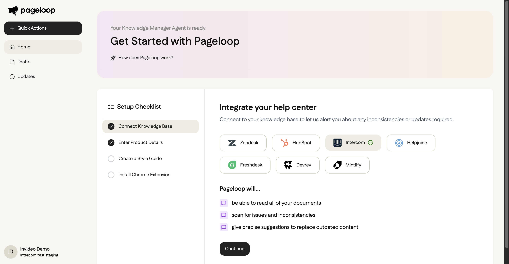
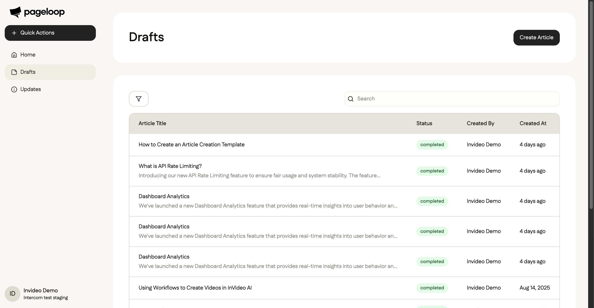
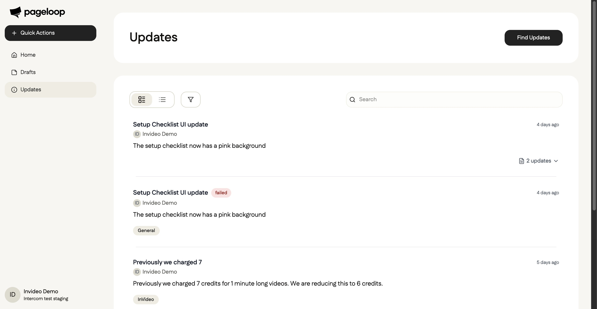

# Navigating the Pageloop Dashboard

Welcome to Pageloop! Our platform helps you keep your documentation up-to-date and create new articles effortlessly using AI. This guide will walk you through the main sections of the Pageloop dashboard to help you get started. Dinakarasdasdsad

## The Home page shows an Overview of your workspace. You see two panels:- Drafts: the number of drafts and a link to View all drafts.- Updates: articles that may need changes and a link to View all updates.Use the left sidebar to navigate between Home, Drafts, and Updates.

<Frame>
  
</Frame>

## Drafts

You can access your articles by clicking on **Drafts** in the navigation menu on the left.

The Drafts page displays a list of all your articles, along with their status, creator, and creation date. From here, you can manage existing content or start a new article by clicking the **Create Article** button. Use the search bar and filters to find and manage articles.

<Frame>
  
</Frame>

## Updates

Click on **Updates** in the sidebar to view recent changes and potential inconsistencies detected in your documentation.

This section helps you track all modifications, ensuring your knowledge base remains accurate. You can use the search and filter options to find specific updates quickly.

<Frame>
  
</Frame>

## Profile and Settings

To access your account settings, click on your profile information at the bottom of the left sidebar.

A menu will appear providing options for **Help**, **Settings**, and **Logout**.

<Callout type="info">
  Callout
</Callout>

**Could not display content**

|                  |             |                                                                                                                      |                                                                                                                                                                                                                                                                                                                      |
| ---------------- | ----------- | -------------------------------------------------------------------------------------------------------------------- | -------------------------------------------------------------------------------------------------------------------------------------------------------------------------------------------------------------------------------------------------------------------------------------------------------------------- |
| Type             | Tag         | Classes                                                                                                              | Sample HTML Snippet                                                                                                                                                                                                                                                                                                  |
| **Callout**      | div         | embercom-prosemirror-composer-callout                                                                                | `<div class="embercom-prosemirror-composer-callout" data-insertable="true" style="background-color: #e8e8e880; border-color: #73737633;"><p class="intercom-interblocks-align-left">He</p></div>`                                                                                                                    |
| **Button (CTA)** | div/a       | embercom-prosemirror-composer-block-container, embercom-prosemirror-composer-button, intercom-interblocks-align-left | `<div class="embercom-prosemirror-composer-block-container embercom-prosemirror-composer-button intercom-interblocks-align-left" data-link-url="https://asdasd" contenteditable="false"><a class="intercom-h2b-button" style="border-color: transparent; background-color: ; border-style: solid;">asdasd</a></div>` |
| **Collapsible**  | details/div | embercom-prosemirror-composer-collapsible-section-content                                                            | `<details open="true"><summary><h2 class="intercom-interblocks-align-left">Paragraph</h2></summary><div class="embercom-prosemirror-composer-collapsible-section-content"><p>...</p></div></details>`                                                                                                                |

```
title: job?.title || 'New Article',
```

### Check this

Paragraph

The document states that the 'Connect Knowledge Base' step is marked as complete after a successful connection. However, the release notes clarify that the entire setup checklist is removed from the dashboard upon completion.

The document states that the 'Connect Knowledge Base' step is marked as complete after a successful connection. However, the release notes clarify that the entire setup checklist is removed from the dashboard upon completion.

- asdasdaasda

- adsadsasd

---
