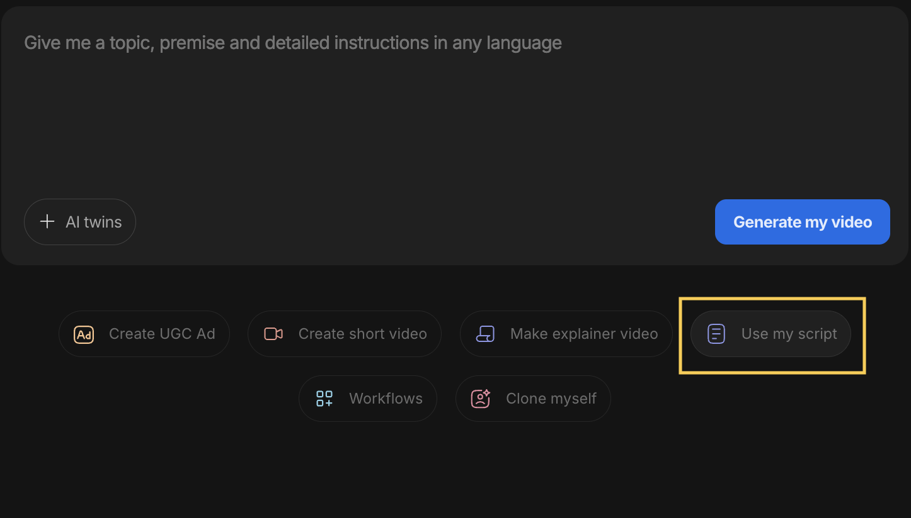
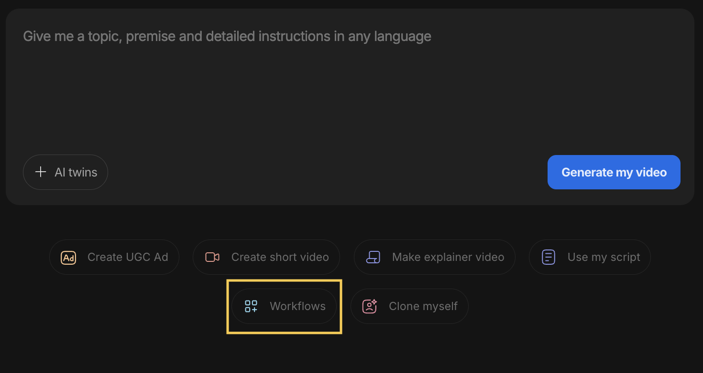
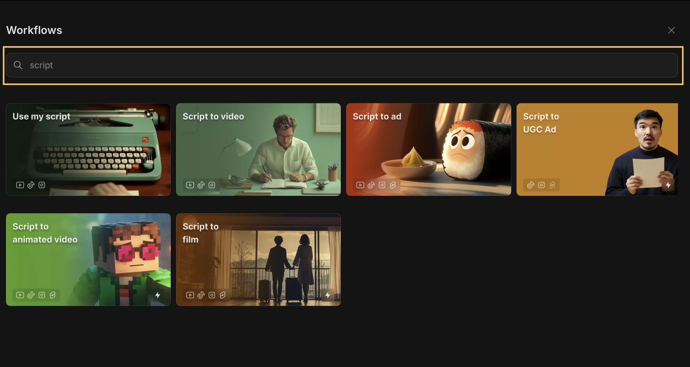
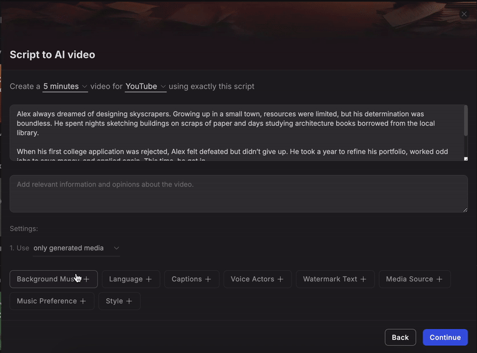
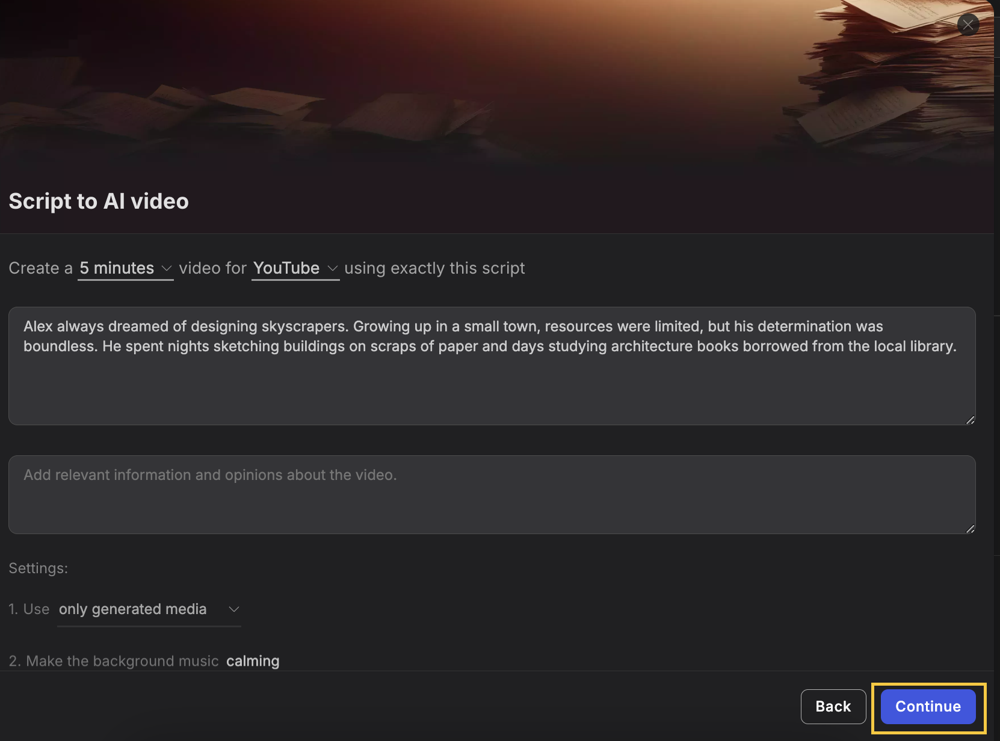
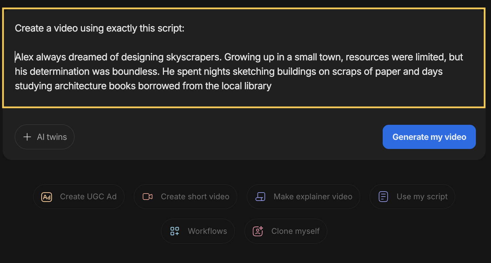
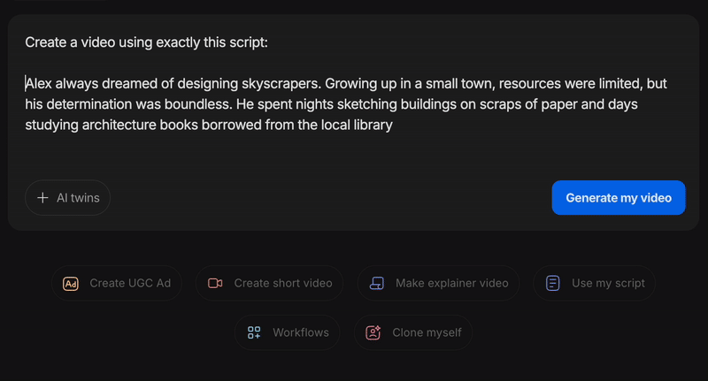

You can use the script to video flow to create a video using your exact script.

**Step 1:&#x20;**&#x43;lick on the **'**&#x55;se my scrip&#x74;**'&#x20;**&#x6F;r 'Workflow&#x73;**'&#x20;**&#x6F;ption.

<Frame>
  
</Frame>

<Frame>
  
</Frame>

**Step 2:&#x20;**&#x54;ype 'script' into the search bar to view all available workflows.

<Frame>
  
</Frame>

**Available script workflow options include:**

- Use my script

- Script to video

- Script to Ad

- Script to UGC Ad

- Script to animated video

- Script to film

**Step 3:&#x20;**&#x53;pecify preferences for media type, background music, subtitle style, language, and other details to include in your video.

<Frame>
  
</Frame>

**Step 4:** Click on 'Continue' to finalise your prompt.

<Frame>
  
</Frame>

## **💡** You can also add this line:

**Create a video using exactly this script** to any prompt, then add your script, and invideo AI will generate a video based on the same script.

<Frame>
  
</Frame>

**Step 5:** Verify your prompt and edit it if required, then click on 'Generate my video'.

<Frame>
  
</Frame>

You can preview, edit, and download your video once it is generated!

​
