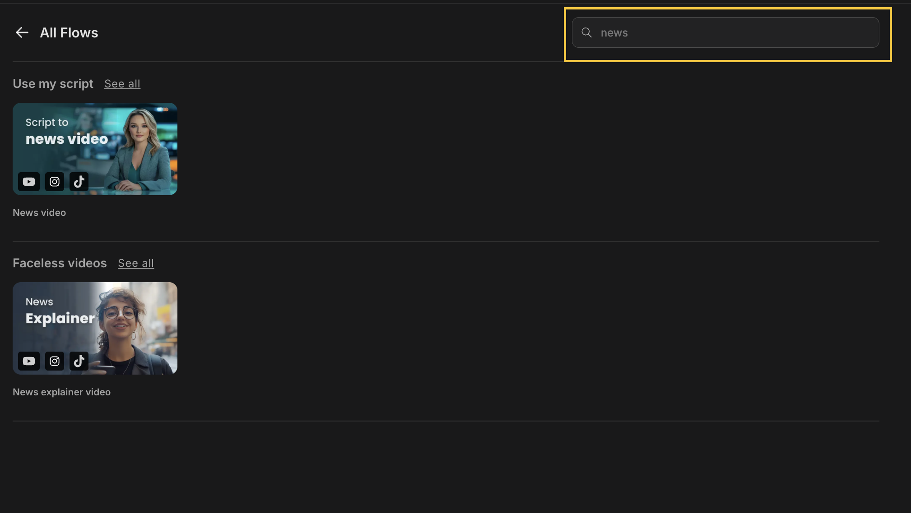
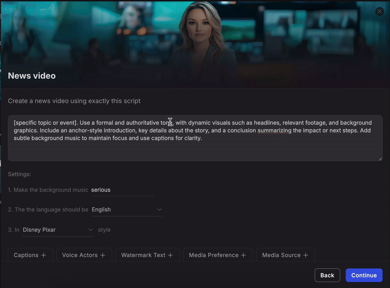
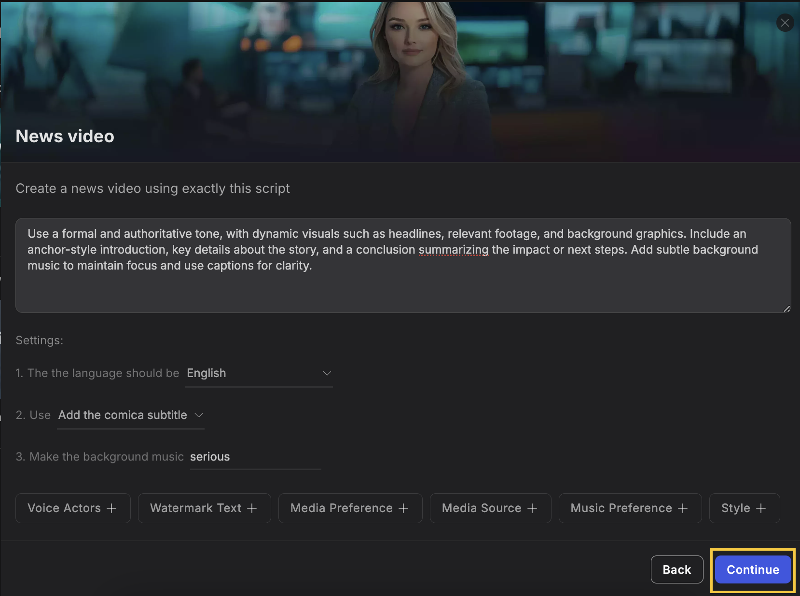
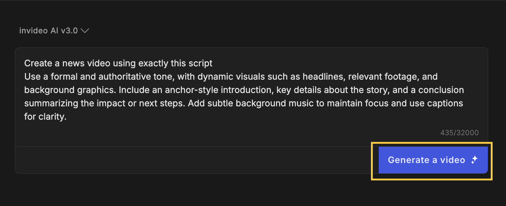

You can use the **news** **video** flow to create a video using a URL to pull script and some content from another website and generate a video on invideo AI as shown in the video below:

**1)&#x20;**&#x43;lick on **workflows**

<Frame>
  
</Frame>

**2)&#x20;**&#x53;earch for '**News**' to explore various flow options available:

<Frame>
  
</Frame>

**3)** Write a short description of the video and what you would like it to be on - the duration can be selected and the type as well.

Give your video a bit of creative direction, such as **media type, background music, subtitle style, language, and other details&#x20;**&#x79;ou'd like to include in your video.

<Frame>
  
</Frame>

Click on **Continue** to finalize your prompt.

<Frame>
  
</Frame>

**4)** Verify your prompt and edit it if required, then click on the **generate a video** option to generate your video.

<Frame>
  
</Frame>

You can preview, edit, and download your video once it is generated!
