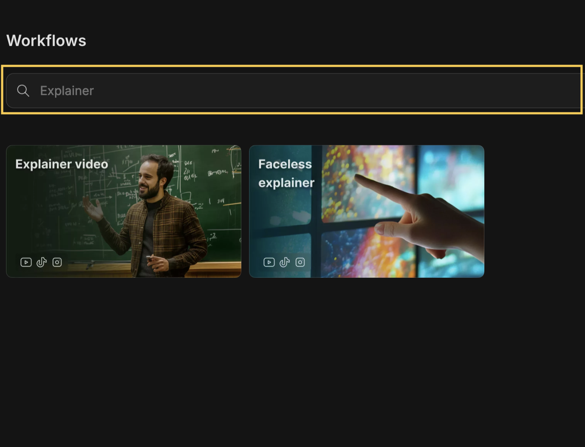
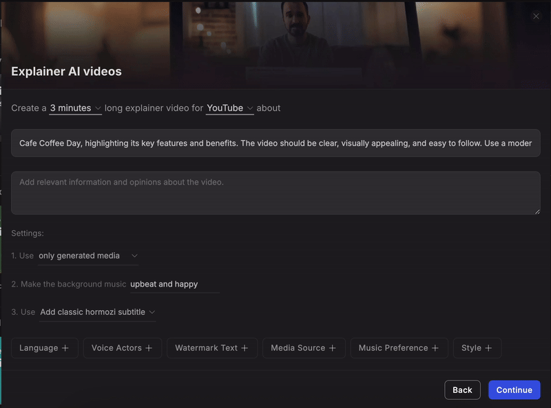
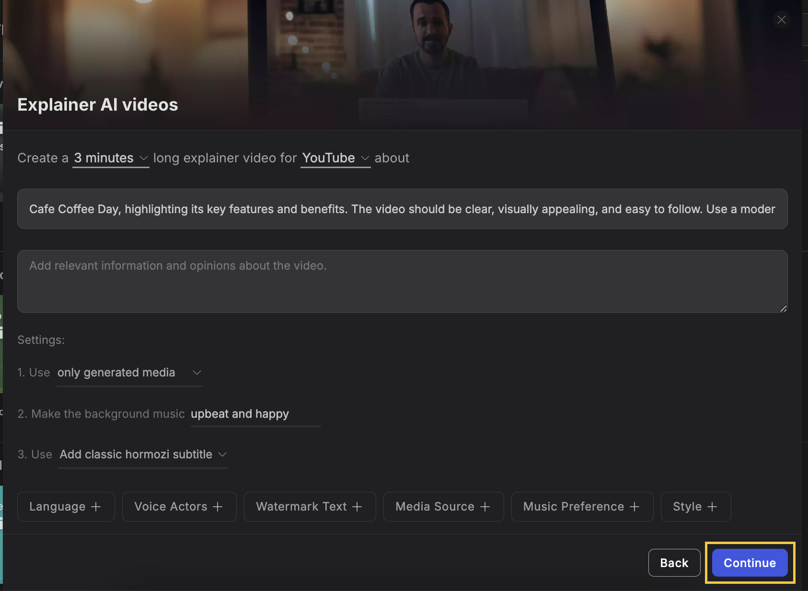
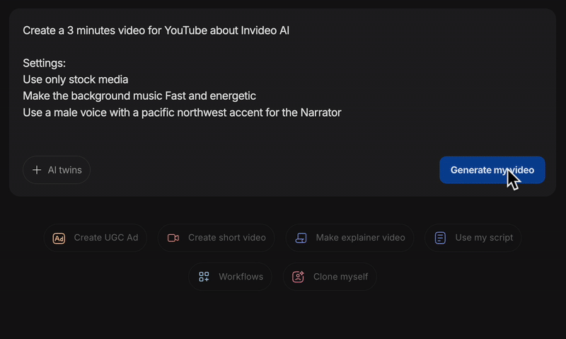

**1)&#x20;**&#x43;lick on workflows

<Frame>
  
</Frame>

**2)&#x20;**&#x53;earch for 'Explainer' to explore various flow options available:

<Frame>
  
</Frame>

**3)** Write a short description of the video and what you would like it to be on - the duration can be selected, and the type as well.

Give your video a bit of creative direction, such as **media type, background music, subtitle style, language, and other details&#x20;**&#x79;ou'd like to include in your video.

<Frame>
  
</Frame>

Click on 'Continue' to finalise your prompt.

<Frame>
  
</Frame>

**4)** Verify your prompt and edit it if required, then click on the 'Generate my video'.

<Frame>
  
</Frame>

You can preview, edit, and download your video once it is generated!

​
