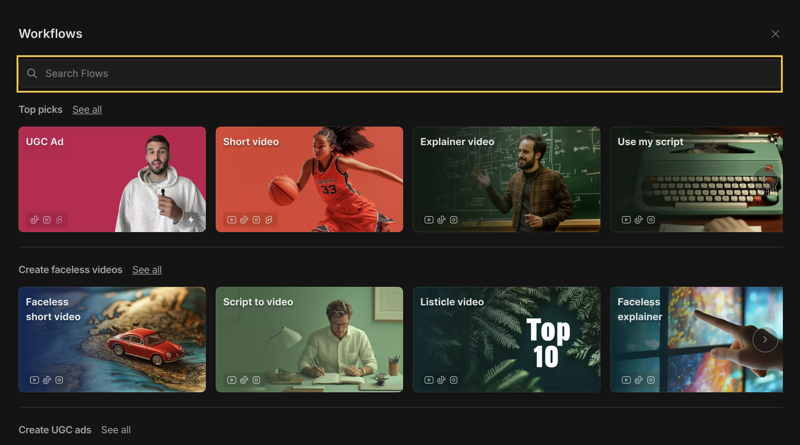

From the prompt page, click o&#x6E;**&#x20;'workflows'.&#x20;**&#x54;his will show you all the flows available. There are 66 flows to help you get started!

<Frame>
  
</Frame>

Use the search box in the top right corner to find a specific flow. Just type in a keyword or flow name, and it’ll pop up if it’s available.

<Frame>
  
</Frame>

Discover all the amazing videos you can create with invideo here: **[https://invideo.io/ai-videos/](https://invideo.io/ai-videos/)**

## **👇 You can also check the articles below to see the different visual styles we support:**

- [Anime Style](https://help-ai.invideo.io/en/articles/9978831-what-is-anime-and-how-can-i-create-a-video-using-anime-styles)

- [Cinematic Style](https://help-ai.invideo.io/en/articles/9979278-what-is-cinematic-style-and-how-can-i-create-a-video-using-it)

- [Animation Style](https://help-ai.invideo.io/en/articles/9978685-how-can-i-create-a-video-using-animation-styles)
