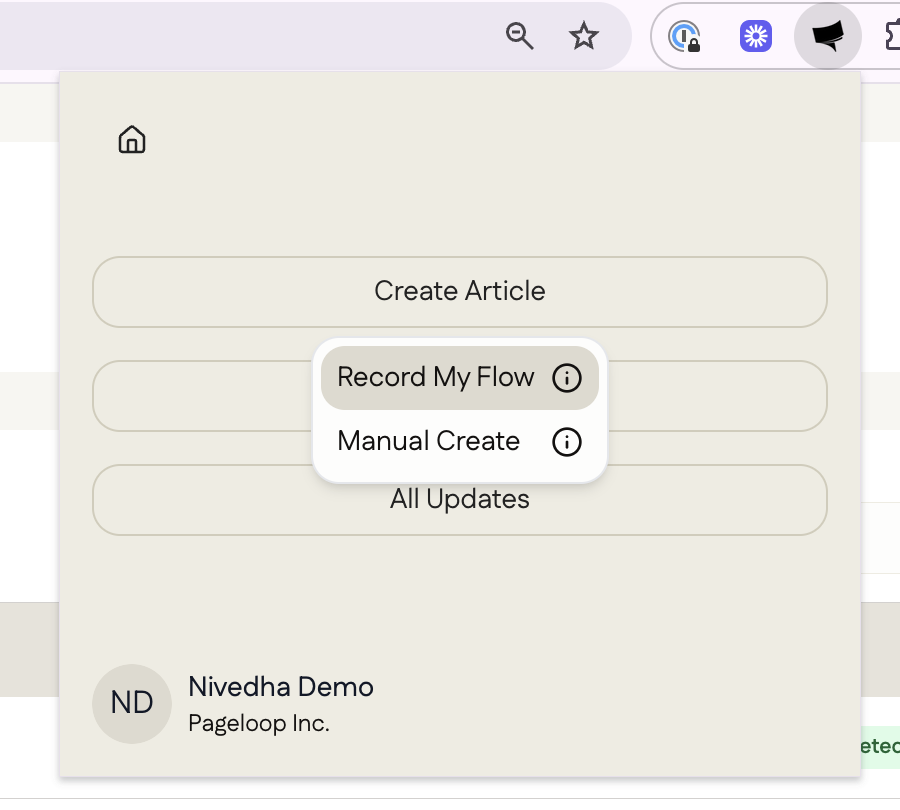

The Record Flow feature helps you create new documentation by capturing your actions directly from your product. Using the Pageloop Chrome extension, you can record a workflow and automatically generate an article draft.

# How to Use Flow

1\. Open the Pageloop Chrome extension and click **Create Article,&#x20;**&#x61;nd then **Record My Flow**

<Frame>
  
</Frame>

2\. In the **Select Tab** window, choose the browser tab where you want to record your actions.

3\. Click through the feature as a user would. Pageloop captures your clicks and on-screen actions.

4\. Once done, you can stop the recording which will show you a summary of the captured steps.

<Frame>
  
</Frame>

5\. Once you hit **Save,&#x20;**&#x61;dd any Product Note&#x73;**&#x20;**&#x6F;r upload images before clicking on **Create Article.**

6\. Click on the newly created article from your [Drafts](https://app.pageloop.ai/articles/new) and then click on **Open in Editor**.

7\. This will open a new article in your Help Center where you can cmd+v or ctlr+v to paste the draft.

Voila! You can directly publish the new article from your Help Center tool!
