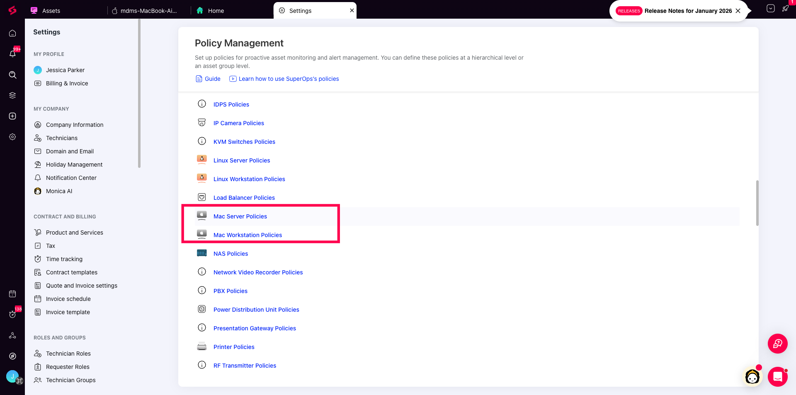
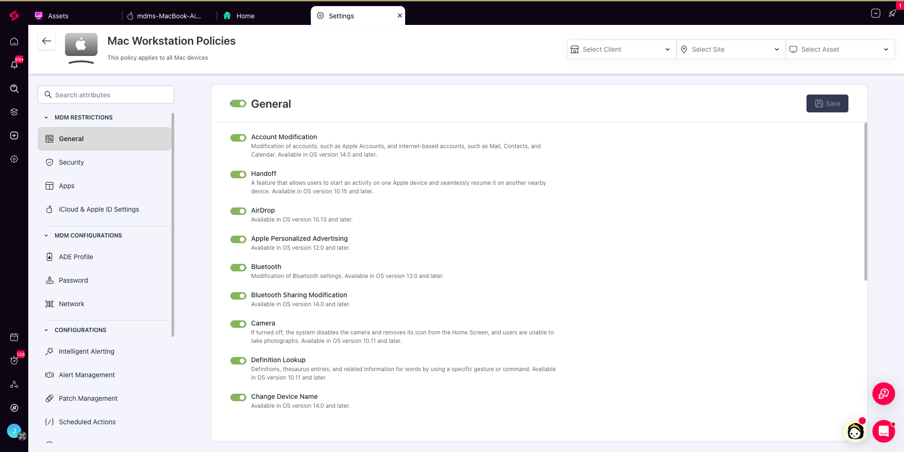
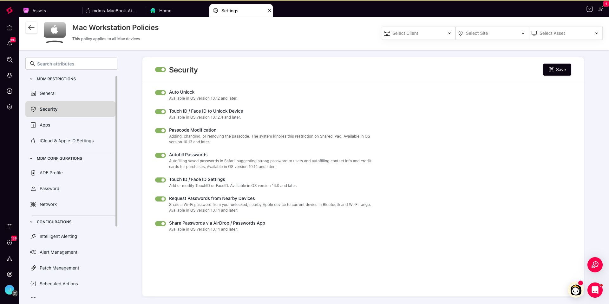
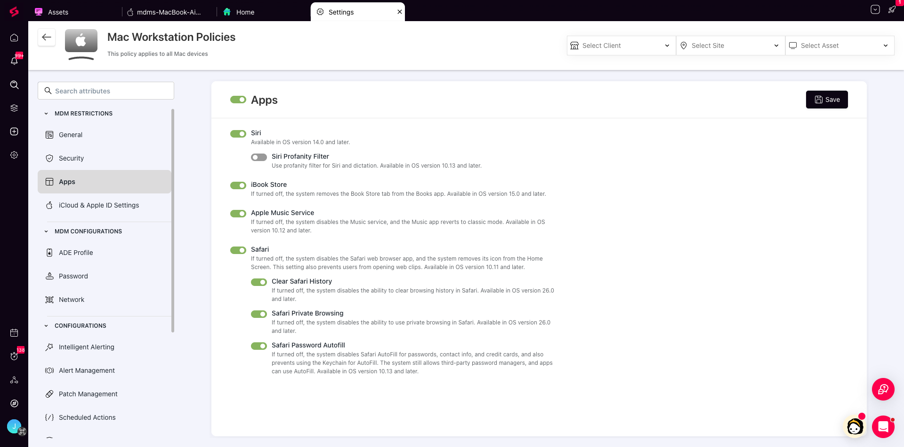
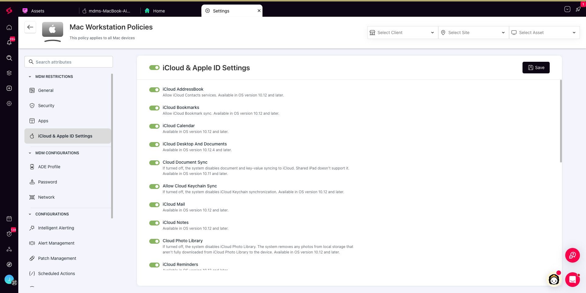
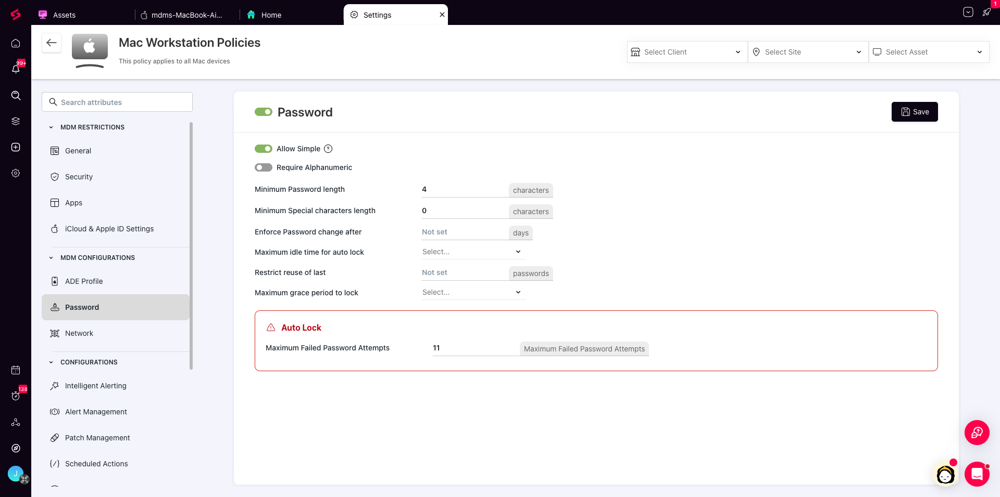
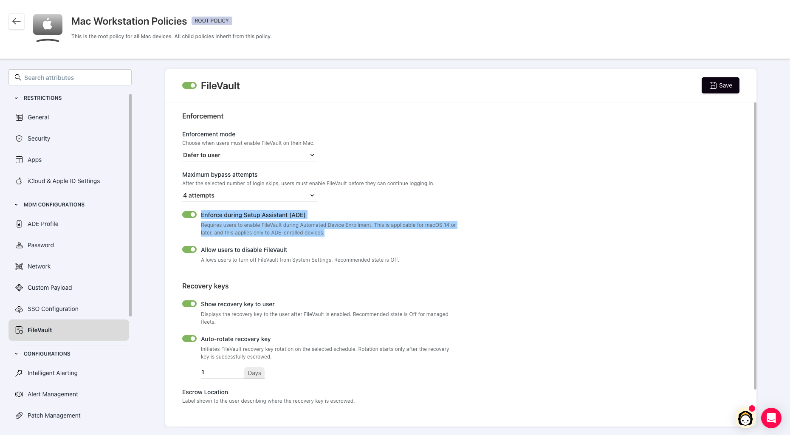
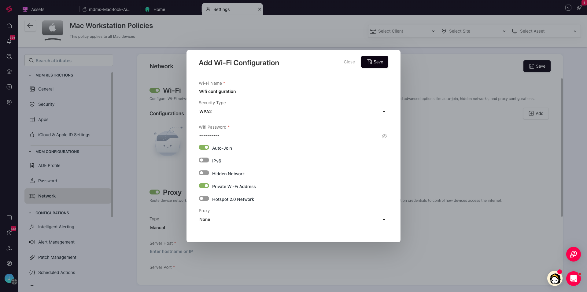

SuperOps MDM allows you to manage Mac devices at the operating system level. You can enforce password policies, restrict device features like AirDrop and Bluetooth, manage iCloud services, configure network settings, and control security-related system behaviorscontrol security-related system behaviors such as FileVault encryption enforcement. These controls are implemented through macOS configurations and restrictions.\
​\
In this article, you will learn what these configurations and restrictions are and how to manage them in SuperOps

## What are Configurations and Restrictions?

Certain macOS policies in SuperOps are enforced purely through Apple’s Mobile Device Management (MDM) framework.

These controls operate at the OS level. Once a device is enrolled and the policy is applied, macOS enforces the setting directly. The SuperOps RMM agent is not involved in these controls.

MDM-based policies are typically used to:

- Establish security baselines

- Control device behavior

- Standardize onboarding

- Enforce compliance requirements

These settings fall into two categories:

- **Restrictions**

- **Configurations**

This article specifically focuses on MDM-based controls.

## Accessing Mac Policies

To configure these settings, navigate to **Settings** > **Policy Management**. Here you will see options for both Mac Server and Mac Workstation Policies.

<Callout type="warning">
  Note : If you are using the **Advanced Policy Framework**, you can create child policies under a root policy. This allows you to apply different configurations to different clients or device groups at scale.
</Callout>

<Frame>
  
</Frame>

## MDM Restrictions

Restrictions control what users can or cannot do on a device. These are enforced directly by macOS after enrollment.

In SuperOps, MDM Restrictions are grouped into:

- General

- Security

- Apps

- iCloud & Apple ID Settings

* **General:** Controls core OS features like Account Modification, AirDrop, and Bluetooth settings.

  <Frame>
    
  </Frame>

* **Security:** Manages authentication and lock screen settings, such as Touch ID, Auto Unlock, and password modification.

  <Frame>
    
  </Frame>

* **Apps:** Restricts specific applications and services, such as the iBook Store, Safari autofill, or Siri.

  <Frame>
    
  </Frame>

* **iCloud & Apple ID Settings:** Manages cloud synchronization features, including iCloud Drive, Keychain sync, and document sync.

  <Frame>
    
  </Frame>

## MDM Configurations

These configurations are ideal for baseline compliance and zero-touch provisioning.

- **ADE Profile:** Configures the Automated Device Enrollment experience, including supervision behavior and Setup Assistant screens. These settings are defined in advance so that when devices are enrolled through ADE, the specified options are automatically applied during onboarding.

  **ADE Profile:** Configures the Automated Device Enrollment experience, including supervision behavior and Setup Assistant screens. These settings are defined in advance so that when devices are enrolled through ADE, the specified options are automatically applied during onboarding. When FileVault is enforced during Setup Assistant from the FileVault policy, the FileVault pane is shown even if the ADE profile skip settings are configured to skip that pane.

  <Frame>
    
  </Frame>

- **Password:** Enforces passcode requirements such as complexity, minimum length, auto-lock timing, and password rotation rules.

  <Frame>
    
  </Frame>

- **FileVault:** Enforces Mac disk encryption and escrows recovery keys to SuperOps. For ADE-enrolled Mac assets, you can require FileVault during Setup Assistant so users cannot skip or defer encryption, the recovery key is escrowed from the first day, and the device is encrypted from first boot.

  <Frame>
    
  </Frame>

- **Network:** Allows pre-configuration of Wi-Fi and proxy settings so devices can connect automatically during setup.

  <Frame>
    
  </Frame>

**Remote support on managed Macs with Splashtop and ISLOnline**

SuperOps comes bundled with both Splashtop and ISLOnline, so your technicians can initiate remote sessions on managed Mac devices directly from the platform without any additional licensing.

To enable remote support on managed Macs, navigate to **Settings > Policy Management > Mac Workstation Polict > Remote Desktop** and enable the toggle for Splashtop or ISLOnline.

For remote sessions to work smoothly on macOS, the remote support tool needs specific privacy permissions — Accessibility and Full Disk Access. If you have MDM enabled, SuperOps can grant these permissions silently across all managed Macs under the policy without any end-user intervention. Simply enable the permissions toggle alongside the remote desktop integration.

To understand how to integrate with Splashtop and ISLOnline, refer to the links below.

1. [Splashtop](https://support.superops.com/en/articles/6632197-how-to-integrate-splashtop-with-superops?q=m)

2. [ISLOnline](https://support.superops.com/en/articles/10501894-how-to-integrate-isl-online-with-superops)

<Callout type="warning">
  **Note:** Screen Recording cannot be silently pre-approved. The end user will need to approve it manually once, the first time a remote session is initiated on their Mac. This is an Apple-enforced privacy protection that applies across all MDM platforms.
</Callout>

## Next Steps

Restrictions and configurations establish the baseline security and behavior of macOS devices.

OS updates and software updates follows a hybrid approach. SuperOps lets you manage them through MDM controls and the RMM agent. Please refer to the following links for deeper understanding.

- [OS Management](https://support.superops.com/en/articles/13772521-manage-os-updates-on-mac-devices-using-mdm)

- [Application Management](https://support.superops.com/en/articles/13772861-manage-app-deployment-for-mac-devices-through-mdm)

These sections explain how enforcement, scheduling, and software deployment operate beyond baseline configuration.
