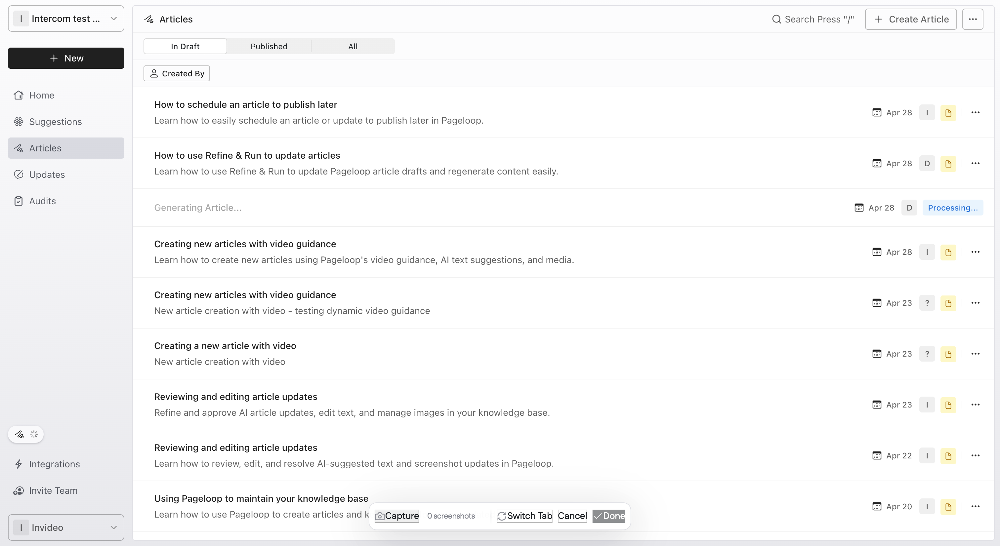
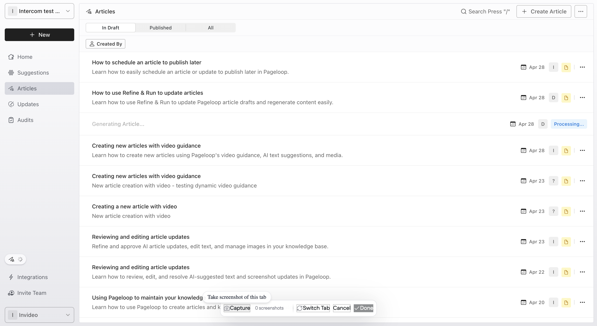
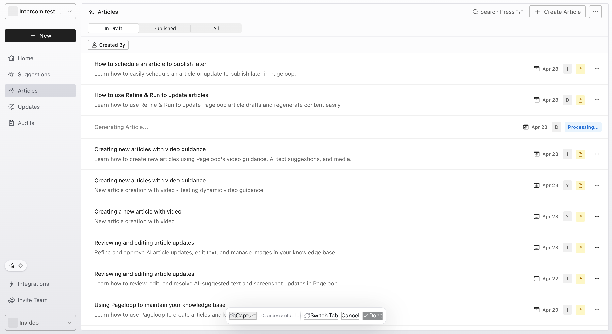
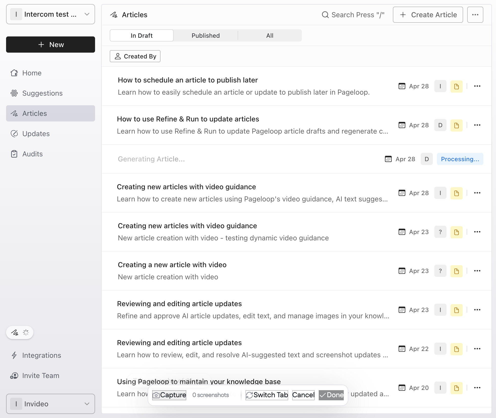
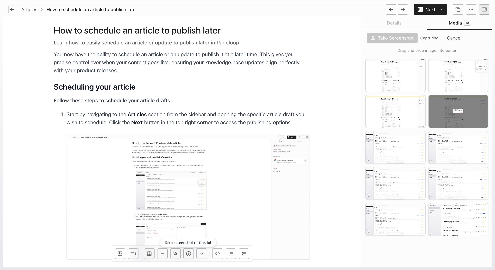
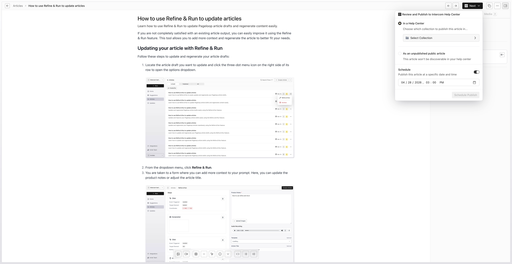
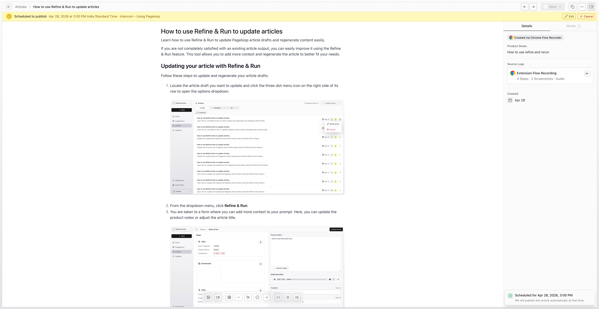
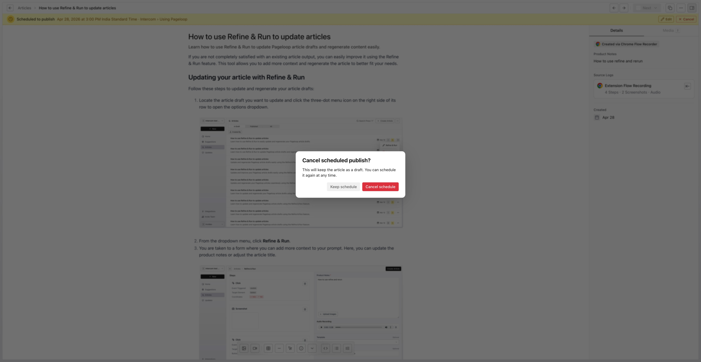

Timing is everything when launching new features. You can now schedule an article or an update to publish at a later time, giving you precise control over when your content goes live and ensuring your knowledge base updates align perfectly with your product releases. Dinakar Tumu Dinakar 06/04/2026 2

# Scheduling your article

Follow these steps to schedule your article drafts:

1. Navigate to the **Articles** section from the sidebar and select the article draft you want to schedule.

   <Frame>
     
   </Frame>

   <Frame>
     
   </Frame>

   <Frame>
     
   </Frame>

   <Frame>
     
   </Frame>

   <Frame>
     
   </Frame>

   <Frame>
     
   </Frame>

2. Click the **Next** button in the top right corner and select **Review and Publish to Help Center**.

   <Frame>
     
   </Frame>

   <Frame>
     
   </Frame>

3. In the publish menu, toggle the **Schedule** switch to set a specific date and time for the article to be published.

   <Frame>
     
   </Frame>

4. Choose the appropriate collection for your article (for example, 'Using Pageloop') and click the **Schedule Publish** button. Once scheduled, the article displays a yellow scheduled banner at the top with the planned publish time.

   <Frame>
     
   </Frame>

# Canceling a scheduled publication

If you need to adjust your timeline, you can easily cancel a scheduled post.

1. Click the **Cancel** button located on the yellow scheduled banner. A confirmation modal appears.

   <Frame>
     
   </Frame>

2. Click the **Cancel schedule** button in the modal to confirm. This cancels the planned publication and reverts the article to a draft, allowing you to edit or reschedule it at any time.

3. Click to select the version stacks icon

   <Frame>
     
   </Frame>

## From asset preview

# Next steps

Now that you know how to schedule content, explore our guide on [Reviewing and approving content on the Updates page](/pageloop-helpdesk/reviewing-and-approving-content-on-the-updates-page) to manage your ongoing documentation improvements.
