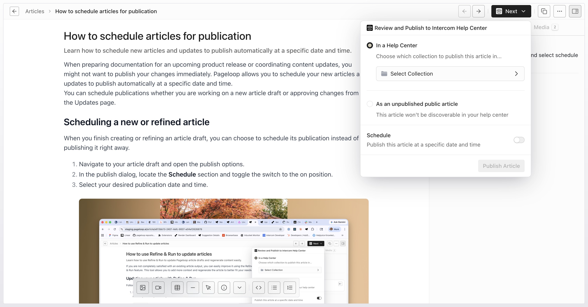
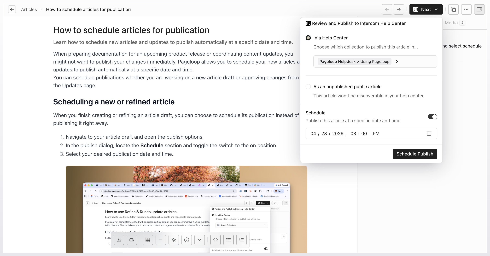
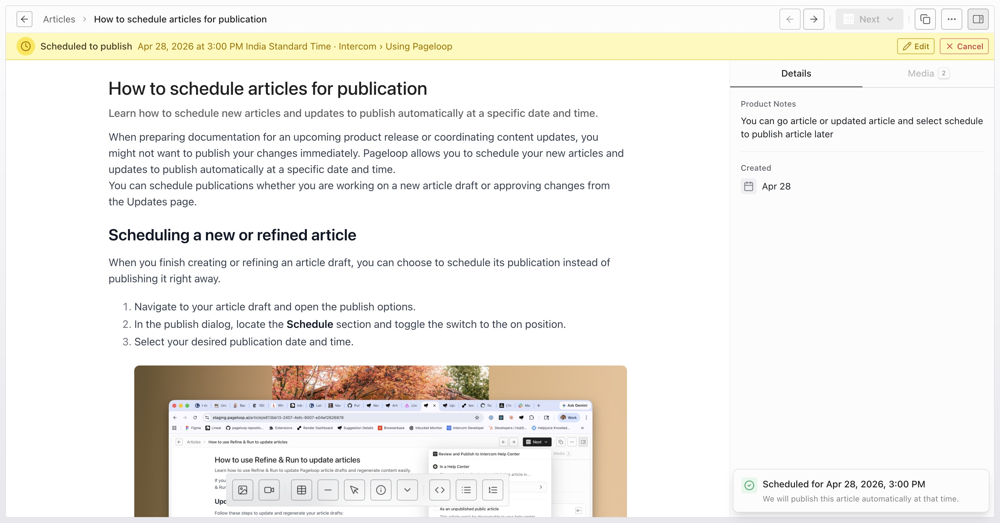
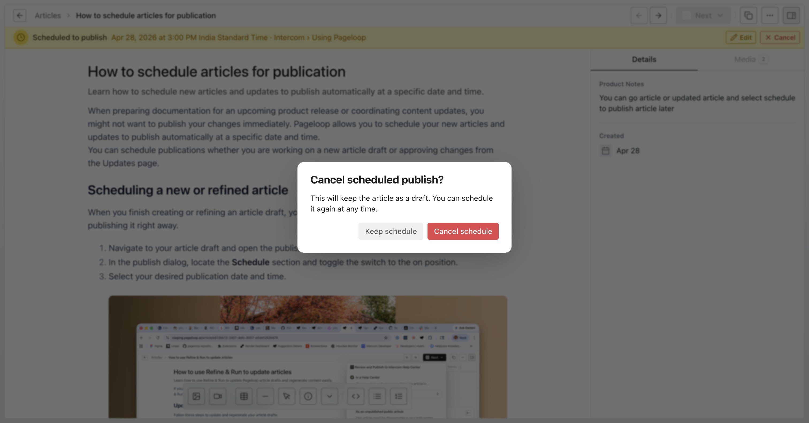

Timing is critical when launching new features or coordinating content updates. Pageloop allows you to schedule your new articles dinakarand updates to publish automatically at a specific date and time. This ensures your knowledge base updates align perfectly with your product releases without requiring manual publication at the exact moment of launch.

You can schedule publications whether you are working on a new article draft or approving changes from the Updates page. Before you begin, make sure you have created a draft by following our guide on [Creating a new article or record in Pageloop](/pageloop-helpdesk/creating-a-new-article-or-record-in-pageloop).

# Steps to schedule an article

Follow these steps to configure and schedule your article for publication:

1. Navigate to your draft articles and open the article you wish to schedule. In the top-right corner of the editor, click the **Next** button, then select **Review and Publish to Help Center** from the dropdown menu to open the publication settings panel.

   <Frame>
     
   </Frame>

2. In the publication panel, toggle the **Schedule** switch to the active position to reveal the publication date and time settings. Next, click on **Select Collection**, choose your target category (for example, `Pageloop Helpdesk > Using Pageloop`), and click **Select Collection** to confirm. Selecting a collection will enable the **Schedule Publish** button.

   <Frame>
     
   </Frame>

3. Once you have verified the publication date, time, and target collection, click the **Schedule Publish** button. A yellow confirmation banner will appear at the top of the editor, displaying the scheduled publication date, time, and target integration.

   <Frame>
     
   </Frame>

4. If you need to adjust the scheduled time, click the **Edit** button in the yellow banner. To cancel the scheduled publication entirely, click the **Cancel** button in the banner. A confirmation dialog will appear; click **Cancel schedule** to revert the article back to a draft status.

   <Frame>
     
   </Frame>

# Next Steps

Now that you know how to schedule your articles, you can explore how to manage your ongoing documentation updates. See our guide on [Reviewing and approving content on the Updates page](/pageloop-helpdesk/reviewing-and-approving-content-on-the-updates-page) to learn how Pageloop helps keep your published content fresh. For a broader overview of documentation maintenance, read about [Using Pageloop to maintain your knowledge base](/pageloop-helpdesk/using-pageloop-to-maintain-your-knowledge-base).
