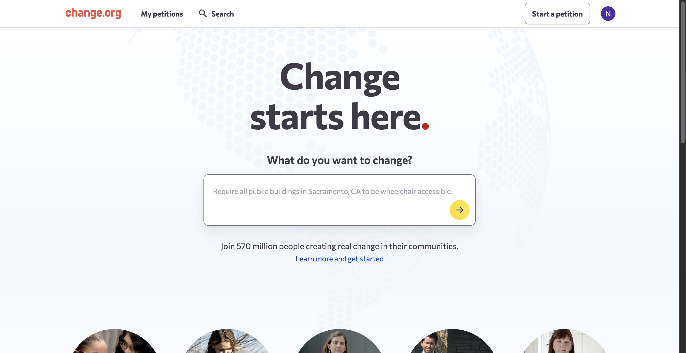
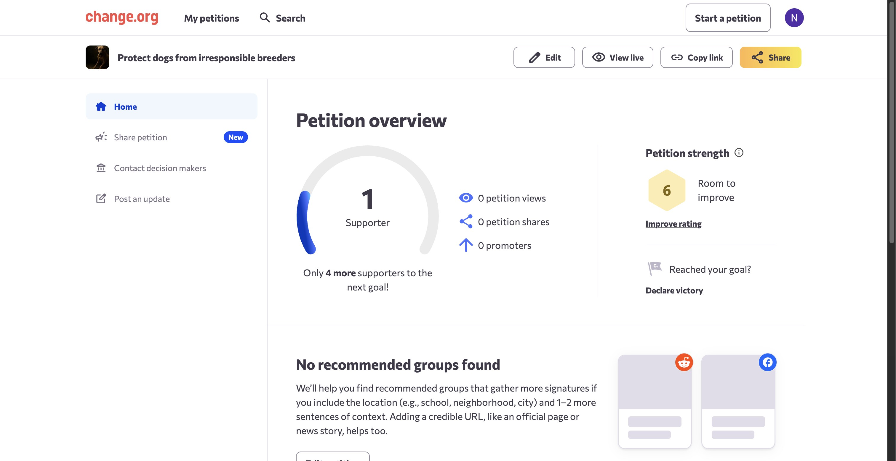
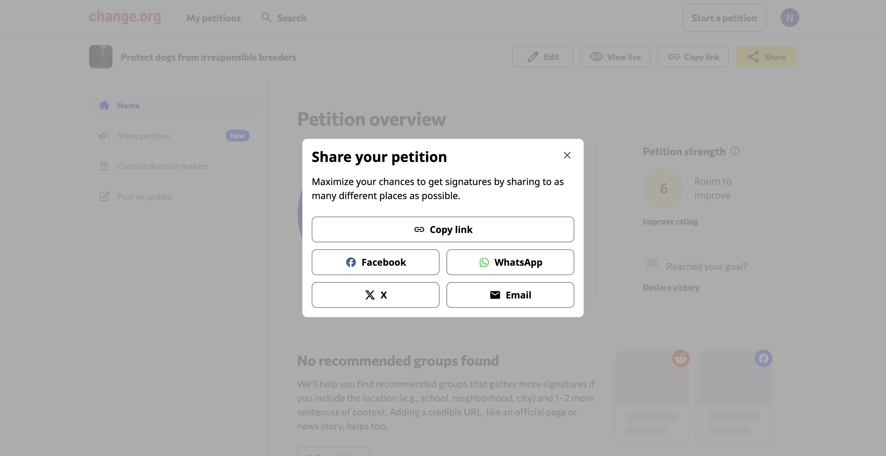
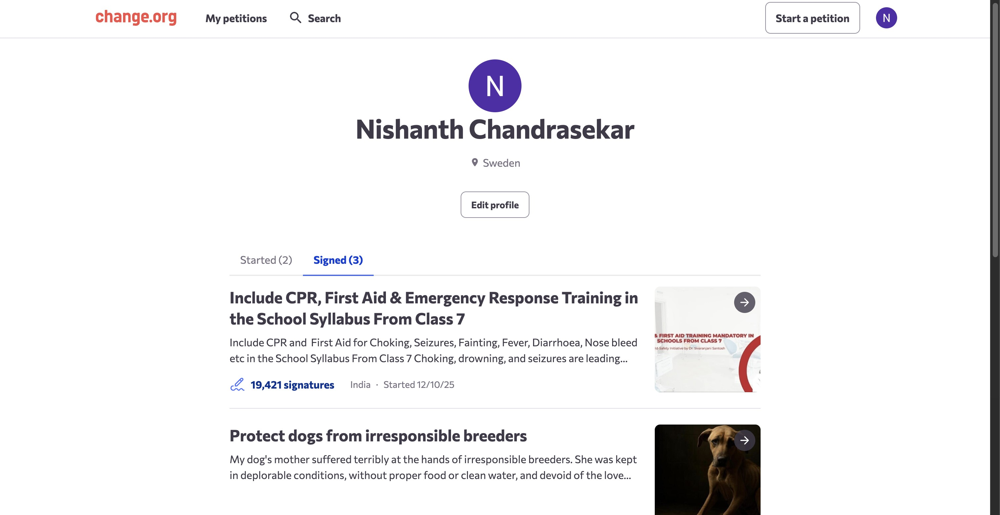
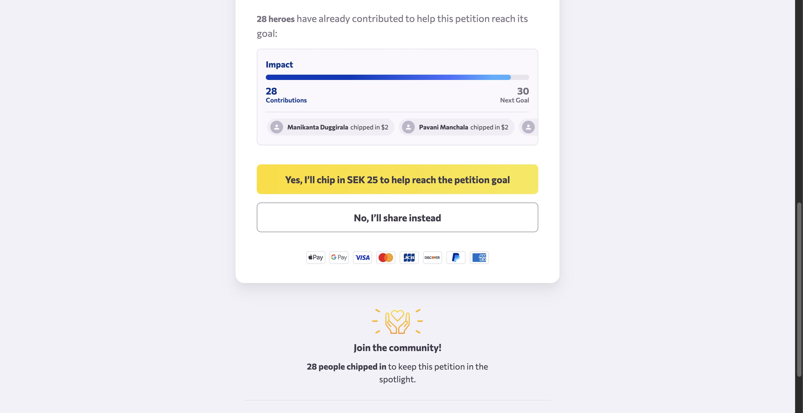

Sharing is the primary driver of momentum for any cause. Whether you are managing your own petition or championing one you have signed, spreading the word helps gather the signatures needed to create real change. Follow this guide to share petitions directly from your profile.

# Sharing a petition you started

To mobilize support for a petition you created, you can access sharing tools directly from your dashboard.

1. Navigate to the Change.org homepage.

   <Frame>
     
   </Frame>

2. From the header menu, click on **My petitions** to access your profile. Under the **Started** tab, click on the specific petition you wish to manage.

3. You will be directed to the **Petition overview** dashboard, which displays your supporter statistics.

   <Frame>
     
   </Frame>

4. Click the **Share** button located in the top-right corner of the dashboard.

5. A **Share your petition** pop-up will appear. Select your preferred method, such as copying the link or sharing directly to Facebook, WhatsApp, X, or Email.

   <Frame>
     
   </Frame>

# Sharing a petition you have signed

You can also amplify the voices of others by sharing petitions you have supported.

1. Navigate to your profile page and click on the **Signed** tab to view a list of all petitions you have signed.

   <Frame>
     
   </Frame>

2. Select the petition you wish to share to view its page, then click the **Take the next step!** button.

3. You will be taken to a page asking for a financial contribution. To proceed with sharing instead of donating, click the **No, I’ll share instead** button.

   <Frame>
     
   </Frame>

4. You will be redirected to a page where you can share the petition with your network to help it gather more signatures.

# Next Steps

Now that you have shared your petition, consider posting regular updates to keep your supporters engaged. Consistent communication can significantly increase the likelihood of reaching your signature goals.
