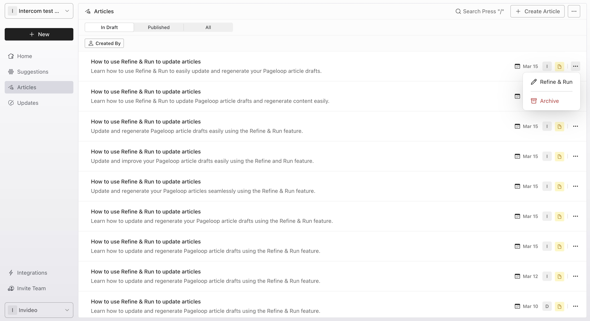
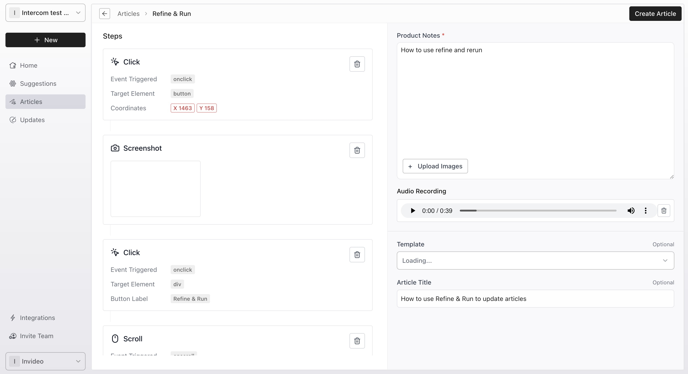

Sometimes an initial draft needs a slight adjustment to perfectly match your brand voice or capture a specific detail. The Refine & Run feature lets you revisit an existing draft, provide additional context, and generate an improved version.

# Refine an article draft

Follow these steps to update your content:

1. In the left-hand navigation sidebar, click **Articles** to view your list of drafts.

2. Locate the draft you want to improve, click the **three-dot menu (...)** on the far right of the row, and select **Refine & Run**.

   <Frame>
     
   </Frame>

3. On the detailed form page, review the recorded steps. In the **Product Notes** text area, add specific instructions or context to guide the AI.

4. When you are ready to proceed, click **Create Article** in the top right corner to save your changes and generate the refined article.

   <Frame>
     
   </Frame>

# Next steps

Once you generate your refined article, you can review the new draft in your dashboard. For more information on managing your workspace, see [Navigating Your Pageloop Dashboard](/navigating-your-pageloop-dashboard).
