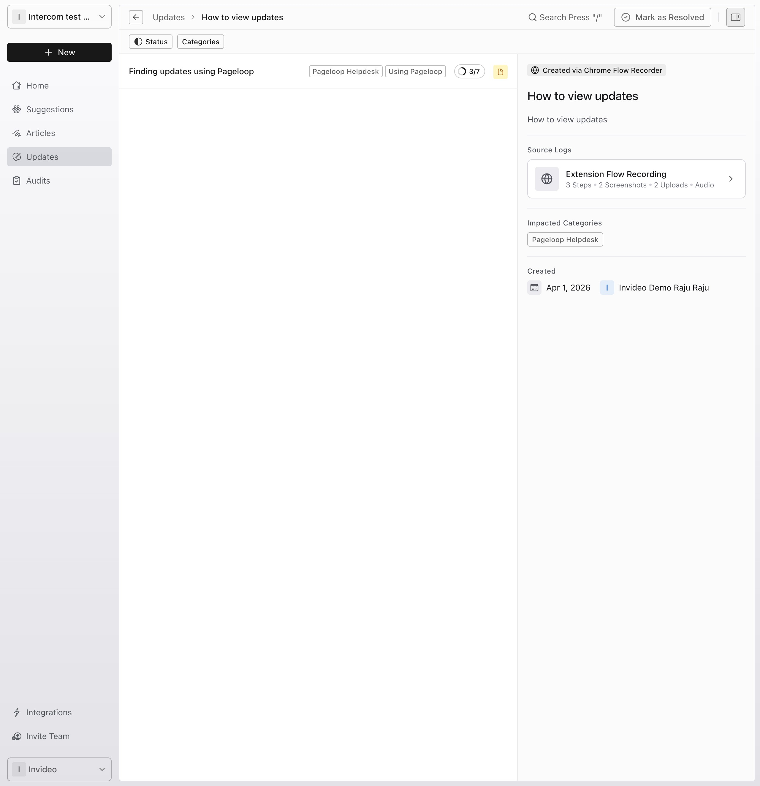
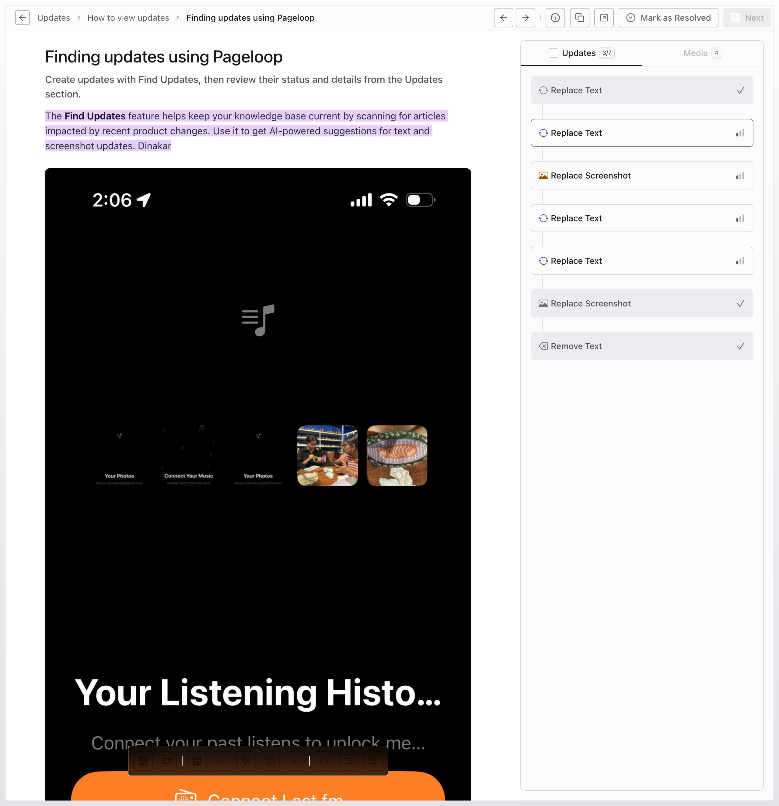

Changes to be picked up on the per articles update agent Another check on the per article\
This is a small change\
Another small change

Dinakar Tumu\
Great products evolve constantly, and your documentation should seamlessly follow suit. Pageloop acts as your editorial partner, automating the tedious aspects of knowledge base maintenance so you can focus on clarity and user experience. Dinakar\
​\
Updating again

The Updates section helps you keep your knowledge base content fresh and accurate. Pageloop automatically detects potential changes for your published articles and lists them here. If you need to generate new updates first, see our guide on [Finding updates using Pageloop](/pageloop-helpdesk/finding-updates-using-pageloop).

Open Updates from the left navigation to review your updates. Pending items appear under the Todo tab. Click any update in the list to open its detail page.

<Frame>
  
</Frame>

# Navigating the split-view experience

Once you open an update, you enter the full split-view experience. This layout presents proposed changes alongside your existing content, allowing you to compare and refine updates efficiently. You can easily orient yourself using the breadcrumb navigation at the top of the page, which tracks your exact location within the Updates hierarchy.

<Frame>
  
</Frame>

# Reviewing text and screenshot suggestions

On the Details tab, review the specific recommendations:

- **Replace Text:** Review and edit proposed text rewrites to ensure clarity and tone.

- **Replace Screenshot:** Evaluate updated visuals that capture your latest interface changes.

When reviewing a Replace Screenshot suggestion, you have five action buttons to manage the visual asset:

- **Replace:** Accept the AI-suggested screenshot to update the visual.

- **AI Enhance:** Ask Pageloop to upscale or recolor the AI-suggested screenshot before accepting it.

- **Upload:** Open the Add Image popover to upload a different image file from your computer.

- **From Recording:** Select an alternative frame captured directly from your recorded product flow.

- **Ignore:** Dismiss the suggestion and keep your existing screenshot; Pageloop shows an undo toast for 5 seconds in case you change your mind.

# Adding new visuals with the Media Library

Sometimes an update requires more context or new visual assets. The update detail page gives you direct access to your captured assets. Switch to the Media tab to access your Media Library and product notes. To insert new visuals into your documentation:

1. Click Add Image to upload new files.

2. Select an image thumbnail and drag and drop it directly into the article editor.

3. Reference your product notes to ensure all technical nuances are accurately documented.

# Approving and publishing changes

We never publish changes without your explicit approval. Once the content meets your standards, accept the finalized changes to update your Articles. For a deeper dive into the editorial process, read our guide on [Reviewing and editing article updates](https://intercom.help/pageloop-b54cb61ac5a8/en/articles/14726435-reviewing-and-editing-article-updates).

# Managing your Articles

After your updates are approved and processed, they are organized in your workspace. In the left-hand navigation sidebar, click Articles to view your list of drafts, published pieces, and all content. To learn more about managing these documents, see [How to use Refine & Run to update articles](/pageloop-helpdesk/how-to-use-refine-run-to-update-articles).

# Next Steps

Now that you understand how to navigate the Updates page, you can confidently maintain a highly accurate, beautifully curated knowledge base. Explore the linked guides above to master your editorial workflow and ensure your documentation always reflects your latest product improvements.
