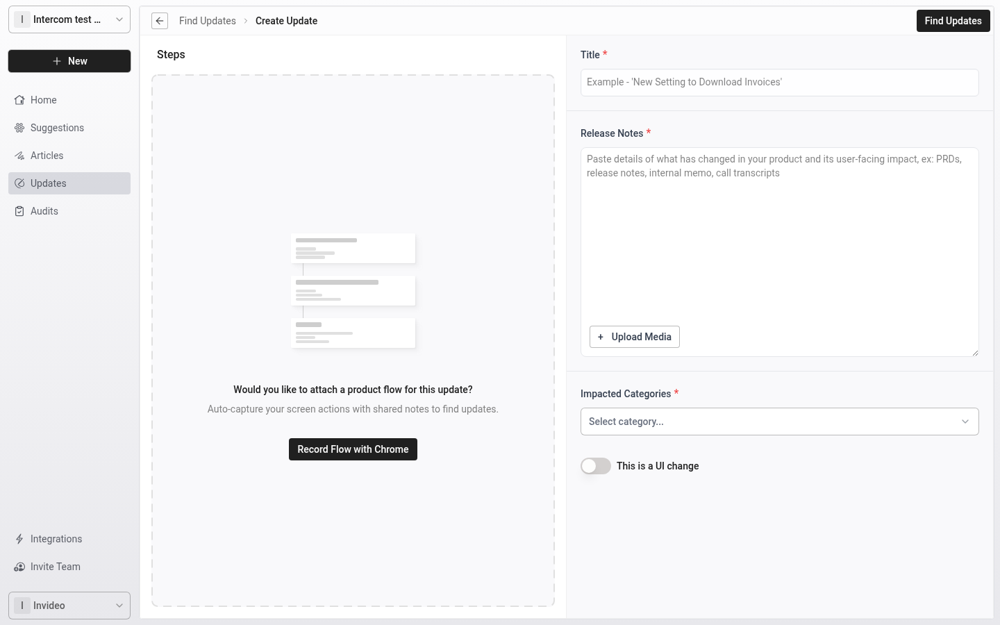
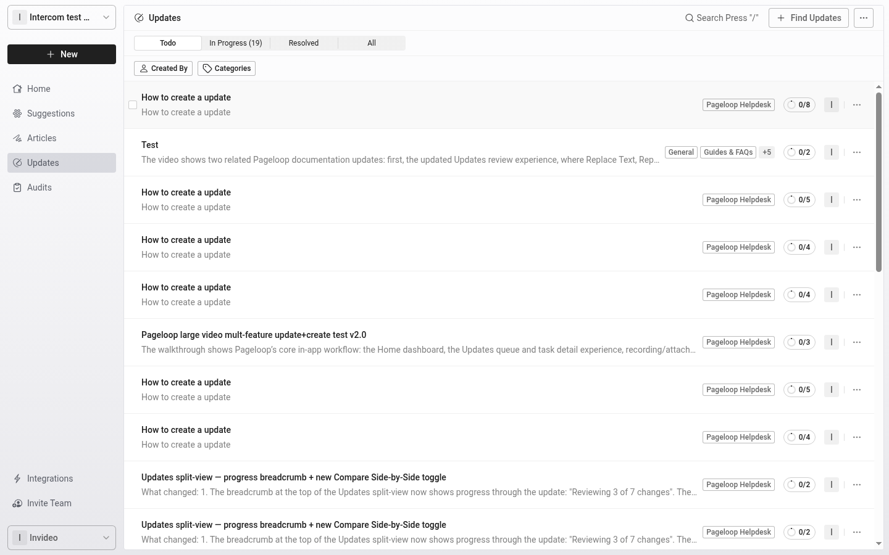

Great products evolve constantly, and your documentation should seamlessly follow suit. Pageloop acts as your editorial partner, automating the tedious aspects of knowledge base maintenance so you can focus on clarity and user experience.

This guide outlines the core workflow you will use to ensure your help center remains accurate and consistently reflects your latest interface.

# Initiate the update scan

The process begins when you provide Pageloop with the details of a recent product update. This gives our AI the context it needs to understand what has changed and which parts of your knowledge base might be affected.

1. Navigate to the Updates section from your main dashboard.

2. Enter your release notes or product requirements. Provide a detailed description of the changes to ensure the most accurate AI suggestions.

3. Select the article categories most likely affected by the update. For major releases, you can select all categories for a comprehensive scan.

4. Enable the **This is a UI change** toggle if the update involves interface modifications. You must enable this setting for Pageloop to suggest new screenshots.

# Review and publish your content

Once the scan is complete, Pageloop proposes rewrites and image updates in your brand voice. We never publish changes without your explicit approval.

1. Open the **Todo** tab within the Updates section to view pending items.

2. Review the AI-generated suggestions to replace outdated text, screenshots, and procedural steps.

3. Open the Updates section to view the full list of updates.

4. Click an update to open its detail page and see the articles impacted by that update.

5. Select an impacted article from the list to review its suggested text, screenshot, and procedural changes.

6. Edit the proposed text as needed to ensure the tone and formatting meet your standards.

7. Accept the finalized changes to publish the updates directly to your integrated help center.

# Next steps

With your existing documentation up to date, you can explore how to [create a new article using Flow](/pageloop-helpdesk/create-a-new-article-using-flow) to document entirely new features. For a broader look at managing your workspace, see our guide on [navigating the Pageloop UI](/navigating-the-pageloop-ui).

<Frame>
  
</Frame>

<Frame>
  
</Frame>

_Screenshot capturing…_

_Screenshot capturing…_
