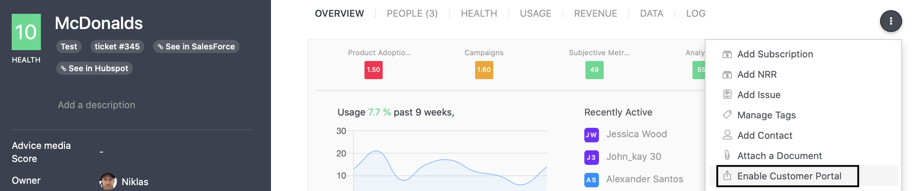
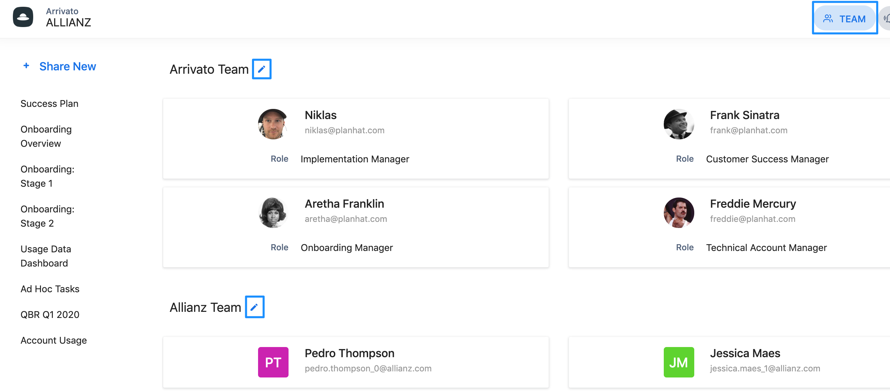
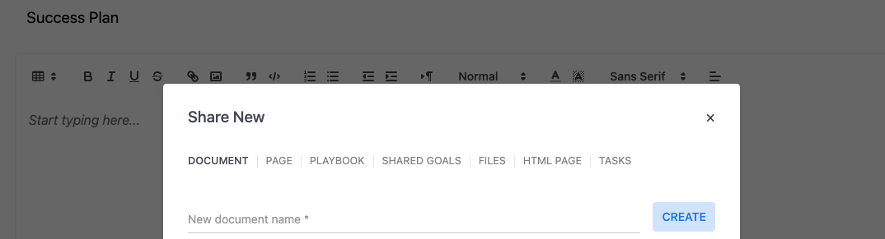

Customer Portals are designed to enable collaboration and transparency with your customers.

In their simplest form, Customer Portals let you share information in a secure, branded environment ensuring that you and your customer are aligned on key information, key processes, and the value they are getting from your product.\
​\
We built Customer Portals as we recognized a gap in our own Onboarding. There were things we needed to do and things our Customers needed to do, but with no obvious way to share these projects to keep everyone on track and informed. Once we started using Portals we also recognized many additional problems they solve.\
​\
Common use cases for Customer Portals today include:\
​\
• Transparent Onboarding\
• Collaborative Project Management with Customers\
• [Sharing dashboards to show usage and ROI.](http://support.planhat.com/en/articles/3734256-shared-dashboards-in-portals)\
• Building Success plans together\
• Defining and updating customer objectives\
• Measuring customer milestones\
• Providing customers with curated, branded content at scale.\
​

---

# **Setting up a Customer Portal**

To create a Customer Portal, click on the ellipsis icon on the top right of any Account profile and select ‘Enable Customer Portal’.\
​\
A blue link will appear below the Customer’s Name. Click this link and a new browser tab containing their Portal will open.

<Frame>
  
</Frame>

# **Branding your Portal**

Customer Portals use the logo uploaded to your account via the Settings menu.\
Click the Controls icon (bottom left of all screens), and select ‘_Settings_’.

# **Providing Access to a Portal**

To provide access to your colleagues and customer contacts, once inside the portal click the Team button. You can choose who from your internal team has access by selecting any of the team members related to the Account, the Owner, Co-Owner, Followers, or Collaborators. Simply click the pen icon to choose.

Custom fields on the Team Member object will show below your colleagues' names.

For your customer end-users, you can choose their Featured Users, individually Selected Users, or All Users giving you complete control over who can access the portal.

**_📌 Important to note:_&#x20;**&#x41;dding an end-user to the list will not send out an email to invite them to the portal, you would have to manually share the portal link with them.

<Frame>
  
</Frame>

# **Sharing is Caring**

In a Customer Portal you can share a range of different objects from your Planhat account, as well as create content or tasks natively. The following objects are available to share by clicking the ‘Share New’ button at the top left:\
​\
• [Document](http://support.planhat.com/en/articles/3734248-using-documents-in-portals): Shared from templates or created natively\
• [Page](http://support.planhat.com/en/articles/3734256-shared-dashboards-in-portals): Shared from Customer Intelligence\
• [Workflow](https://support.planhat.com/en/articles/8861723-workflows-overview): Shared from Workflows on the Company Profile\
• [Shared Goals](https://support.planhat.com/en/articles/3737058-shared-goals-in-customer-portals): shared from Success Units on the Company Profile\
• [Files](https://support.planhat.com/en/articles/3736940-sharing-files-in-customer-portals): Shared from Files uploaded to the Company Profile, or uploaded directly\
• HTML Page: Shared from templates\
• [Tasks](http://support.planhat.com/en/articles/3737023-sharing-activities-or-tasks-in-customer-portals): Ad-hoc Tasks shared via a tag from Tasks on the Company Profile

<Frame>
  
</Frame>

🚀 **Quick tip:** There is no limit to how many objects you can share in a Portal at a time.

---

📣 **Pro tip:** you can also [share customer portals ](http://support.planhat.com/en/articles/4712156-display-and-share-your-portal-with-your-customers-within-your-app)with your customers from within your own application.
