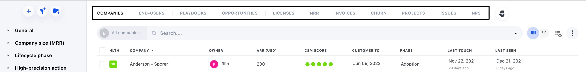

Planhat is comprised of a variety of different data models or data objects. As a user of Planhat you generally engage with these data models through the Data Module or Company Profile and as a Developer working with Planhat, through the API. Most of the Data Models available in your Planhat account are visible as tabs across the top of the Data Module. Conversations and Tasks have their own dedicated modules (Actions and Conversations) so are not visible on the Data Module.

<Frame>
  
</Frame>

Each Data Model has a number of similarities:

- Can have custom fields

- Can trigger, or be updated by, an Automation.

- Is available to analyse in Customer Intelligence,

But each Data Model is also unique.

Put another way, we like to think that each Data Model has its own personality. Below we summarise key features of each Data Model so you can consider how to use them and understand their true purpose.

# Company

This is the parent model. Almost all other models have a relationship to the Company. The Company should represent your customer and be your central concept in Planhat. You can create parent / child relationships between companies as needed.

# End User

End User model represents your Contacts and Users combined. Since it represents people it has a many to one relationship with the Company and can enable things like emailing, scheduling or assigning Workflows to End Users (e.g. Sequences).

# Workflow

Workflows help you achieve a goal. They are templated sequences of Tasks and/or Emails that relate to either the Company or the End User and drive efficiency into your CS processes. Workflows are action-oriented, with Groups, Steps, and Step details as components. To learn more about Workflows, see [here](https://support.planhat.com/en/articles/8861723-workflows-overview).

# Opportunity

Opportunities help you track sales processes, whether they are renewal, new biz, or upsells. Opportunities can move through Stages and, when Closed/Won, can convert into Licenses.

# License

Licenses represent recurring revenue in Planhat. They need a value, a start date and unless open ended, an end date. Licenses power the Revenue Module and drive a number of system metrics on the Company such as Renewal Date, Customer since, Customer to and ARR / MRR values.

# Sale

Sales represents _non-recurring revenue_. Similar to Licenses it requires a value and is generally used for things like Implementation fees or Professional Services. Sales impacts in the month it is sold and is visible on some reports on the Revenue Module.

# Invoice

Invoices can be related to the License, but can also be independent. They represent an amount that has been or should be paid by a customer and have statuses such as Paid and Overdue. Invoices can be generated by a setting on the License.

# Issue

Issues are generally used to represent enhancement ideas and feature requests. They are unique as they have a many to many relationship with Companies. A Company can have many parallel issues, and an issue can belong to many Companies at the same time. The JIRA Software integration sends JIRA Issues to the Issues object.

# Project

Projects have a many to one relationship to the Company and a time component. They can receive time-series data via the API, integrations or imports to create Project level Calculated Metrics. Projects are generally used by companies that sell time based components such as Marketing Campaigns or Sales Competitions, but can also be used to track Customer objectives.

# Asset

Assets are similar to Projects in that they have a many to one relationship to the Company and can receive time-series data and display Calculated Metrics. They do not have a time component (Start / End date) Iike Projects. Assets are generally used to represent sub-entities of a Company, for example Departments, Shops or Locations, Data Clusters, Products, Product Environments or any other trackable component of a customer.

# NPS

The NPS model stores all results from NPS surveys and lets you easily interact with the results and filter them by any data point.

# Churn

The Churn model helps you store reasons why customers Churned, with the ability to have your primary churn reasons and secondary or tertiary reasons in custom fields. When creating 'a Churn' you can have it automatically set the corresponding License(s) to status Lost.

# Conversation

Conversations in Planhat are any direct communication with customers, such as Emails, Phone Calls, Tickets or Chats. Data from tools like Gmail, Zendesk and Intercom show as Conversations in Planhat, but equally Conversation types can be manually created, for example 'Onboarding', 'Training' or 'Customer Consulting'. All Conversations are visible in the Conversations module and on the Company profile.

# Task

Tasks are items that are scheduled to be completed on a certain day or at a certain time. They can be created manually in Planhat or via calendar integrations. Tasks show on the Actions Module and on the Company profile. When a Task is completed (marked as done) it is converted into a Conversation and shows on the Activity Feed

and in the Conversations Module.
