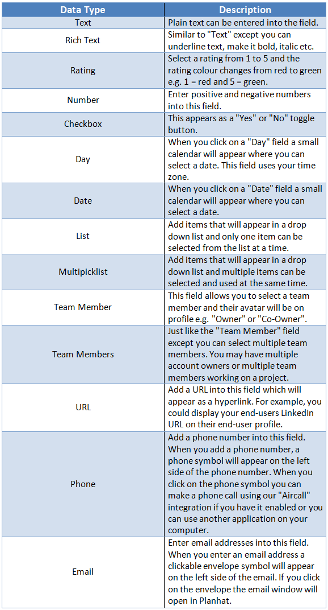

​

[Watch video](https://www.loom.com/embed/3945131a0db64de98ebaf45b7807946f)

Custom fields are incredibly powerful and allow you to add additional information into Planhat that is important for your team. Custom fields can be added to almost any data object in Planhat e.g. Companies, End Users, Licenses, NRR, Opportunities, Tasks, Conversations and many more 🚀!

Good examples of bringing in custom data include creating custom fields on Company profiles so you can bring in data that you have already collected in your CRM. You can also create value-adding CS fields such as "Next Key Objective", "Potential Risks" and "Customer Goals". If you're ready to start creating your own range of custom fields, grab a coffee and read on ☕.\
​

---

# **How to Add Custom Data Fields**

There are a few different ways that you can add custom fields in Planhat:

## 1. Add Custom Fields via the Fields Page

1. Hover over your avatar which is in the bottom left corner of Planhat and then go to "Fields"\
   ​\
   ​

2. Select "_Add New_"\
   ​\
   ​

3. Then there are a few fields that you need to populate before you finish creating your custom field:

- **Name of this field:&#x20;**&#x6E;ame your field\
  ​\
  ​

- **What is this data related to?:&#x20;**&#x74;his is the object that you want the custom field to be on. For example, if you want the field to be on the company profile then you would select "Company".\
  ​\
  ​

- **What type of data is it?:&#x20;**&#x73;elect the data type, for example, if your custom field is going to store numbers you would select "number". Learn more about Planhat's data types [here](https://support.planhat.com/en/articles/4163599-custom-field-data-types).\
  ​\
  ​

- **Check mark fields:**\
  ​\
  ​

  - **Required:** the field will display a red border if it's not populated.\
    ​\
    ​

  - **Locked:** the field can't be edited.\
    ​\
    ​

  - **Featured:&#x20;**&#x54;he field is visible on an object, for example, if you create a custom field on the Company object then it will be visible on the company profile down the left-hand side.\
    ​\
    ​

  - **Hide this field:&#x20;**&#x74;he field won't appear in searches and it can't be displayed.

Learn more about managing custom fields in Planhat [here](https://support.planhat.com/en/articles/3971738-managing-fields) 🤓.

---

## 2. Add Custom Fields via the Data Module

1. Go to the Data Module and click on the object that you would like to add a field to e.g. Companies, End Users, Workflows etc.\
   ​\
   ​

2. Click on the ellipsis icon in the top right corner and select "Manage Fields".\
   ​\
   ​

3. Follow step 3 [above](https://support.planhat.com/en/articles/1631614-how-to-create-custom-fields#how-to-add-custom-data-fields).

---

## 3. Add Custom Fields via API

Custom fields can also be created by using our API, check out our API documentation [here](https://docs.planhat.com/#post_customfield).

?&#xDCCC;**&#x20;Important to note:&#x20;**&#x54;o access "_Fields_" in Planhat you need to be an administrator. You will also need the "Customfiel&#x64;**"** permissions enabled in order to create, update and remove fields.

<Frame>
  
</Frame>

---

# **Field Options**

- **Formula:** currently only Planhat admin can use the "Formula" option. This option enables the Planhat team to create custom formula fields. There will be more information available on this as soon as it's officially released 👍.

* **Required:&#x20;**&#x54;his option means the field is required and if there are no data in the field it will have a red border around it (on the Data module) or the field will be filled in red (on forms).

- **Locked:&#x20;**&#x6C;ocked fields are typically system fields that are populated by the system or they're custom fields that are populated via Planhat's API. If you lock a field it means nobody can manually edit the data in that field. This feature helps ensure that the data sent over remains the way it was from the source.

* **Featured:&#x20;**&#x79;ou can choose to feature your custom data on the customer profile side panel by checking the "_Featured_" box. If you choose not to feature the item then the item will be displayed on the company profile under the tab called "_Data_".

<Frame>
  
</Frame>

?&#xDCCC;**&#x20;Important things to note:**

1. The gear symbol next to the field means that this is a system field given to you by Planhat and it cannot be removed from the customer profile.\
   ​\
   ​

2. The ruler icon means it's a custom field that you have added and you can choose to display it.\
   ​\
   ​

3. This "Hide this fiel&#x64;**"&#x20;**&#x6F;ption will hide the field from the interface but you can still use the field in your search queries or in filters.

?&#xDCE3;**&#x20;Pro tip:** you can drag & drop your fields into the order that you would like them to be displayed on each profile. For example, if you would like certain featured fields displayed at the top of the company profile then you would drag the field to the top.

​

<Frame>
  
</Frame>

---

# **Custom Field Data Types**

There are several different data types to choose from when creating a custom field. We have listed all of the data types below with a brief description 👍.

<Frame>
  
</Frame>

?&#xDCCC;**&#x20;Important to note:&#x20;**&#x49;t's **NOT** possible to edit the field type after a custom field has been created (even if you delete all the data related to the custom field). If you want to change the field type, you'll need to delete the custom field and recreate it with the new field type (you will lose any data that's stored in the field).
