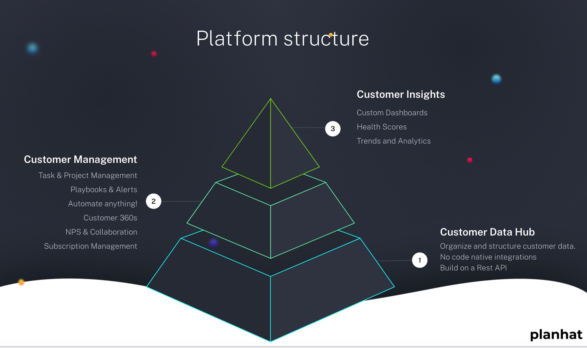

Data is the foundation of Customer Success and data is very much the foundation of Planhat.

Planhat is designed as a Data Hub, with a Workflow layer, an Insights layer and Automations linking them all together. Ensuring the Data Hub is full of clean and accurate customer data is critical to long term success.

<Frame>
  
</Frame>

# Five Types of Data

There are five types of data in Planhat, though they each take on a range of forms and are used in a range of locations. They are:

|                   |                                                                                                                                             |                                                |
| ----------------- | ------------------------------------------------------------------------------------------------------------------------------------------- | ---------------------------------------------- |
| Data Type         | Description                                                                                                                                 | Typical Source                                 |
| Customer Data     | Who your Customer are, why they bought and what they want to achieve.                                                                       | CRM, Excel, GDocs, Database / API              |
| End User Data     | Who your Contacts and Users are, what their roles are, what your relationships are like and what they want to achieve/                      | CRM, Email, Support tools, Product usage data. |
| Revenue Data      | What your customer are paying, what they are paying for and over what amount of time.                                                       | CRM, ERP, Excel                                |
| Conversation Data | All the back and forth between your team and your customers, from Emails to Tickets and meeting notes and logged Phone calls.               | Email, Support tools, CRM                      |
| Product Data      | How your customers are using your Product, where they have high adoption and how their adoption is tracking against targets and thresholds. | Product Analytics tools, Excel, API / Database |

🚀 **Quick tip:&#x20;**&#x41;s a golden rule, you need at least 3 of these data types to be clean and accurate to start seeing huge value. It is critical therefore to focus on data accuracy and hygiene when you first start using Planhat.

Once you have more than 3 data types in Planhat, you need to make the data actionable and meaningful for your teams, and to do that you need to understand the building blocks of data in Planhat.

\_\_\_\_\_\_\_\_\_\_\_\_\_\_\_\_\_\_\_\_\_\_\_\_\_\_\_\_\_\_\_\_\_\_\_\_\_\_\_\_\_\_\_\_\_\_\_\_\_\_\_\_\_\_\_\_\_\_\_\_\_\_\_\_\_\_

# Data Building Blocks

When using Planhat there are some critical building blocks in the application to maximise your use of data and achieve your desired outcomes.

?&#xDCE3;**&#x20;Pro tip: Check out this article on the Data Models in Planhat and their distinct personalities:&#x20;**[http://support.planhat.com/en/articles/5832265-data-models](http://support.planhat.com/en/articles/5832265-data-models)

The 3 data building blocks are:

## 1 . Custom Fields

Across each data model in Planhat you can add custom fields to live alongside the system fields already in Planhat. Custom fields can have a wide range of types and can be used to build filters, drive automations or populate dashboards.

To learn more about Custom Fields check out this article: [How to create custom fields\
​](https://support.planhat.com/en/articles/1631614-how-to-create-custom-fields)

## 2. Filters

Filters are a crucial way of organising data in Planhat. With filters you can isolate components of any data model as needed, for example all Companies in New York, or all End Users that are Decision Makers. You can even cross reference data between data models to find, for example, all Decision Makers in New York that belong to companies with an open invoice.

Company Filters are available across Planhat to filter any view via the Search Bar, and all Filters are entry / exit points when building Automations.

Building a wide array of Filters ensures your team can easily identify important cohorts of Companies or Users or any data model, analyse them, drive automations because of them and overall be much more in control of their data.

You can learn how to build filters [in this article here](https://support.planhat.com/en/articles/3737946-designing-and-building-filters)

## 3. Calculated Metrics

Calculated Metrics are a way of transforming the raw data in Planhat into time-series data so you can easily monitor performance over time or performance against thresholds.

Calculated Metrics are most commonly used to translate raw product data into meaningful metrics for Customer Success, but can also be used with any numeric field.

Calculated Metrics can be built using data on the Company, End User, Asset or Project data models, and tend to be used to drive things like Workflow Sequences based on product adoption, to trigger Automations informing your team about changes in customer behaviour or as part of dashboards showcasing your customer portfolio.

You can learn more about Calculated Metrics in this series of [article](https://support.planhat.com/en/articles/3739457-calculated-metrics)s
