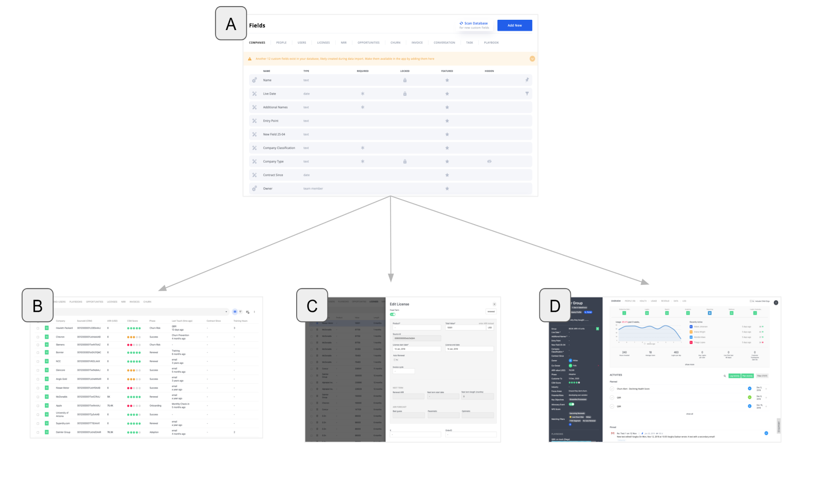
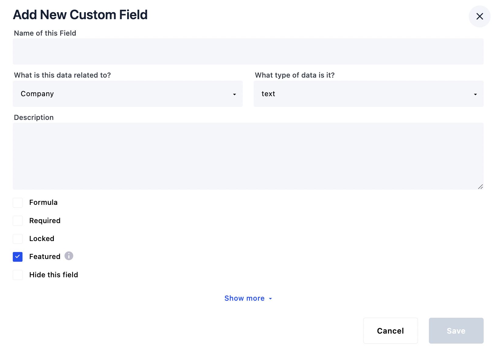
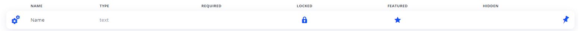
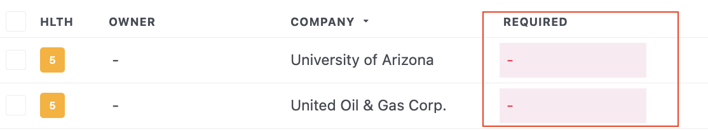
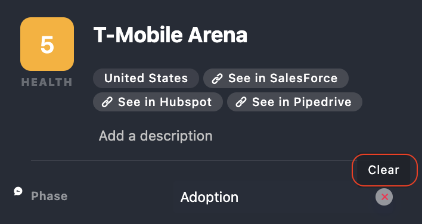

Where to Manage Fields

All objects in Planhat have a set of default fields (also known as system fields). In addition, each tenant can add any number of custom fields!

Both default and custom fields for all objects can be managed from multiple places:\
​\
1\. Settings > Fields (A)\
​\
2\. Data module > click on the ellipsis icon in the top right hand corner and select "Manage Fields".

These settings affect how the fields are displayed and edited in the follow areas of Planhat:

- Table Views in the Data Module (B).

- Create and Edit forms across the entire application (C).

- Company, Enduser and User profile pages (D).

<Frame>
  
</Frame>

In the field list of the setting page (A), default fields have a gears icon to the left and the custom fields have a ruler icon.

You can learn more about available Field Types and how to use them [here](https://support.planhat.com/en/articles/4163599-fields-different-field-types).\
​\
​

## Field Settings

The options available for each field will depend on if it’s a default field or a custom field. Simply click on a field on the settings page (A) to open up the field edit form.\
​\
Default fields typically come with some restrictions. For example the name of a company is always required, always visible and always appears at the top left of the company profile. Therefore these settings don’t even show up in the edit dialog.

<Frame>
  
</Frame>

## Ordering, Visibility and Featured Fields

Fields that have “hide this field” checked will not show at all in the application, on the profile pages or in the data module. If you have quite a few additional fields and their only purpose is to be filtered on or to be used within a formula then it's probably best to hide these fields. By doing this you will prevent your profile pages and forms from becoming cluttered 👍.\
​\
Fields that need to be visible in the application, but don't require much attention should have the checkbox “Featured” unchecked. When this box is unchecked, the fields will show under the "Data" tab of the customer profile (D) and under “show more” in the edit forms (C).\
​\
The list of fields on the settings page can be re-ordered by drag and drop.\
This will be reflected both on the customer profiles (D) and in the edit forms (C), but this doesn’t affect the Data Module list views. This allows the most commonly used or most important information to be displayed first, for example in the left side panel of the company profile.\
​\
Some of the system fields are fixed though and have a fixed place on the page. Company name for example will always appear at the top left of the company profile and this cannot be changed. In the settings this field is displayed right at the top and it has a pin icon to the right to indicate that it cannot be reordered.\
​

<Frame>
  
</Frame>

The same applies to the license form when several default fields such as value/mrr, currency, start date, and end date have fixed positions.

## Locked:

Means the field cannot be edited from the application. This is typically the case when there is an external source of truth, for example when companies are created over the API and synced from some external or proprietary system. Note that these fields can still be changed using either file import or API.\
​\
​

## Required:

When checked it means the field should always have a value. That said, Planhat doesn’t strictly enforce it so it’s still possible to create and update objects without providing a value for a required field. If this were to happen then the field with no value in the Data module would be filled with red. Also, required fields in the customer profile and forms will have an asterisk.

<Frame>
  
</Frame>

Later on we may add the option to enforce the required fields and/or alert the account owners of the missing required fields.

## **Mandatory System Fields**

- Company: name

- EndUser: companyId and a least one keyable: email, externalId or sourceId

- License: \_currency, companyId, fromDate

- Asset: name, companyId

For details on more objects, please refer to our [API docs](https://docs.planhat.com/#introduction)

## Conditional Fields (show advanced)

Sometimes you need the ability to conditionally display your fields. An example might be that you have a low touch segment and a high touch segment. High touch customers get a solution architect assigned (field of type team member(s)) so you would add this custom field. However, this field is now appearing on your low touch segment where it’s not required! We don't want to display irrelevant fields, so in this case you could create a rule to only display this field if the customer is part of the high touch segment.\
​\
Another use case related to Conversation could be fields such as Priority and Severity that typically make sense for a support ticket, but probably wouldn’t for a QBR touch point.

Note: Even if a field is conditionally hidden, it may still exist in the database, and in the data module, if you chose to show this column in some view, then it will show for all objects regardless of condition.

You can learn more about Conditional Fields [here](http://support.planhat.com/en/articles/4150134-conditional-fields-success-units-and-calculated-metrics)\
​

## Clearing Fields

Normally to clear a field from a profile you simply edit it and remove the contents. In some cases the control won’t allow it, for example once a rating (1-5) has been set you can only change it, you cannot “unset” it to nothing. The same applies with the date and day pickers, there you can also only change the date but but completely remove it.\
​\
However there are many cases where you might want to actually remove it, you can do this by hovering over the value either in the data module table view, or on the customers profile page and a cross icon appears to the right, click it to delete the value.

<Frame>
  
</Frame>

## Lists and Multipicklists

You can rename values for list and multipicklist fields. This will change references in conditon builders (like filters) as well as in automations. Renaming a list or multipicklist value will not, however, change references in Calculated Metrics or Formula Fields. 📌Please note that list and multipicklist fields are limited to 500 options!

📣 **Quick tip:&#x20;**&#x57;hen managing fields,**&#x20;**&#x74;he color of the fields have meaning

- Gray = System Fields

- Purple = Custom Fields

- Blue = Calculated Metrics

- Green = Success Units
