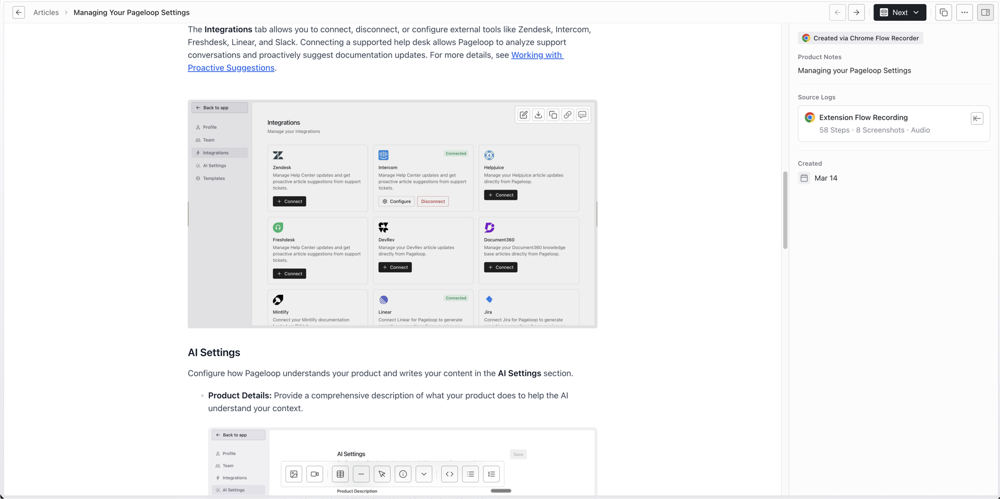
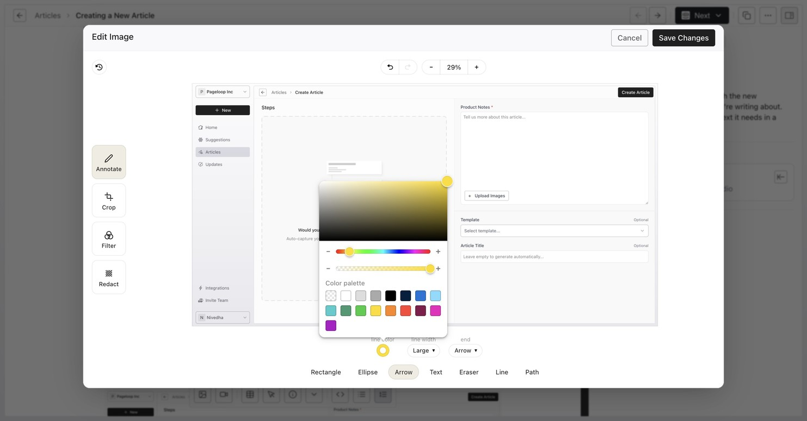
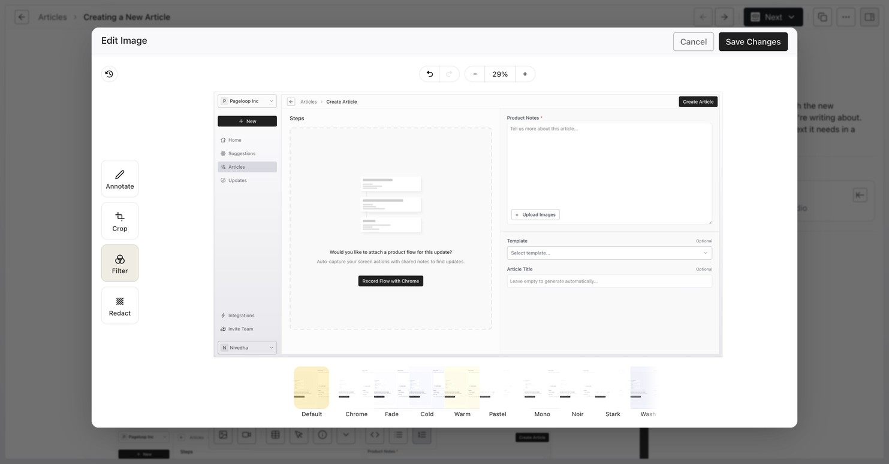
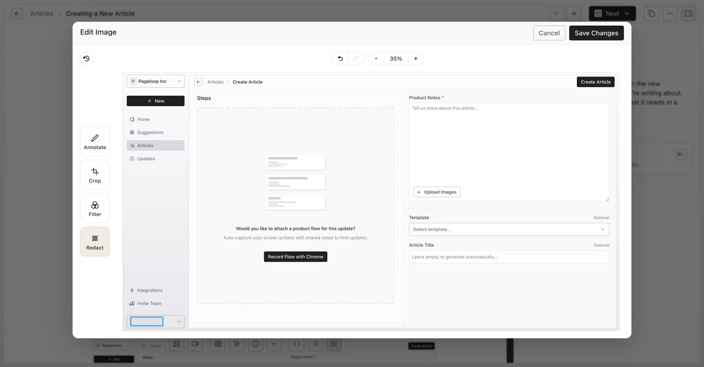

Pageloop includes a built-in image editor that lets you annotate and adjust screenshots directly within your articles. The editor can also use configured brand colors for annotations.

# Access the Pageloop Image Editor

You can open the image editor from any article that contains images, including both new article drafts and existing articles with updates.

1. Open the article containing the image you want to edit.

2. Hover over the image. A toolbar will appear in the top-right corner of the image with several options.

<Frame>
  
</Frame>

3\. Click the **Edit Image** button (the pencil icon) to open the image editor.

The image hover toolbar also provides quick actions for working with images:

- **Download** - Save the image to your computer.

- **Copy** - Copy the image to your clipboard.

- **Link** - Add a hyperlink to the image so it links to another page when clicked.

- **Alt Text** - Add or edit descriptive alt text for the image. Descriptive alt text improves accessibility and helps AI agents better understand your documentation. When Pageloop generates an article, it includes alt text for each image automatically. You can also add or update alt text manually at any time using this button.

## Use the Annotation Tools

When the Pageloop image editor opens, the **Annotate** tool is selected by default. The annotation toolbar at the bottom of the editor provides the following tools:

<Frame>
  
</Frame>

- **Rectangle** - Draw rectangular outlines to highlight areas of the screenshot. Useful for calling attention to buttons, fields, or sections of an interface.

- **Ellipse** - Draw circular or oval outlines to highlight specific elements.

- **Arrow** - Add arrows to point to specific interface elements. Arrows are one of the most effective ways to direct a reader's attention in visual documentation.

- **Text** - Insert text labels directly onto the image. You can adjust the font size and color to make your text stand out.

- **Line** - Draw straight lines on the image.

- **Path** - Draw freeform lines for more flexible markups.

## Customize Your Annotations

Each annotation tool in Pageloop can be customized to suit your needs:

- **Color** - Click the color swatch below the toolbar to open the color picker. You can choose from the full picker and the palette. When brand colors are configured in [Settings > Branding](https://help.pageloop.ai/en/articles/14836169-customize-brand-colors-for-image-annotations), those colors appear in the palette and replace the default color options.

- **Line width** - Adjust the thickness of lines, shapes, and arrows using the line width control. Options range from thin to thick strokes.

- **Arrow end style** - When using the Arrow tool, you can configure the arrowhead style.

All annotation tools default to blue, which stands out well on most screenshots.

## Crop Images

To remove unwanted areas from your screenshot, select the **Crop** tool from the left-side menu in the Pageloop image editor. Drag the corner and edge handles to define the area of the image you want to keep. Cropping is useful for focusing on the relevant part of a screenshot and removing distracting elements or extra whitespace.

## Apply Filters

The **Filter** tool in the Pageloop image editor lets you apply visual effects to your screenshots. Select the Filter tool from the left-side menu to see a row of preset filters at the bottom of the editor.

<Frame>
  
</Frame>

Available filter presets include Default, Chrome, Fade, Cold, Warm, Pastel, Mono, Noir, Stark, and Wash. Click on any preset to preview the effect on your image.

## Redact Sensitive Information

If your screenshots contain personal data, credentials, or other sensitive information that should not appear in your documentation, use the **Redact** tool. Select the Redact tool from the left-side menu in the Pageloop image editor, then draw over the areas you want to obscure. The redacted areas will be scrambled so the underlying information cannot be read.

<Frame>
  
</Frame>

## Save Your Edits

When you are satisfied with your annotations, crops, filters, or redactions, click the **Save Changes** button in the top-right corner of the Pageloop image editor. Your edits will be applied to the image in your article. If you want to discard your changes, click **Cancel** to close the editor without saving.

## Screenshot Annotation Best Practices

- **Use arrows to direct attention.** Arrows are the clearest way to show readers exactly where to look or click in an interface.

- **Keep annotations minimal.** Too many shapes and callouts can make a screenshot harder to read. Focus on highlighting the most important element in each step.

- **Use consistent colors.** Stick to one color (such as the default blue) across all your screenshots for a clean, professional look.

- **Crop out distractions.** If only part of the screen is relevant to the instruction, crop to show just that area.

- **Redact sensitive data before publishing.** Always check screenshots for email addresses, names, credentials, or other personal information that should be removed.

- **Add descriptive alt text.** Use the Alt Text option on the image hover toolbar to provide a description of what the image shows. This improves accessibility for screen readers and helps AI support agents reference your documentation accurately.

---

# Frequently Asked Questions

## Can I edit images in both new articles and article updates?

Yes. The Pageloop image editor is available wherever images appear in the article editor, including new article drafts and articles with pending updates.

## What image formats does the Pageloop image editor support?

The image editor in Pageloop supports standard web image formats including PNG and JPEG.

## Can I edit images that were not uploaded through Pageloop?

Yes. The Pageloop image editor works with both images uploaded through Pageloop (such as screenshots from flow recordings) and external images already present in your article content.

## Where can I learn how to capture screenshots using the Chrome extension?

To learn how to capture screenshots during a flow recording, see [Using the Pageloop Chrome Extension](https://help.pageloop.ai/en/articles/13654464-using-the-pageloop-chrome-extension).

## How do I create an article that includes screenshots?

For step-by-step instructions on creating articles with images, see [Create Articles Using Pageloop](https://help.pageloop.ai/en/articles/13654529-create-articles-using-pageloop). After your article is generated, you can use the image editor described in this article to annotate and adjust your screenshots before [publishing to your Help Center](https://help.pageloop.ai/en/articles/13654534-publish-new-articles-to-your-help-center).
