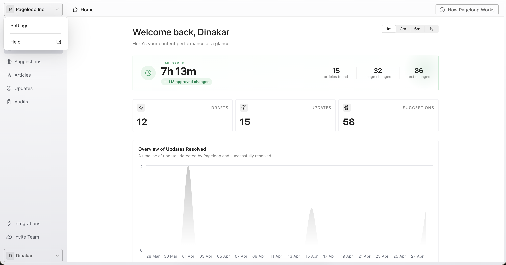
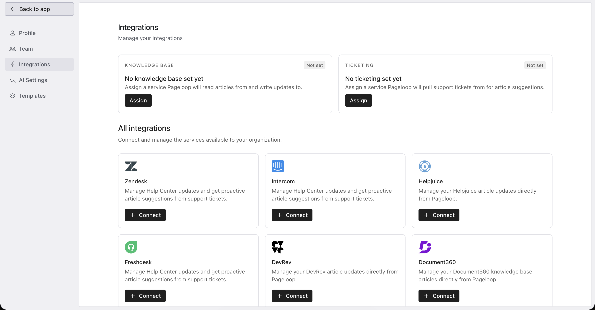
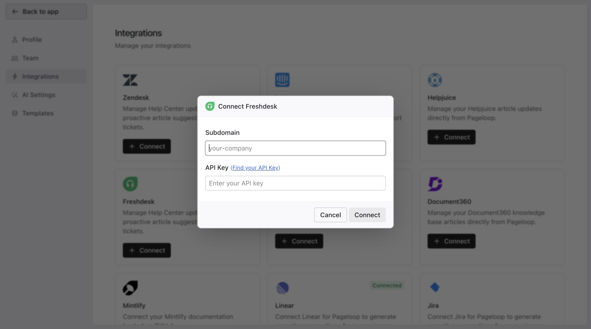
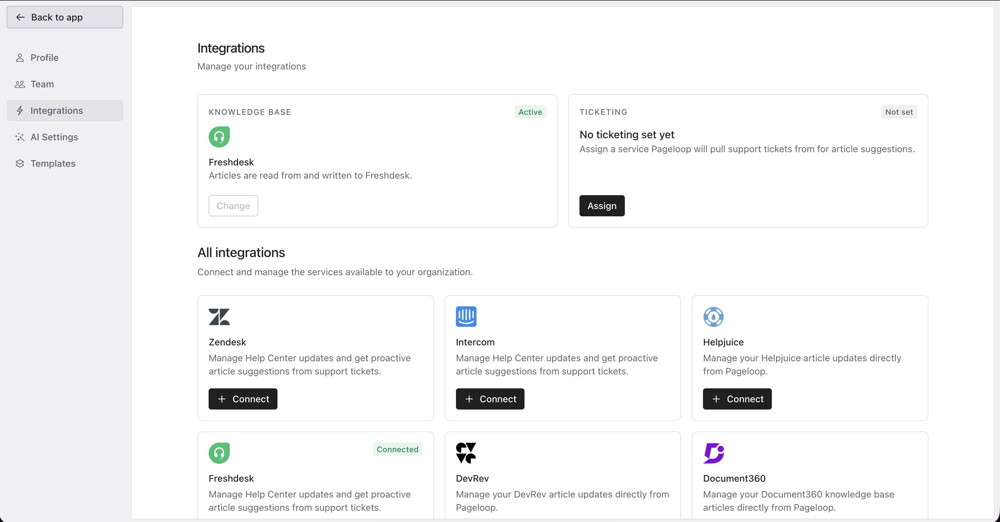
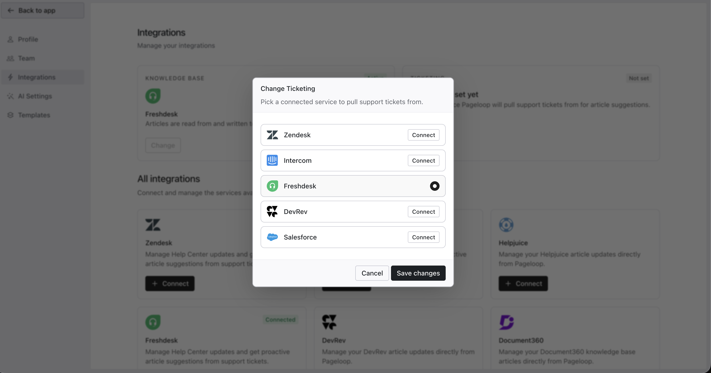
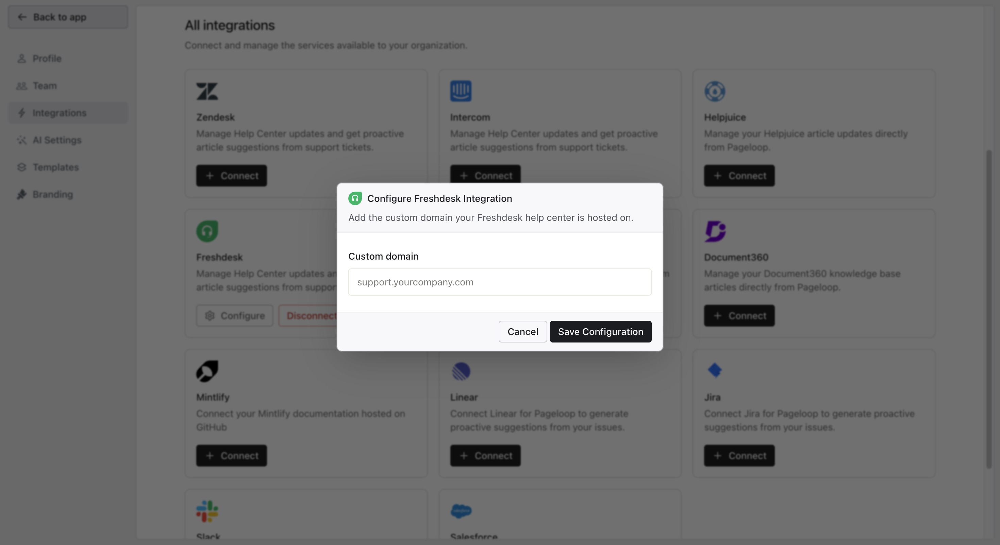

Pageloop integrates with your Freshdesk Help Center to help you identify outdated content and publish documentation without leaving the app.

# Before You Connect

Before starting, ensure you have:

- A Freshdesk account with help center access.

- Your Freshdesk subdomain, found in your Freshdesk URL before `.freshdesk.com`.

- Your Freshdesk API key, found by opening your Freshdesk profile settings, verifying the captcha, and locating the key on the right side.

# Connect Freshdesk

1. To begin the setup, start from your Pageloop Home dashboard.\
   ​

   <Frame>
     
   </Frame>

2. From the Pageloop dashboard, click the **Integrations** tab in the left sidebar.

   <Frame>
     
   </Frame>

3. Locate the Freshdesk card and click **Connect**.

   <Frame>
     
   </Frame>

4. Enter your Freshdesk Subdomain, found in your Freshdesk URL before `.freshdesk.com`

5. Paste your API Key by following the [instructions here](https://support.freshdesk.com/support/solutions/articles/225435-where-can-i-find-my-api-key-).

6. Click **Connect**. A pop-up confirms the connection, and the card displays a green Connected badge.

**Note:** Knowledge Base and Ticketing are assigned separately on the Integrations page. Use Freshdesk as the help center connection, and select Freshdesk as the Ticketing service if Pageloop should pull Freshdesk support tickets for article suggestions.

<Frame>
  
</Frame>

<Frame>
  
</Frame>

# Configure your Freshdesk custom domain

After Freshdesk is connected, configure the custom domain connected to your Freshdesk help center.

1. Go to **Settings > Integrations**.

2. Locate the connected Freshdesk integration card and click **Configure**.

<Frame>
  
</Frame>

1. Enter the domain connected to your Freshdesk help center in the **Custom domain** field. For example, `help.pageloop.ai`.

2. Click **Save Configuration** to apply the change, or click **Cancel** to close the modal without saving.

# Editing and Publishing Articles

Pageloop matches the Freshdesk editor experience, ensuring consistent formatting, layout, and styling.

You can use familiar rich text tools and upload images directly. The maximum file size is 10MB per image. Supported formats include JPEG, PNG, GIF, and WEBP.

# Disconnect Freshdesk

If you need to disconnect, go to the Integrations section and select the disconnect option. Disconnecting removes the connection but does not modify or delete your published articles.

# Next Steps

Your Freshdesk account is now connected. Explore the [Updates section](https://help.pageloop.ai/en/articles/13654507-find-updates-for-your-articles) to start reviewing AI-generated suggestions for your stale articles.

---

# Frequently Asked Questions

## Where do I find my Freshdesk API key?

Your Freshdesk API key is available in your Freshdesk account. Log in to Freshdesk, click on your profile picture in the top right corner, and select **Profile Settings**. Your API key is displayed on the right side of the profile page. Copy it and paste it into the Pageloop connection dialog.

## What is my Freshdesk subdomain?

Your Freshdesk subdomain is the first part of your Freshdesk URL. For example, if you access Freshdesk at **_https\://acme.freshdesk.com_**, your subdomain is _acme_. Enter only the subdomain in the connection dialog, not the full URL.

## What is the difference between my Freshdesk subdomain and custom domain?

Your Freshdesk subdomain connects Pageloop to Freshdesk. Your custom domain is the domain connected to your Freshdesk help center, such as `help.pageloop.ai`. Configure it from the connected Freshdesk card in **Settings > Integrations**.

## Why is the connection failing?

If the Freshdesk connection fails, check the following:

- Make sure your **subdomain** is spelled correctly and does not include _.freshdesk.com_ or _https\://_.

- Verify that your **API key** is correct and has not been regenerated since you copied it.

- Confirm that your Freshdesk account has the Solutions (Help Center) feature enabled.

- Ensure you have an active internet connection and try again.

## Can I connect both Freshdesk and another Help Center at the same time?

No. Pageloop supports connecting one Help Center at a time. If you need to switch from Freshdesk to another platform (or vice versa), disconnect your current Help Center first, then connect the new one from **Settings > Integrations**.

## Why do I not see the Integrations page?

Only Pageloop admin users can access the Integrations page and manage Help Center connections. If you do not see the Integrations option in Settings, ask your team's Pageloop admin to set up the Freshdesk connection or to change your role to admin.

## Will the folders on my Freshdesk Help Center show on Pageloop?

Yes, when you either Create Article or Update Articles, you will be shown the Categories and Folders that are set up on your Freshdesk Help Center.
