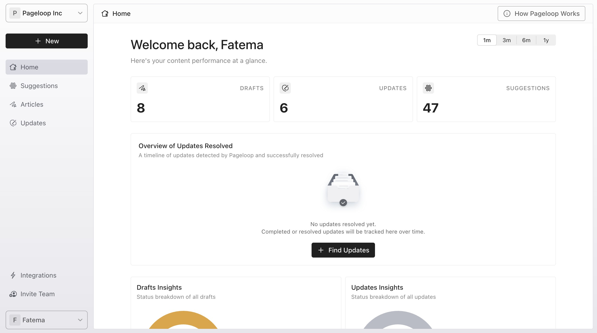
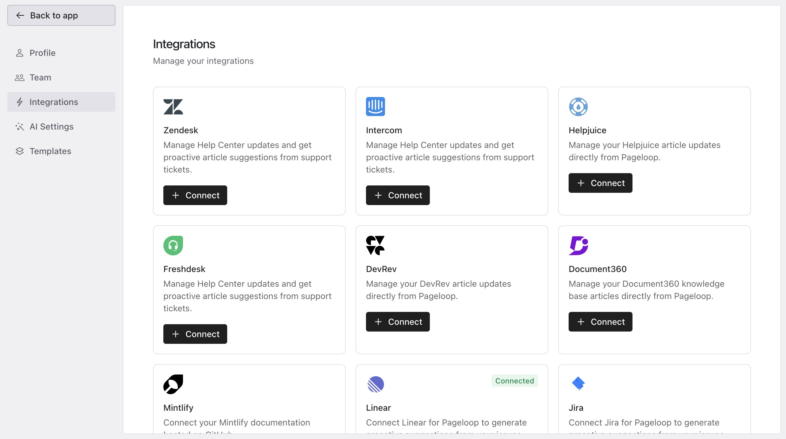
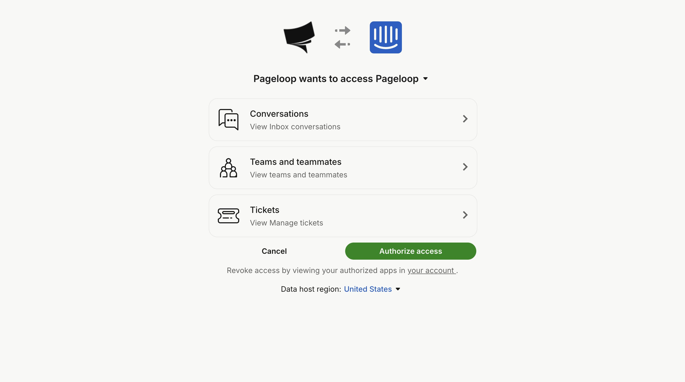
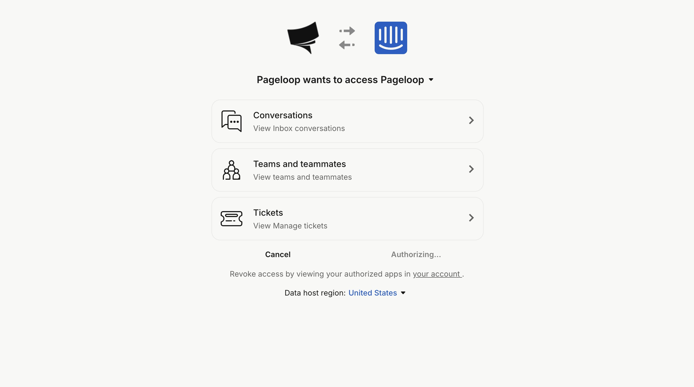
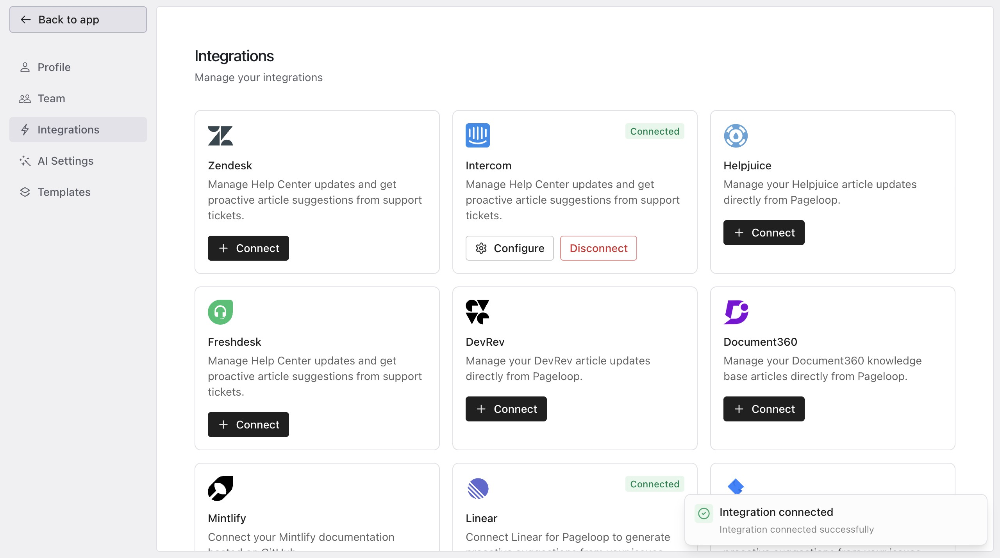

Pageloop integrates with your Intercom Help Center to help you identify outdated content and publish documentation without leaving the app.

# Before You Connect

Ensure you have the following before connecting Intercom:

- An Intercom account with admin access.

- Permission to authorize third-party applications in your Intercom workspace.

- An active Intercom Help Center with at least one collection or article.

- A Pageloop Admin role. If you are a member, ask your team admin to connect the integration from the [Settings page](https://help.pageloop.ai/en/articles/14071321-managing-your-pageloop-settings).

<Callout type="warning">
  **Note:** Pageloop supports only one help center integration at a time. If you have another integration connected, such as Zendesk or Freshdesk, you must disconnect it first.
</Callout>

# Integration Capabilities

Once connected, Pageloop can:

- **Read existing articles:** Imports articles to scan for outdated information and inconsistencies.

- **Write and publish new articles:** Publish directly to Intercom. Selecting a collection publishes it live; otherwise, it saves as a draft.

- **Suggest updates:** Uses synced articles to identify needed changes.

- **Analyze support conversations and tickets:** Reads interactions where an AI agent escalated to a human to provide [proactive suggestions](https://help.pageloop.ai/en/articles/14071191-set-up-slack-for-proactive-suggestions).

# Connect Intercom

Follow these steps to set up the integration:

1. To begin the setup, start from your Pageloop Home dashboard.

   <Frame>
     
   </Frame>

2. Navigate to the settings by clicking on **Integrations** in the left-hand sidebar menu. On the Integrations page, locate the **Intercom** card and click the **Connect** button.

   <Frame>
     
   </Frame>

3. You will be redirected to the Intercom authorization page where Pageloop will request access to your workspace.

   <Frame>
     
   </Frame>

4. Click the **Authorize access** button to confirm the integration with Pageloop.

   <Frame>
     
   </Frame>

5. You will be redirected back to the Pageloop Integrations page. A green **Connected** badge will now appear on the Intercom card, and a success notification will confirm the integration.

   <Frame>
     
   </Frame>

# Permissions Pageloop Requests

Pageloop only asks for permissions needed to manage your Help Center and provide suggestions:

- **Read and write articles:** To import articles for scanning and publish updates directly.

- **Read admins:** To list workspace admins, letting you assign authors before publishing.

- **Read conversations:** To analyze support interactions and identify documentation gaps.

- **Read tickets:** To ensure a complete picture of customer support interactions.

# The Pageloop Editor for Intercom

Pageloop uses the same text editor as Intercom. What you see in the Pageloop editor matches your published article. The editor automatically applies Intercom-compatible styling to maintain a consistent look.

# Disconnect Intercom

If you need to disconnect, go to the Integrations section and select the disconnect option. Disconnecting removes the connection but does not modify or delete your published articles.

# Next Steps

Now that your Intercom Help Center is connected, you can start improving your documentation. Learn how to [publish new articles to your Help Center](https://help.pageloop.ai/en/articles/13654534-publish-new-articles-to-your-help-center) or review your [proactive suggestions](https://help.pageloop.ai/en/articles/14071242-working-with-proactive-suggestions).

---

# Frequently Asked Questions

## Why did my Intercom connection fail?

Connection failures typically occur if you do not have admin permissions in your Intercom workspace, or if you denied access during the authorization step. Make sure you are logged into the correct Intercom account and that you click Authorize when prompted. If the problem persists, try disconnecting any existing Help Center integration first, then reconnect Intercom.

## Can I connect more than one Help Center at the same time?

No. Pageloop supports only one Help Center connection at a time. If you want to switch from another platform (such as Freshdesk or Zendesk) to Intercom, you need to disconnect the current Help Center integration first, then connect Intercom.

## My articles are not appearing in Pageloop after connecting. What should I do?

Pageloop does not display your Intercom article within the app. Once you connect your Intercom account, your articles will be used for generating Suggestions, publishing to your Intercom Help Center or retrieving articles when you run an update. If you want to view a specific article, you may do so from your Intercom Help Center directly.

## Does connecting Intercom as a Help Center also set up conversation suggestions?

Yes. The same Intercom connection is used for both Help Center article management and [conversation-based suggestions](https://help.pageloop.ai/en/articles/14071242-working-with-proactive-suggestions). Once your Intercom account is connected, Pageloop can analyze support conversations and tickets where the AI agent escalated to a human, and proactively suggest documentation improvements.
