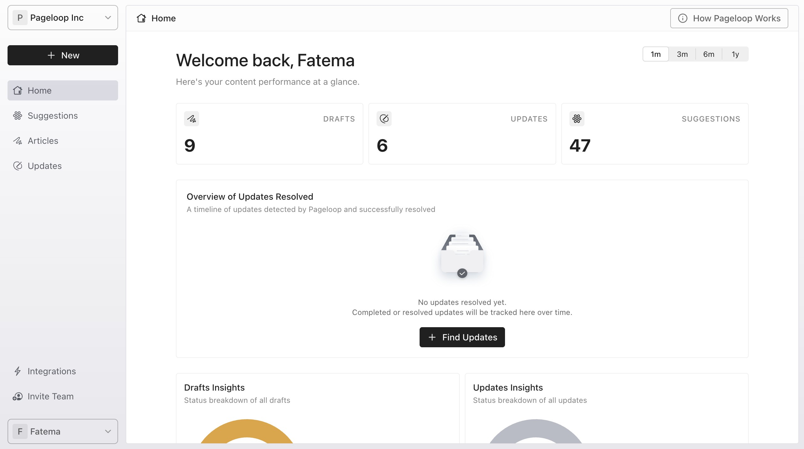
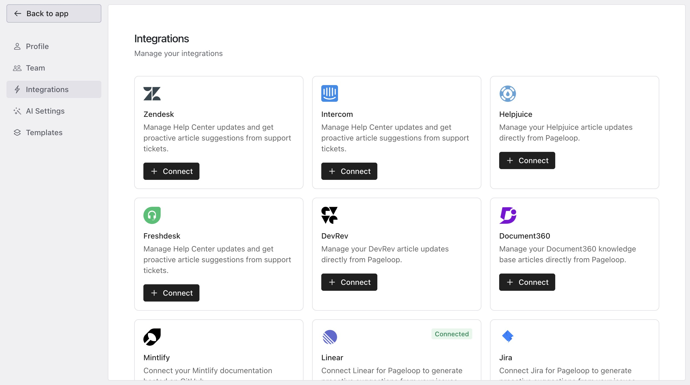
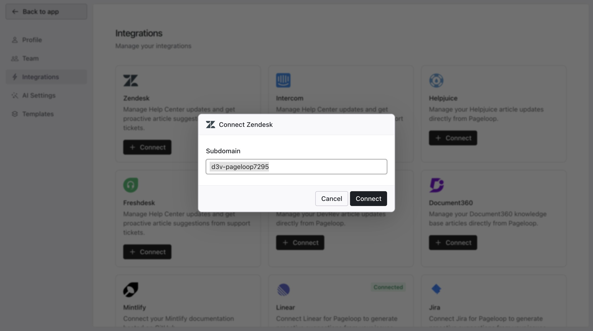
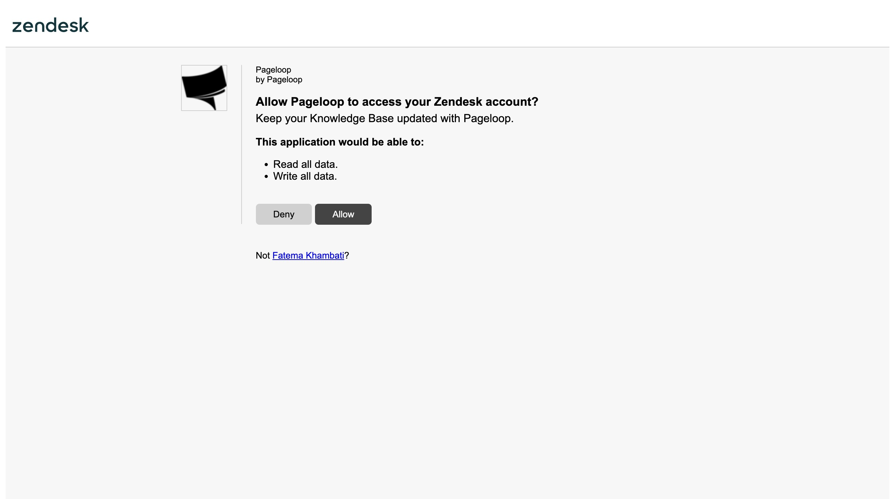
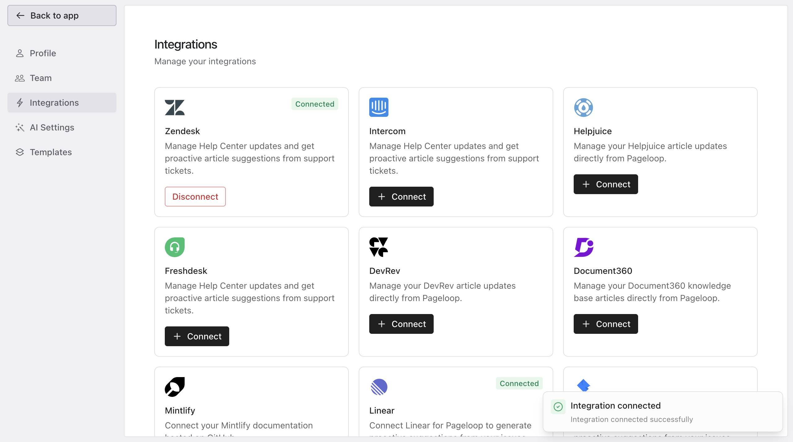

Pageloop integrates with your Zendesk Help Center to help you identify outdated content and publish documentation without leaving the app.

# Before You Connect

Before setting up the integration, ensure you meet the following requirements:

- You have a Zendesk account with Admin access.

- You have an active Zendesk Help Center with at least one published article.

- You have a Pageloop Admin role.

# Connect Your Zendesk Account

Follow these steps to integrate Pageloop with Zendesk:

1. From your Pageloop Home dashboard, click **Integrations** in the left sidebar.

   <Frame>
     
   </Frame>

2. On the Integrations page, locate the Zendesk card and click **+ Connect**.

   <Frame>
     
   </Frame>

3. A modal appears asking for your Zendesk subdomain. The [Zendesk subdomain](https://support.zendesk.com/hc/en-us/articles/4409381383578-Where-can-I-find-my-Zendesk-subdomain) is what shows on your URL on your Zendesk account before _.zendesk.com_

   <Frame>
     
   </Frame>

4. Once you click on **Connect** you will be redirected to a Zendesk authorization page. Review the requested access, then click **Allow** to approve the permissions required for the Pageloop help center integration.

   <Frame>
     
   </Frame>

5. Once completed, you are redirected back to Pageloop.

   _Note:_ The permissions shown on the Zendesk authorization page are the specific scopes Pageloop requires to connect your help center. The exact list may vary from older screenshots, so rely on the permissions displayed during authorization.

   The Zendesk card displays a green Connected badge.

   <Frame>
     
   </Frame>

# Publishing and Managing Articles

When you create or edit an article in Pageloop, the editor automatically applies Zendesk-compatible styling. You can publish articles live by selecting a specific collection or section. If you do not select a destination, the article saves as a draft to review later.

# Disconnecting Zendesk

If you need to switch to a different Help Center platform, you can disconnect Zendesk at any time. Go to **Settings >** **Integrations** and click **Disconnect** on the Zendesk card. Disconnecting removes Pageloop's access, but your existing Zendesk articles remain unchanged.

# Next Steps

Now that your help center is connected, explore your dashboard to review proactive suggestions. For more details on content generation, see our guide on using the [Refine and Run](https://help.pageloop.ai/en/articles/13654507-find-updates-for-your-articles) feature to update your published articles.
