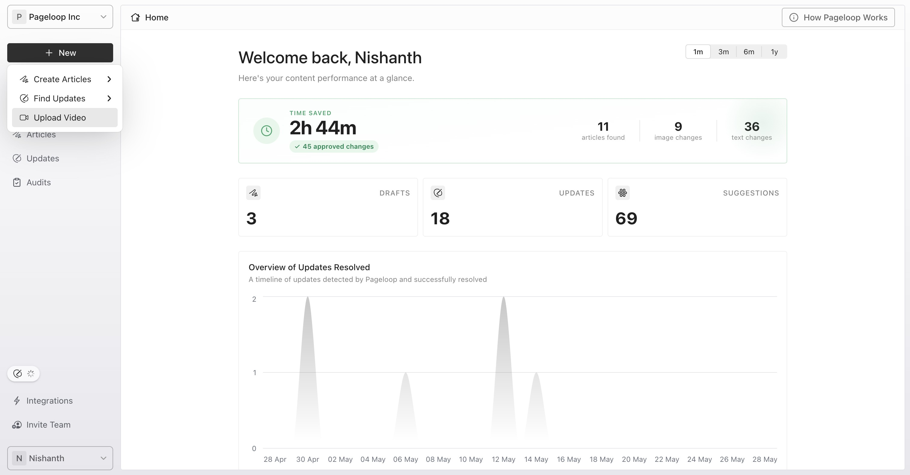
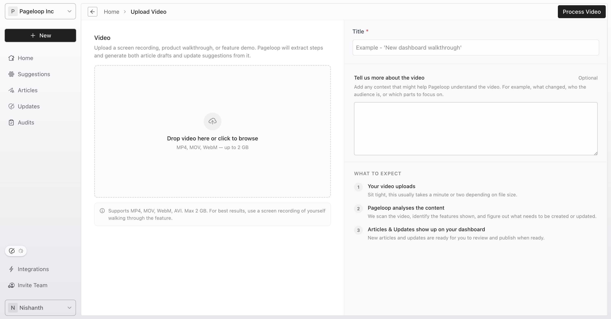

Pageloop allows you to transform video recordings directly into accurate documentation. Instead of manually drafting articles or tracking down product updates, you can upload a single screen recording, product walkthrough, feature demo, or onboarding session. Pageloop analyzes the recording to identify documentation opportunities, automatically suggesting new articles or updates to existing ones.

Here are the steps to upload and process your video:

1. Navigate to the Pageloop Home screen and click the **+ New** button in the top-left corner of the sidebar.

   <Frame>
     
   </Frame>

2. Select **Upload Video** from the dropdown menu.

   <Frame>
     
   </Frame>

3. Drag and drop your video file or click to browse. Pageloop supports MP4, MOV, WebM, and AVI formats with a maximum file size of 2 GB.

4. Enter a descriptive name in the required **Title** field.

5. Provide optional context in the **Tell us more about the video** field. You can include details like the target audience, areas to focus on, or specific product changes shown in the recording.

6. Click **Process Video** to begin the analysis.

# Reviewing Generated Work

Depending on the video content, you may see new articles created for you under the **Articles tab**, and/or updates to existing articles under the **Updates&#x20;**&#x74;ab. Uploaded video updates go ahead and directly create updates to your documentation, unlike [Proactive Suggestions](https://help.pageloop.ai/en/articles/14071242-working-with-proactive-suggestions).

# Troubleshooting

If you encounter issues while uploading or processing videos, check the following:

- **Unsupported File Format:** Ensure your video is in MP4, MOV, WebM, or AVI format.

- **File Size Limit:** Confirm that your video file does not exceed the 2 GB limit.

- **Delayed Work Items:** Video analysis takes time. If you do not see new suggestions immediately, allow a few minutes for the background processing to complete.

- **No Suggestions Generated:** If the video does not contain clear documentation opportunities or product changes, Pageloop may not generate any changes to your documentation. Try adding more detail in the optional notes field to guide the AI.

# Next Steps

Now that you know how to generate documentation from videos, you can explore other ways to keep your knowledge base up to date. Learn how to [Set Up Linear for Proactive Suggestions](https://help.pageloop.ai/en/articles/14734582-set-up-linear-for-proactive-suggestions) or see how to [Run Audits to Fix Broken Links and Conflicts](https://help.pageloop.ai/en/articles/14106939-run-audits-to-fix-broken-links-and-conflicts).
