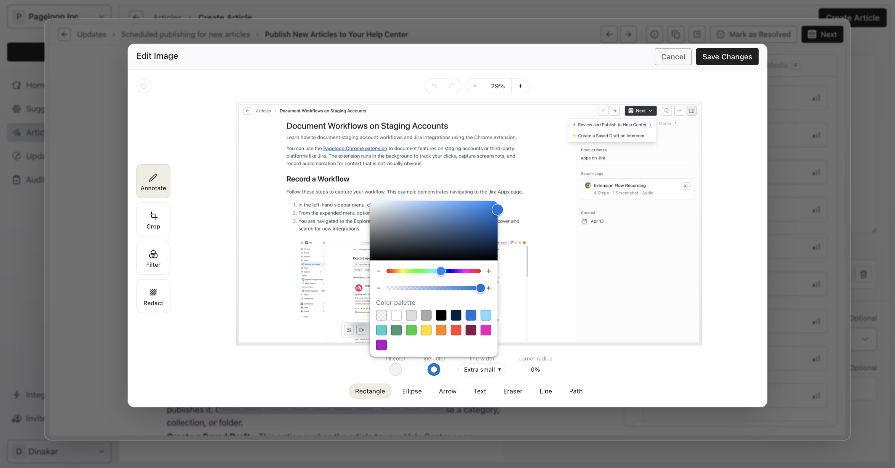
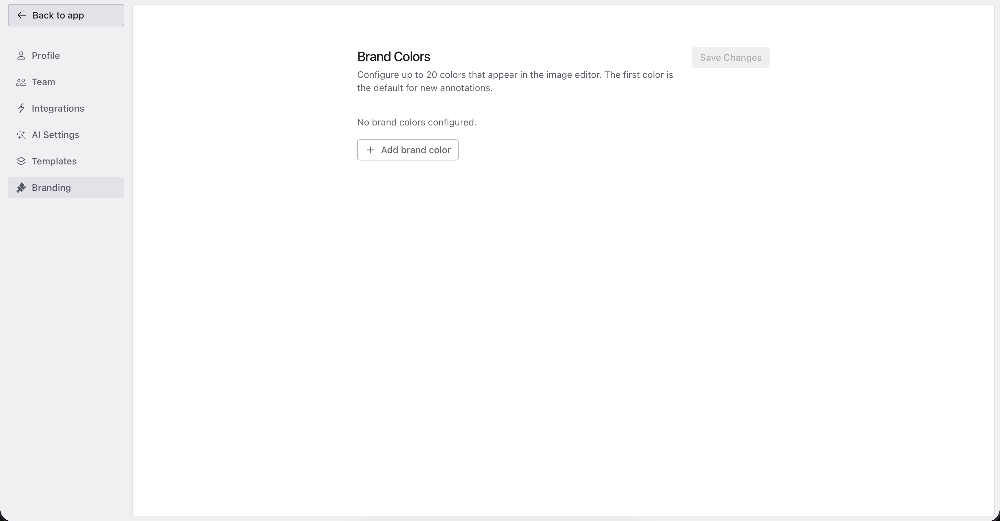
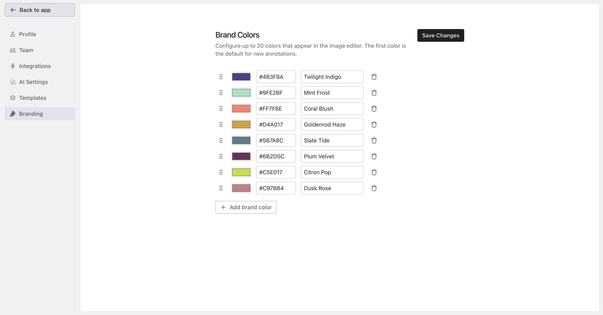
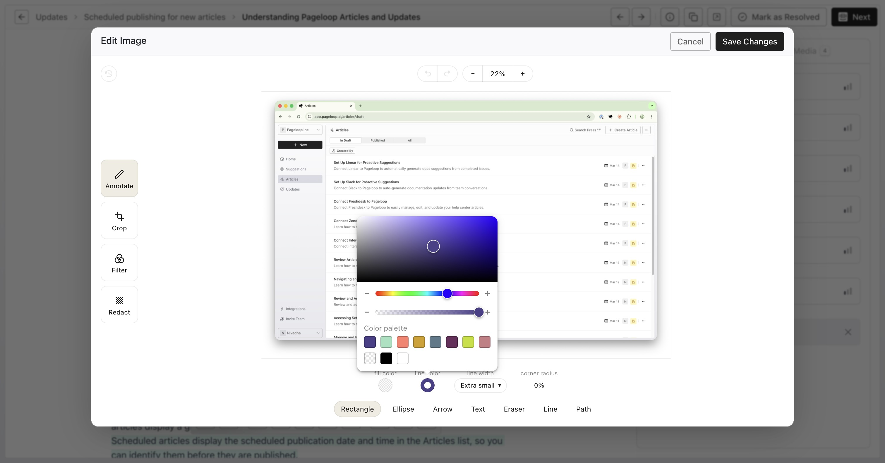

By default, the image annotation tool in Pageloop provides a standard color palette for adding shapes and text to your screenshots.

<Frame>
  
</Frame>

You can customize these colors to match your company branding.

# Configure Brand Colors

Follow these steps to set up your custom color palette:

1. Click on your workspace name in the top left corner and select **Settings**. From the left sidebar, navigate to the **Branding** tab.

   <Frame>
     
   </Frame>

2. In the Brand Colors section, configure up to 20 custom colors. Add new colors, enter their hex codes, and provide labels. The first color in the list automatically becomes the default for new annotations. Click **Save Changes**.

   <Frame>
     
   </Frame>

3. Return to the app and open any article or update. Click the **Edit Image** button on an image to open the editor. Select the **Annotate** tool and open the color picker to use your custom brand colors.

   <Frame>
     
   </Frame>

# Next Steps

Now that you have configured your brand colors, learn more about how to [annotate and edit screenshots](https://help.pageloop.ai/en/articles/13654531-annotate-and-edit-screenshots) to enhance your documentation. You can also explore how to [publish new articles to your Help Center](https://help.pageloop.ai/en/articles/13654534-publish-new-articles-to-your-help-center).
