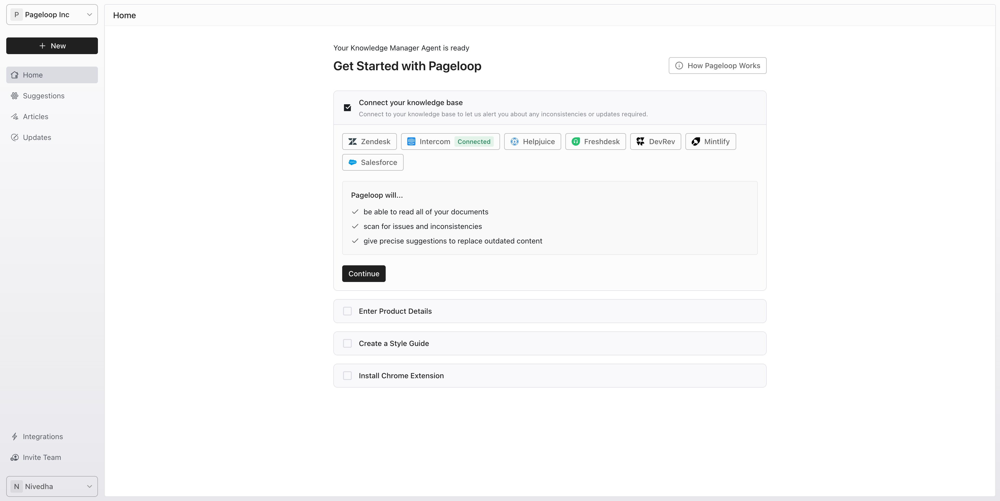
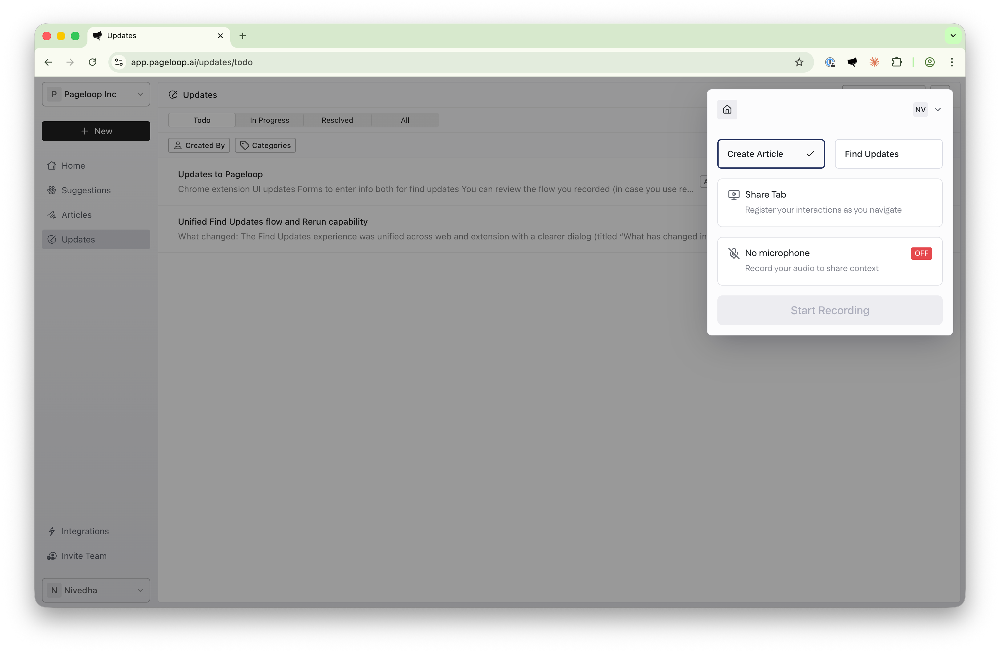
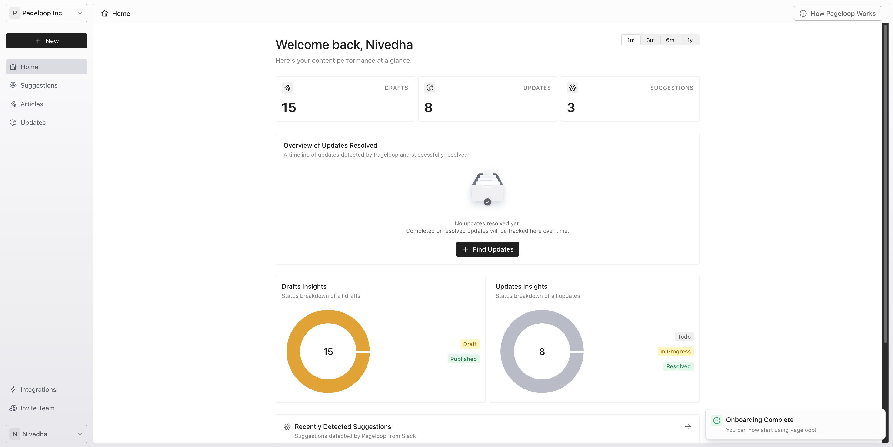
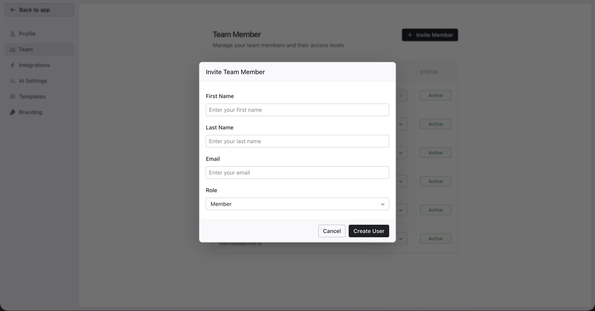

Pageloop is an AI-powered knowledge management tool that helps you keep your Help Center up to date. It streamlines your documentation process by allowing you to create new articles from scratch, automatically detect when existing content needs updating, and receive proactive suggestions based on your team's activity or direct @Pageloop mentions in supported connected sources.

# Set Up Your Account

When you log in to Pageloop for the first time, an onboarding flow guides you through the initial configuration to get your workspace ready.

1. **Connect your Help Center.** Select your current knowledge base provider (such as [Intercom](https://help.pageloop.ai/en/articles/14071358-connect-intercom-as-your-help-center), [Zendesk](https://help.pageloop.ai/en/articles/14071483-connect-zendesk-as-your-help-center), or [Freshdesk](https://help.pageloop.ai/en/articles/14071393-connect-freshdesk-as-your-help-center)) to let Pageloop access your existing articles.

   <Frame>
     
   </Frame>

2. **Enter product details.** Provide a description of what your product does, its main features, and your target customers. This context is crucial for Pageloop's AI to generate accurate and relevant suggestions. Click **Save & Continue**

3. **Configure your style guide.** Define your brand's writing tone and list specific product terms (like your product name) to ensure consistent capitalization and formatting. If you don't have a style guide, Pageloop defaults to the Google Developer Style Guide.

4. **Install the Chrome extension.** The [Pageloop Chrome Extension](https://help.pageloop.ai/en/articles/13654464-using-the-pageloop-chrome-extension) allows you to record workflows and capture screenshots, giving the AI the context it needs to document features accurately.

   <Frame>
     
   </Frame>

5. Click the install button, then click **Finish** to complete onboarding.

# Navigate the Dashboard

After setup, you will land on the Home dashboard. This screen provides analytics on your content performance, including drafts, updates, and suggestions.

<Frame>
  
</Frame>

The sidebar navigation gives you access to the main sections of the app:

- **Home:** Your main dashboard.

- **Suggestions:** Proactive recommendations from connected sources like [Slack](connect-slack-suggestions), Linear, and Jira, and from support tickets or chats from our help desk integrations.

- **Articles:** Create and manage new documentation.

- **Updates:** Review and apply changes to existing articles.

- **Settings:** Manage integrations, team members, AI configurations, templates, and branding options such as brand colors for image annotations.

# Invite Your Team

Collaborate with your colleagues by inviting them to your workspace. Click **Invite Team** in the bottom-left corner of the sidebar.

Enter your team member's name and email address, assign them a role, and click **Create User** to send the invitation.

<Frame>
  
</Frame>

# Core Workflows

Pageloop supports three main ways to manage your documentation:

- **Create Articles:** Generate new content from product notes or recorded flows. See [Create Articles Using Pageloop](https://help.pageloop.ai/en/articles/13654529-create-articles-using-pageloop).

- **Find Updates:** Scan your Help Center for outdated articles based on new release notes. See [Find Updates for Your Articles](https://help.pageloop.ai/en/articles/13654507-find-updates-for-your-articles).

- **Proactive Suggestions:** Receive automatic recommendations to create or update content based on support tickets and team conversations. Suggestions can be triggered automatically from connected activity or directly through **@Pageloop** mentions in supported sources.

# Next Steps

Now that your account is set up, you are ready to start improving your documentation:

- [Create your first article](https://help.pageloop.ai/en/articles/13654529-create-articles-using-pageloop)

- [Find updates for existing content](https://help.pageloop.ai/en/articles/13654507-find-updates-for-your-articles)

- [Connect additional integrations](https://help.pageloop.ai/en/articles/14071321-managing-your-pageloop-settings)
