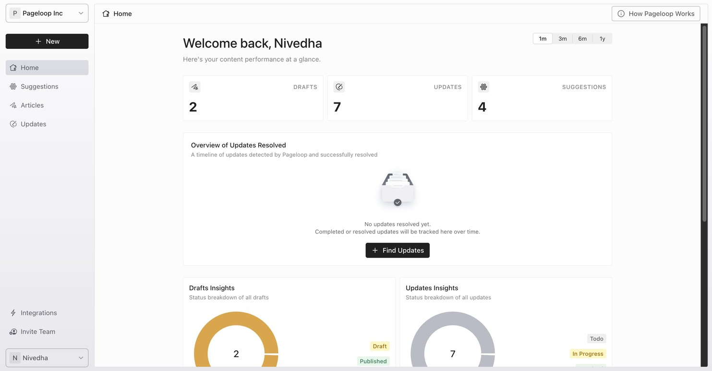
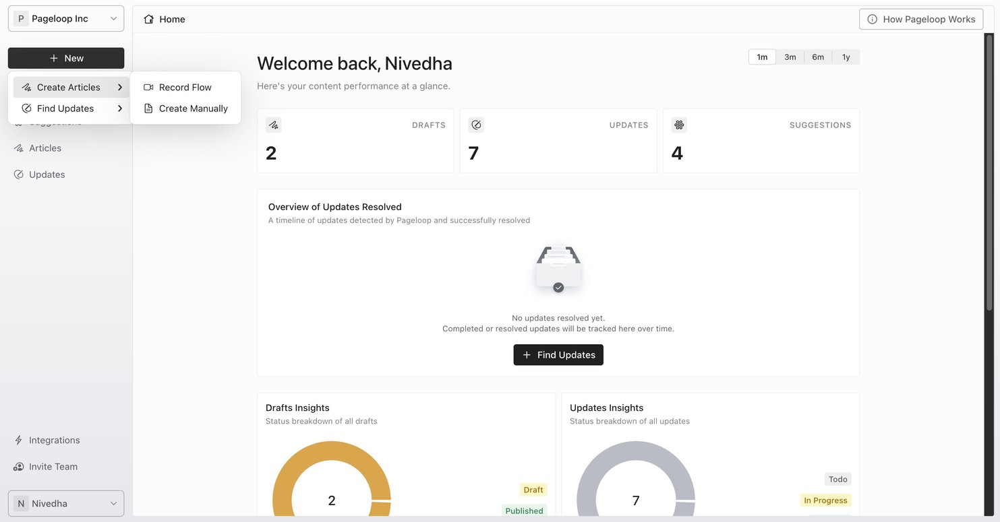
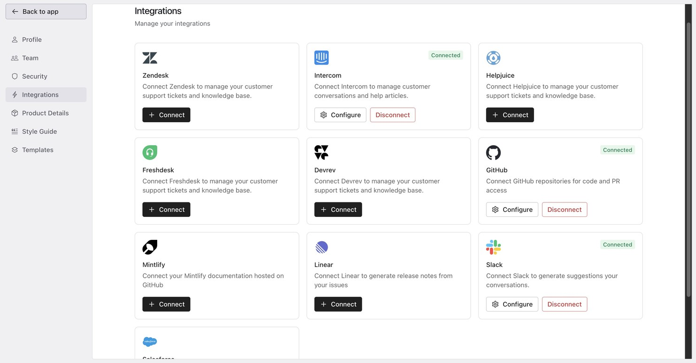

Pageloop helps you keep your Help Center up to date. An up-to-date Help Center is essential for providing effective AI-powered support and for ensuring that every visitor to your Help Center sees accurate, current information.

With Pageloop, you can create new articles from scratch, automatically detect when existing articles need updating after product changes, and receive proactive suggestions from your connected data sources.

Pageloop integrates with popular knowledge base platforms, including [Intercom](connect-intercom), [Freshdesk](connect-freshdesk), Zendesk, HelpJuice, and more coming soon. It also connects to your team's communication and project management tools like [Slack](connect-slack-suggestions) and [Linear](connect-linear-suggestions), with Jira and Teams integrations coming soon.

## Home Dashboard

When you log in, you come to the Home dashboard. This page gives you an at-a-glance view of your content performance, including counts of your Drafts, Updates, and Suggestions, along with insights into your article and update activity over time.

<Frame>
  
</Frame>

## Navigate the Pageloop Interface

The Pageloop sidebar is your primary way to move around the application. Here is what each section does:

- **Home** - Your main dashboard with content performance stats and an overview of resolved updates.

- **Suggestions** - View proactive recommendations from your connected data sources (Slack, Linear, and support conversations). Pageloop monitors these sources and suggests new articles to create or existing articles to update.

- **Articles** - View and manage all the articles you have created in Pageloop. Filter by status: Draft or Published.

- **Updates** - View and manage update suggestions for your existing Help Center articles. Filter by status: To-Do, In-Progress, or Resolved.

At the bottom of the sidebar, you will find quick links to **Integrations** and **Invite Team**, which take you directly to those sections of your Settings page.

## Create Articles and Find Updates

The **+ New** button in the sidebar is your starting point for the two core Pageloop workflows:

- **Create Articles** - Start a new article from product notes, or record a flow with the Chrome extension to generate step-by-step documentation with screenshots.

- **Find Updates** - Provide release notes about a product change and let Pageloop scan your Help Center for articles that need updating.

Each option gives you two choices: **Record Flow** (which uses the [Pageloop Chrome Extension](using-chrome-extension) to capture your screen actions) or a manual option (where you enter your notes and images directly in the web app). For Create Articles, the manual option is called **Create Manually**. For Find Updates, it is called **Manual Update**.

<Frame>
  
</Frame>

## Set Up Your Account

Before you start creating content, there are a few important setup steps to complete. You can access all of these from **Settings** by clicking on your name at the bottom left of the sidebar and selecting **Settings**.

### Connect Your Help Center

Pageloop needs to connect to your Help Center platform so it can read your existing articles and push new content. Pageloop supports [Intercom](https://connect-intercom), [Freshdesk](https://connect-freshdesk), Zendesk, and HelpJuice as Help Center integrations, with more coming soon. Navigate to **Settings** > **Integrations** to connect your platform.

<Frame>
  
</Frame>

### Configure Your Product Details

Telling Pageloop about your product is an important part of setup. When Pageloop understands what your product does, it generates better, more contextual documentation. Navigate to **Settings** > **Product Details** to configure this.

In the Product Details text field, describe:

- What your product does

- What its main features are

- How it helps people

- How users typically use the product

The more detail you provide, the more accurate and relevant Pageloop's generated content will be. Pageloop uses this context to understand your product when creating articles and suggesting updates. When you are done, click **Save**.

### Set Up Your Style Guide

Your style guide helps Pageloop write content that matches your brand voice and maintains consistency across all your documentation. Navigate to **Settings** > **Style Guide** to configure this.

The Pageloop Style Guide page has two fields:

- **Writing Tone** - This field displays the tone Pageloop uses when generating content. If you do not have a custom writing tone configured, Pageloop uses a good default based on the Google Developers style guide. To customize your writing tone, contact the Pageloop team at [hello@pageloop.ai](mailto:hello@pageloop.ai).

- **Product-Specific Terms** - List words specific to your product that you want Pageloop to recognize and not flag during jargon checks. For example, your product name, technical terms, or acronyms that are standard in your domain. You can edit this field directly and click **Save**.

Pageloop will analyze your existing content style, suggest improvements for consistency, and maintain your style guide across all documents it generates.

## Create Your First Article

Once you have completed setup, you are ready to create your first article in Pageloop. Here is a quick walkthrough:

1. Click the **+ New** button in the sidebar.

2. Select **Create Articles** > **Create Manually**.

3. On the article creation page, enter your product notes, PRD text, or a description of the feature you want to document.

4. Optionally, upload images (up to 10) to provide visual context for the article.

5. Optionally, select an [article template](manage-article-templates) for consistent formatting.

6. Provide a title for your article, or leave it blank and let Pageloop generate one for you.

7. Click **Create Article** to generate your article. Pageloop will use your product notes, existing documentation, and product details to create a complete article draft.

Pageloop uses the same editor as your Help Center, so what you see in the Pageloop editor is what your article will look like when published. You can also optionally record a flow using the [Pageloop Chrome Extension](using-chrome-extension) to give Pageloop more context and include screenshots in your generated article.

## Next Steps

Now that you are set up and have created your first article, here are the recommended next steps to get the most out of Pageloop:

1. **Install the Chrome Extension** -- The [Pageloop Chrome Extension](using-chrome-extension) lets you record flows directly in your product to capture screenshots and step-by-step actions, making article creation faster and more visual.

2. **Publish your article** -- Once you have reviewed and edited your article, [publish it to your Help Center](push-article-to-help-center).

3. **Find updates for existing articles** -- After your next product change, use [Find Updates](find-updates-manually) to scan your Help Center for articles that need updating.

4. **Set up proactive suggestions** -- Connect data sources like [Slack](connect-slack-suggestions) or [Linear](connect-linear-suggestions) so Pageloop can automatically recommend documentation changes based on your team's conversations and completed work.

5. **Invite your team** -- Add team members from **Settings** > **Team** so your whole team can collaborate on documentation in Pageloop.

## Frequently Asked Questions

### What is Pageloop and what can I do with it?

Pageloop is a documentation tool that helps you create new Help Center articles and keep existing ones up to date. You can generate articles from product notes or recorded flows, scan your Help Center for outdated content after product changes, and receive proactive suggestions from connected data sources.

### What do I need to set up first?

Start by connecting your Help Center platform (Intercom, Freshdesk, Zendesk, or HelpJuice) from **Settings** > **Integrations**. Then configure your product details at **Settings** > **Product Details** and your style guide at **Settings** > **Style Guide**.

### Where do I find different features in Pageloop?

Use the sidebar navigation: Home for your dashboard, Suggestions for proactive recommendations, Articles for your created articles, and Updates for pending changes to existing articles. The **+ New** button in the sidebar lets you create articles or find updates. Settings are accessible by clicking your name at the bottom of the sidebar.

### What product details should I provide and why?

Describe what your product does, its main features, how it helps people, and how users typically use it. Pageloop uses this information to generate more accurate, contextual documentation that is relevant to your product.

### How does my style guide affect generated content?

Your style guide controls the tone and terminology Pageloop uses when generating articles and suggesting updates. Pageloop analyzes your existing content style, suggests improvements for consistency, and maintains your defined style across all documents.

### What happens if I do not set up a style guide?

If you do not configure a custom writing tone, Pageloop uses a good default based on the Google Developers style guide. You can still add product-specific terms at any time. To customize the writing tone, contact support at [hello@pageloop.ai](mailto:hello@pageloop.ai).
