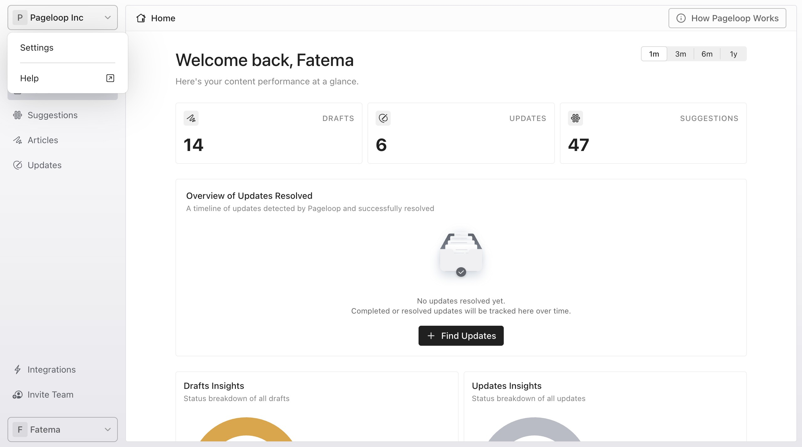
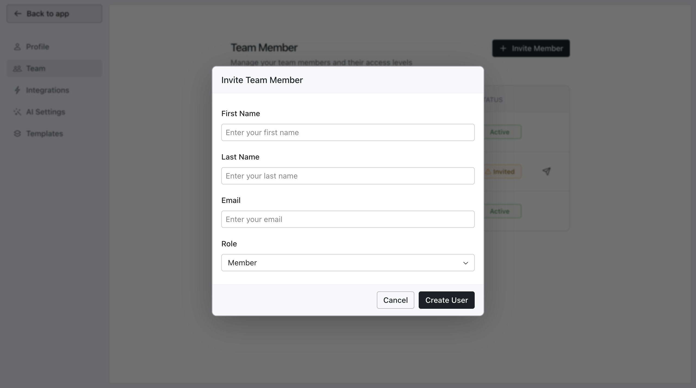
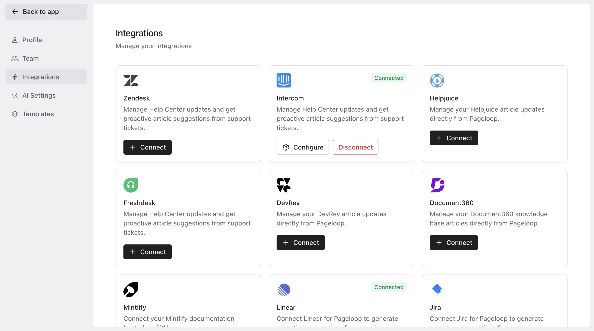
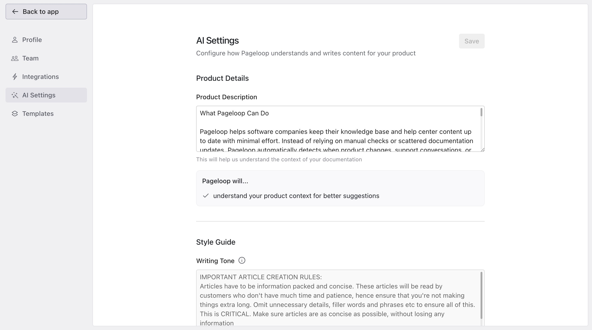
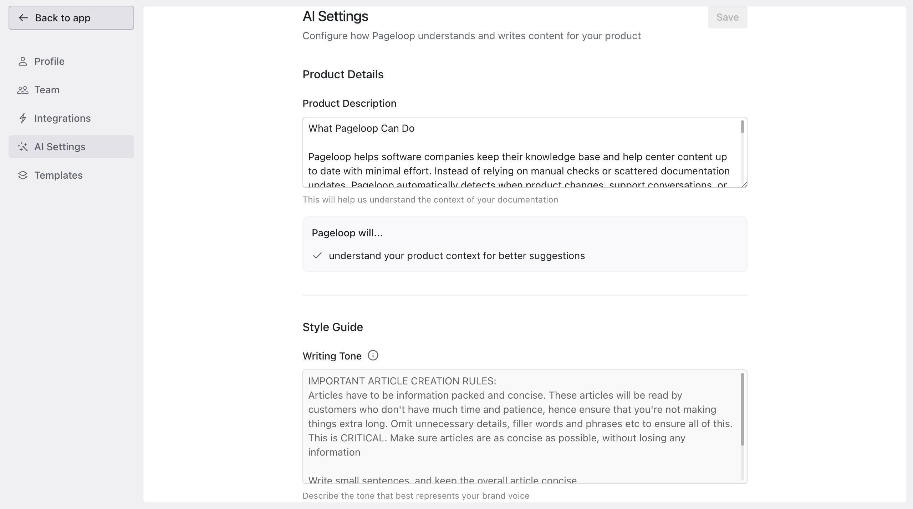
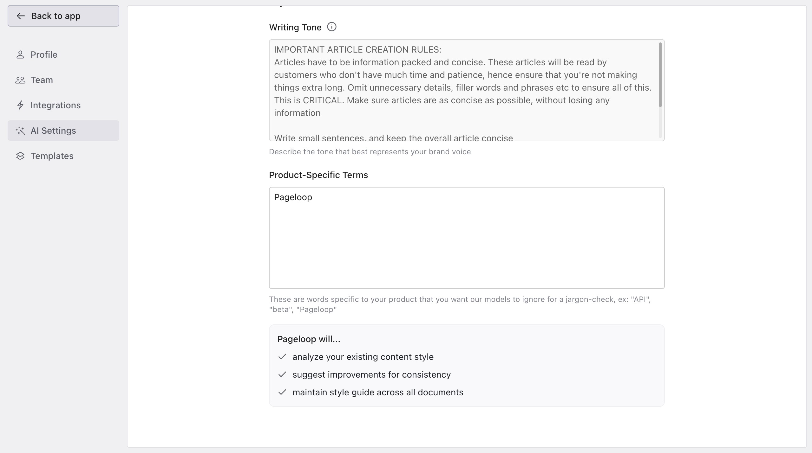
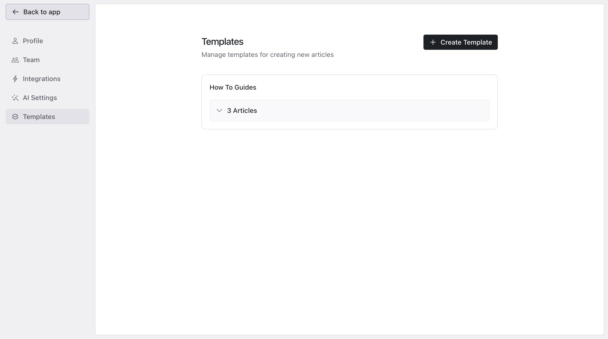

# Access Workspace Settings

To manage your workspace, click the workspace selector in the top left corner of the dashboard and select **Settings**. The settings page features its own dedicated sidebar for easy navigation.

<Frame>
  
</Frame>

# Profile Settings

Under the **Profile** section, you can update your personal account information, including your first name, last name, and email address.

# Team Settings

Click on **Invite Team** on the left navigation bar to manage your workspace members. The team table displays each member's Name, Role, and Status (Active, Invited, or Inactive).

1. Click **Invite Member** to add a new user to your workspace.

   <Frame>
     
   </Frame>

2. Enter their First Name, Last Name, Email, and assign a Role. The default role is Member, but you can change this to Admin.

3. To resend a pending invitation, click the send icon next to their entry. If an invite has been pending for over 24 hours, a warning icon appears indicating it may be stale.

To remove a team member entirely, contact support at [hello@pageloop.ai](mailto:hello@pageloop.ai). If we have a Slack channel with your team, you can post a message asking for team member removal.

# Integrations

The **Integrations** tab allows you to connect, disconnect, or configure external tools. Help Center integrations include [Zendesk](https://help.pageloop.ai/en/articles/14071483-connect-zendesk-as-your-help-center), [Intercom](https://help.pageloop.ai/en/articles/14071358-connect-intercom-as-your-help-center), and [Freshdesk](https://help.pageloop.ai/en/articles/14071393-connect-freshdesk-as-your-help-center). Other integrations include tools such as [Linear](https://help.pageloop.ai/en/articles/14734582-set-up-linear-for-proactive-suggestions) and [Slack](https://help.pageloop.ai/en/articles/14071191-set-up-slack-for-proactive-suggestions). Connecting a supported Help Center allows Pageloop to analyze support conversations and proactively suggest documentation updates. For more details, see [Working with Proactive Suggestions](https://help.pageloop.ai/en/articles/14071242-working-with-proactive-suggestions).

<Frame>
  
</Frame>

# AI Settings

Configure how Pageloop understands your product and writes your content in the **AI Settings** section.

- **Product Details:** Provide a comprehensive description of what your product does to help the AI understand your context.

  <Frame>
    
  </Frame>

- **Style Guide:** Define your brand's writing tone and specific content rules.

  <Frame>
    
  </Frame>

- **Product-Specific Terms:** Input custom jargon or acronyms to teach the AI to ignore these words during jargon checks.

  <Frame>
    
  </Frame>

# Templates

The **Templates** section allows you to manage and create standardized formats for your documentation.

You can read more about how to [Create and Manage Templates](https://help.pageloop.ai/en/articles/13654532-using-article-templates).

<Frame>
  
</Frame>

Once you finish configuring your workspace, click **Back to app** at the top of the sidebar to return to the main dashboard.

# Next Steps

Now that your workspace is configured, explore [getting started with Pageloop](https://help.pageloop.ai/en/articles/13701235-getting-started-with-pageloop) or learn more about [using article templates](https://help.pageloop.ai/en/articles/13654532-using-article-templates) to streamline your documentation workflow.

---

# Frequently Asked Questions

## Can I connect more than one Help Center at the same time?

No. Pageloop allows only one Help Center integration at a time. Zendesk, Intercom, and Freshdesk are mutually exclusive Help Center options. To switch to a different Help Center platform, disconnect your current integration first from **Settings** > **Integrations**, then connect the new one.

## Can I connect multiple data sources at the same time?

Yes. You can connect Slack, Linear, GitHub, and support conversations simultaneously. Each data source monitors your tools independently and generates its own suggestions.

## Who can manage integrations and invite team members?

Only users with the Admin role can access the Integrations and Team sections in Pageloop Settings. Members can view and use connected integrations (for example, pushing articles to a connected Help Center) but cannot connect, disconnect, or configure integrations. Members also cannot invite or manage other team members.

## Do all team members see the same data?

Yes. All team members in a Pageloop workspace share the same data, including articles, updates, suggestions, integrations, and settings. Any changes made by one member are visible to the entire team.

## What happens when I invite a new member?

The new member receives an email invitation. Once they accept and sign in, they will have access to all shared workspace data in Pageloop based on the role you assigned (Admin or Member).

## How do I resend an invitation?

On the Team page, find the member whose status is "Invited" and click the send icon next to their entry to resend the invitation email. If the invitation has been pending for more than 24 hours, a warning icon appears next to the member to indicate the invite may be stale.

## Is the GitHub integration fully available?

The GitHub integration in Pageloop is currently in beta. Reach out to us on [hello@pageloop.ai](mailto:hello@pageloop.ai) if you would like access to this feature.
