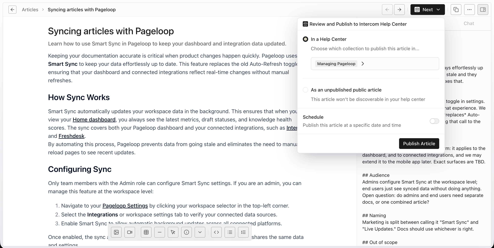

After [creating an article in Pageloop](https://help.pageloop.ai/en/articles/13654529-create-articles-using-pageloop), you can publish your draft directly to your Intercom Help Center.

Follow these steps to publish a draft article:

1. Navigate to the **Articles** tab in the left-hand navigation menu of Pageloop to view your draft articles.

   <Frame>
     
   </Frame>

2. Click on a specific draft article from the list to open it in the editor.

   <Frame>
     
   </Frame>

3. Click the **Next** button in the top right corner of the screen, and select **Review and Publish to Intercom Help Center** from the dropdown menu.

   <Frame>
     
   </Frame>

# Next Steps

Now that your article is published, you can learn how to [review and apply article updates](https://help.pageloop.ai/en/articles/13654536-review-and-apply-article-updates) to keep your documentation accurate.
