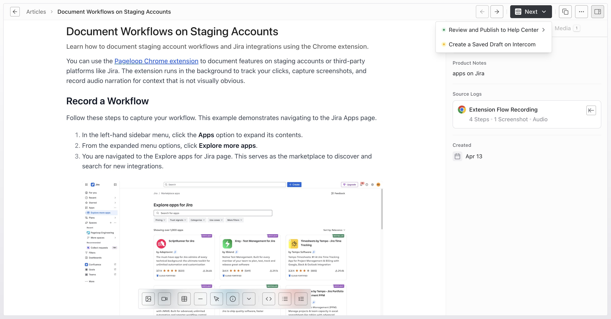
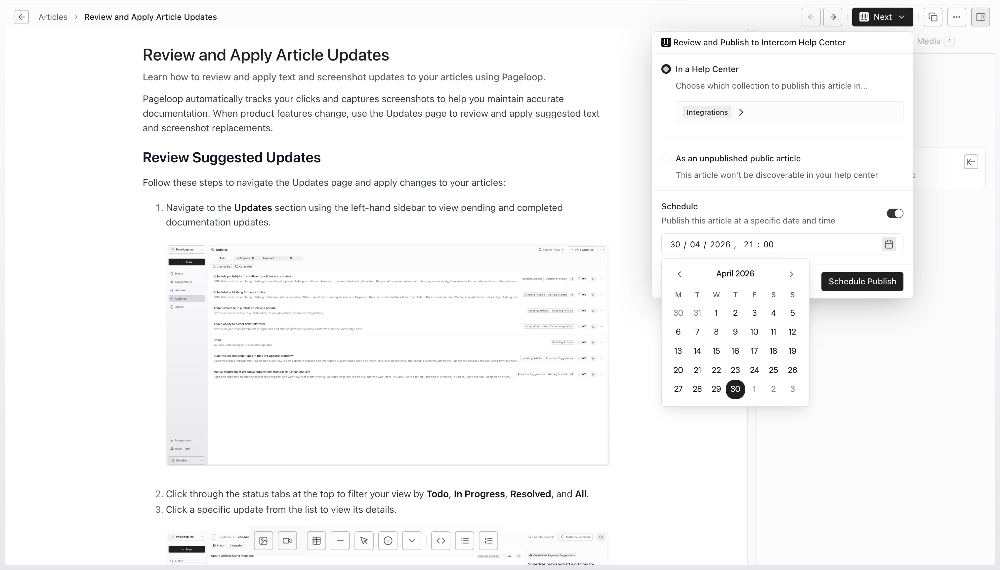

After creating an article in Pageloop, you can publish it to your Help Center immediately, schedule publishing for a future date and time, or create a saved draft, depending on the available destination options.

# Before You Begin

To publish an article from Pageloop, you need the following:

- **A connected Help Center platform** - Pageloop requires a connected Help Center integration to function. You must have already connected one of the supported platforms.

- **A completed article** - Your article must be fully generated and ready for review. If the draft shows a **Needs input** badge, open the draft and answer all pending questions in the **Chat** tab so Pageloop can finish generating it before publishing. If you still need to create one, see [Create Articles Using Pageloop](https://help.pageloop.ai/en/articles/13654529-create-articles-using-pageloop).

# Edit and Finalize Your Article

Before publishing, take a moment to review and polish your article in the Pageloop editor. Pageloop uses the same editor as your Help Center, so what you see in Pageloop closely matches how the article will look when published.

In the article editor, you can:

- Edit the article title and description at the top of the page.

- Make changes to the article body using the formatting toolbar.

- Rearrange content, add headings, lists, images, and other elements.

- Use the right sidebar tabs: **Details** for article information, **Media** to drag and drop uploaded images or flow screenshots into the article, and **Chat** to answer agent clarification questions when the draft needs input.

- Annotate and edit screenshots directly within the editor (see [Annotate and Edit Screenshots](https://help.pageloop.ai/en/articles/13654531-annotate-and-edit-screenshots) for details).

The **Media** tab is useful when an image was not inserted automatically during article generation.

Pageloop automatically saves your edits as you work, so you do not need to manually save before publishing.

# Publish Your Article

When your article is ready, follow these steps to publish it to your Help Center.

## Step 1: Click the Next Button

In the top-right corner of the article editor, you will see a **Next** button displaying your Help Center platform's logo. Click this button to open the publishing options.

<Frame>
  
</Frame>

<Callout type="warning">
  **Note:** The publishing options may slightly differ based on your Help Center.
</Callout>

## Step 2: Choose a Publishing Option

After clicking **Next**, a dropdown menu appears with two options:

- **Review and Publish** - Select where in your Help Center the article should appear, then publishes it. Clicking this opens a platform-specific flow where you choose a category, collection, or folder.

- **Create a Saved Draft** - This option pushes the article to your Help Center as an unpublished draft. The article will not be visible to your customers until you manually publish it from within your Help Center platform.

## Step 3: Select a Location

If you choose **Review and Publish to Help Center**, Pageloop opens a panel where you select the destination \[often called Collection, Category or Folder] for your article. The exact options depend on your Help Center platform.

## Step 4: Publish Now or Schedule for Later

In the publish panel, choose whether to publish immediately or schedule the article for later. To schedule it, turn on **Schedule**, select a future date and time, and click **Schedule Publish**.

<Frame>
  
</Frame>

## Step 5: Confirm and View Your Article

After Pageloop successfully publishes, schedules, or creates a draft of your article, you will see a confirmation banner on the bottom-left corner of your screen.

<Callout type="info">
  For scheduled articles, Pageloop displays a banner with the scheduled time. You can use this banner to edit the time or cancel the schedule before it runs.
</Callout>

You can also use the external link icon button in the top-right corner of the article editor to open the published article on your Help Center at any time.

<Callout type="warning">
  **Note:** Once an article is Published, it becomes read-only on Pageloop. Further edits will have to be made directly on your help center.
</Callout>

---

# Frequently Asked Questions

## How do I publish my article to my Help Center?

Open your completed article in the Pageloop editor, click the **Next** button in the top-right corner, and choose either **Review and Publish to Help Center** or **Create a Saved Draft**. If you review and publish, select a destination, then publish immediately or choose **Schedule** to publish later.

## Where can I find the published article on Pageloop?

You will find this on the Articles page under **Published** tab. You can click on the article to view it on Pageloop.

## Will my article be published immediately or stay as a draft?

It depends on the option you choose. If you select **Review and Publish to Help Center**, the article is published and can be visible to customers (depending on your platform's settings). If you select **Create a Saved Draft**, the article is saved as an unpublished draft on your Help Center until you manually publish it from there.

## Can I change or cancel a scheduled publish?

Yes. Open the scheduled article and use the scheduled banner to edit the time or cancel the schedule before it runs.

## Can I edit the article after publishing?

Yes, but edits must be made directly on your Help Center platform after publishing. The Pageloop editor becomes read-only once the article has been pushed to your Help Center. Pageloop shows a banner reminding you that edits should be made on your Help Center platform.

## Why did publishing fail?

Publishing can fail for several reasons:

- **Your Help Center integration is disconnected.** Make sure your integration is still active by checking Settings > Integrations.

- **You did not select a required location.** Some platforms (such as Freshdesk) require you to select a folder or category before publishing. Make sure you have completed all required selections.

- **A platform error occurred.** Temporary issues with your Help Center provider can cause failures. Try again after a few minutes. If the problem persists, contact Pageloop support at [hello@pageloop.ai](mailto:hello@pageloop.ai).

## Can I publish the same article again?

Once an article has been published to your Help Center, the publishing button becomes disabled for that article in Pageloop. To make further changes, edit the article directly on your Help Center platform.

## What if I do not have a Help Center connected?

Connecting a Help Center is essential for Pageloop to work. Pageloop requires a Help Center integration to create, manage, and publish articles. If you have not connected one yet, set up your integration before proceeding. See [Connect Intercom as Your Help Center](https://help.pageloop.ai/en/articles/14071358-connect-intercom-as-your-help-center) or [Connect Freshdesk as Your Help Center](https://help.pageloop.ai/en/articles/14071393-connect-freshdesk-as-your-help-center) for setup instructions.

## What if I don't want to directly publish the article from Pageloop?

If you prefer not to publish directly through Pageloop, you can copy the article content to your clipboard and paste it into your Help Center manually. To do this, click the **Copy Text** button in the top-right toolbar of the article editor.
