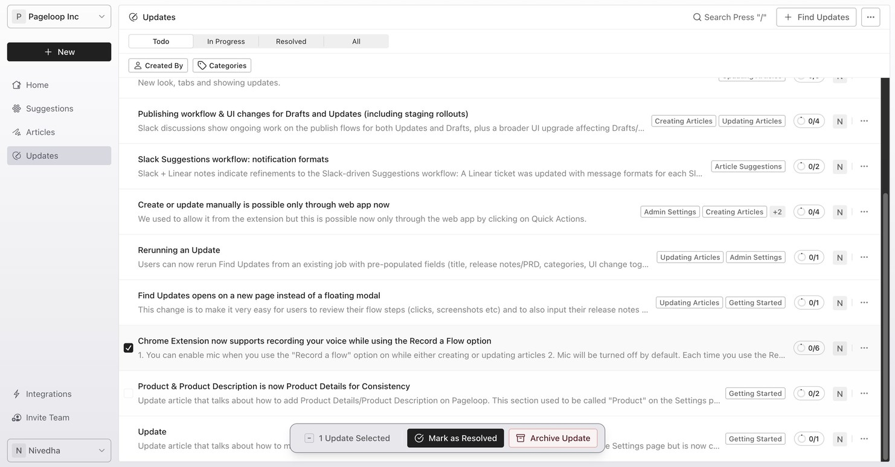
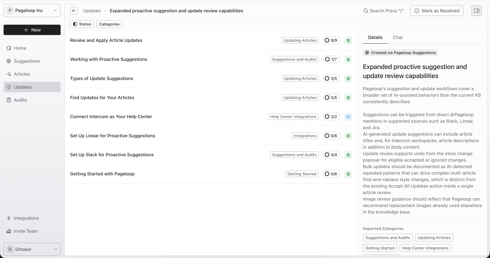
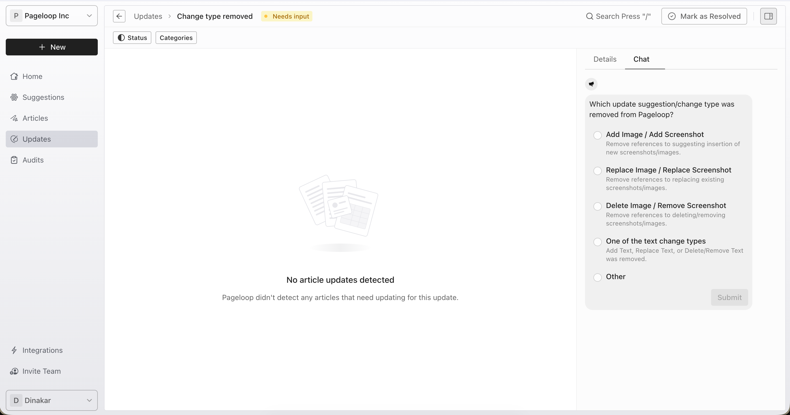
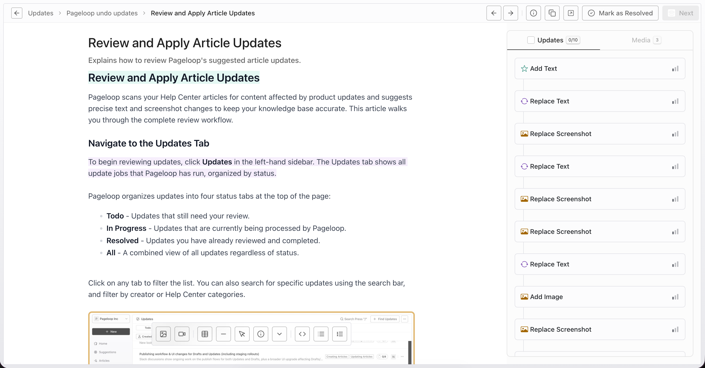
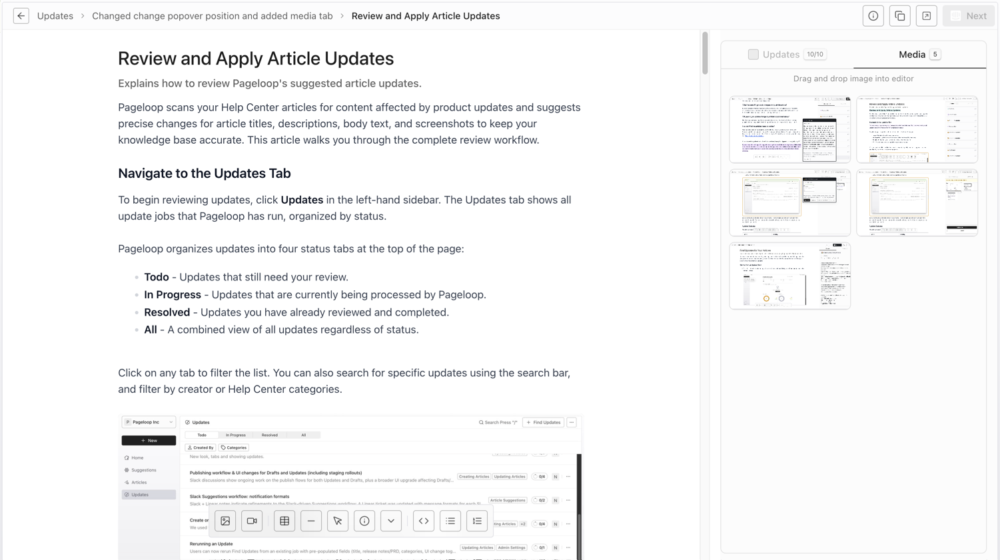
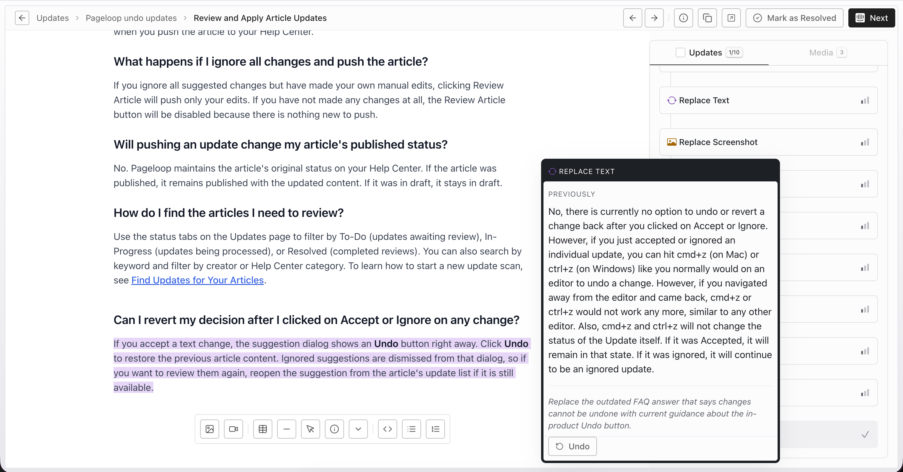
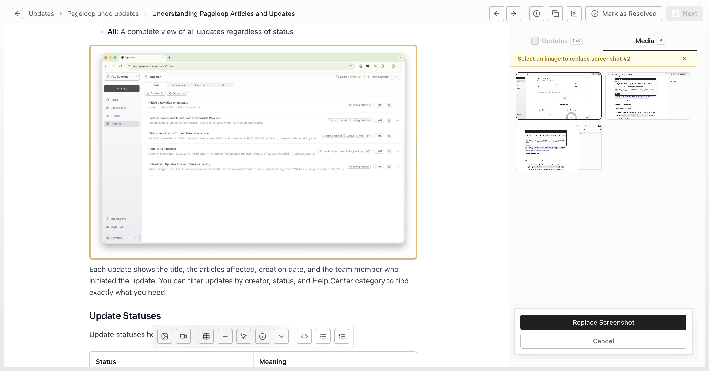
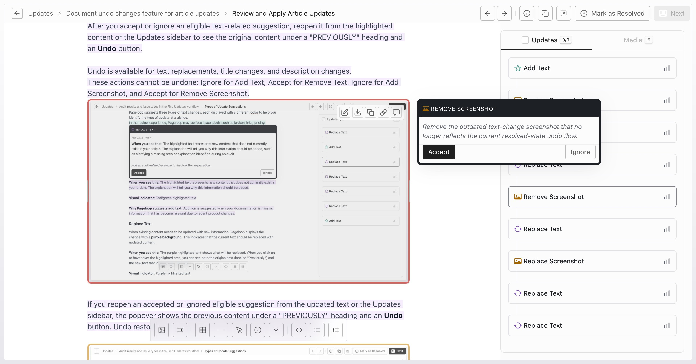
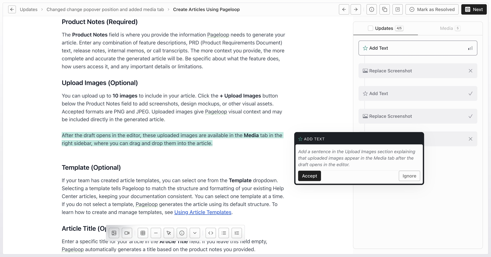

Pageloop scans your Help Center articles for content affected by product updates and suggests precise changes for article titles, descriptions, body text, and screenshots to keep your knowledge base accurate. This article walks you through the complete review workflow.

## Navigate to the Updates Tab

To begin reviewing updates, click **Updates** in the left-hand sidebar. The Updates tab shows all update jobs that Pageloop has run, organized by status.

Pageloop organizes updates into four status tabs at the top of the page:

- **Todo** - Updates that still need your review.

- **In Progress** - Updates that are currently being processed by Pageloop.

- **Resolved** - Updates you have already reviewed and completed.

- **All** - A combined view of all updates regardless of status.

Click on any tab to filter the list. You can also search for specific updates using the search bar, and filter by creator or Help Center categories.

Update rows can also show run-level statuses such as **Needs input**, when Pageloop is waiting for answers to clarification questions.

<Frame>
  
</Frame>

## Manage Updates from the List

From the updates list, you can manage your review queue. Select the checkbox next to one or more updates to reveal bulk action options:

- **Mark as Resolved** - Move the update out of your To-Do list when you are done reviewing it.

- **Archive Update** - Remove the update from your active list entirely.

These options help keep your review queue organized, especially when you have many updates to work through.

## Open an Update to See Impacted Articles

Click on a specific update title to see all the articles that Pageloop has suggested changes for as part of that update. Each article in the list shows the number of suggested changes next to its title.

The articles are ordered automatically by their relevance to the Update. So, the most relevant article will show on the top of the list.

<Frame>
  
</Frame>

## Answer Pageloop Agent Questions

When Pageloop needs more context before generating article updates, the **Chat** tab shows interactive question cards from the Pageloop Agent. Questions can use single-select or multi-select answers. If **Other** is available, you can enter a custom response in the **Type your answer here...** text area.

Click **Submit** to send your response. Answered questions show a confirmation state with the submitted answer.

Submitted answers are saved to the job's message history. After every outstanding question has an answer, Pageloop resumes the update automatically and continues generating article updates.

<Frame>
  
</Frame>

## Review Suggested Changes for an Article

Select an article from the list to open the review editor. The review editor in Pageloop has two main areas:

- **Main panel** - An editor that displays the article title, description, and body content with suggested changes highlighted inline.

- **Right sidebar** - Includes an **Updates** tab with all suggested changes for the article and a **Media** tab with screenshots and uploaded images you can use while reviewing.

The sidebar shows the total number of **updates** and a counter of how many you have accepted so far (for example, "0/6" means zero out of six changes have been accepted).

<Frame>
  
</Frame>

The **Media** tab shows screenshots from the recorded flow and images uploaded with the update request. You can drag and drop them into the article when needed.

<Frame>
  
</Frame>

# Understanding Change Types and Colors

Pageloop uses color-coded highlights to help you quickly identify what type of change is being suggested. For a detailed breakdown of all change types and their visual indicators, see [Types of Update Suggestions](https://help.pageloop.ai/en/articles/13654510-types-of-update-suggestions). Here is a quick summary:

- **Add Text** (teal highlight) - New text that Pageloop recommends adding to the article.

- **Replace Text** (purple highlight) - Existing text that Pageloop recommends replacing with updated wording.

- **Remove Text** (red highlight) - Text that Pageloop recommends removing from the article.

- **Add Image** (green border) - A new image that Pageloop recommends inserting into the article.

- **Replace Screenshot** (amber border) - An existing screenshot that Pageloop recommends replacing with an updated version.

- **Remove Screenshot** (red border) - A screenshot that Pageloop recommends removing.

## Accept or Ignore Individual Changes

To review a specific change, click on it in the Updates sidebar. Pageloop automatically scrolls to the relevant section in the article and opens a popover on the right side of the screen showing the details of the suggestion.

### Review a Text Change

When you click on a text change in the sidebar, Pageloop highlights the affected text in the article and opens a popover on the right side of the screen with:

- The change type label (for example, "REPLACE TEXT")

- For replace changes: the original text under a "PREVIOUSLY" heading, followed by an explanation of why Pageloop is suggesting the change

- For add and delete changes: an explanation of the suggested change

At the bottom of the popover, the initial review state shows two options:

- **Accept** - Apply the suggested change to the article.

- **Ignore** - Dismiss the suggestion and keep the article as it is.

After you accept or ignore an eligible text-related suggestion, reopen it from the highlighted content or the Updates sidebar to see the original content under a "PREVIOUSLY" heading and an **Undo** button.

Undo is available for text replacements, title changes, and description changes.

These actions cannot be undone: Ignore for Add Text, Accept for Remove Text, Ignore for Add Screenshot, and Accept for Remove Screenshot.

<Frame>
  
</Frame>

If you reopen an accepted or ignored eligible suggestion from the updated text or the Updates sidebar, the popover shows the previous content under a "PREVIOUSLY" heading and an **Undo** button. Undo restores the suggestion to pending status in the sidebar.

<Frame>
  
</Frame>

### Review a Screenshot Change

Screenshot changes work similarly to text changes. When you click on a Replace Screenshot change, the popover shows:

- The replacement image (either from a Chrome extension flow recording or another source)

- An explanation of why the screenshot should be replaced

You have four options for screenshot replacements:

- **Replace** - Accept the suggested replacement image.

- **Upload** - Upload a different image if you prefer a different replacement.

- **Media from Flow** - Open the **Media** tab and choose a different screenshot from the recorded flow.

- **Ignore** - Keep the existing screenshot.

The **Media** tab contains screenshots from the recorded flow and images uploaded with the update request.

Click **Media from Flow** to open the **Media** tab, select the image you want.

<Frame>
  
</Frame>

Then click **Replace Screenshot** to apply it.

<Frame>
  
</Frame>

For Remove Screenshot changes, the popover explains why the screenshot should be removed. You can choose to **Accept** the removal or **Ignore** the suggestion.

<Frame>
  
</Frame>

### Review an Add Text Change

Add Text suggestions show exactly where new text will be inserted in the article, so you can see how it will look in context. The added text appears highlighted in green/teal within the article body.

<Frame>
  
</Frame>

## Accept or Ignore All Changes at Once

If you want to quickly accept or ignore all pending changes for an article, use the bulk action feature. Select the checkbox next to the "Updates" header in the sidebar. A card appears at the bottom of the sidebar with two options:

- **Accept All Updates** - Applies every pending change to the article at once.

- **Ignore All Updates** - Dismisses every pending change.

This is especially useful when Pageloop has identified many small changes that you want to apply together.

## Navigate Between Articles

After you finish reviewing one article, you can quickly move to the next article in the update by using the navigation arrows in the top-right corner of the editor. You can also use keyboard shortcuts for faster navigation:

- Press **J** to go to the previous article.

- Press **K** to go to the next article.

These shortcuts work without holding any modifier keys, so you can move through articles quickly while reviewing.

## Push Approved Changes to Your Help Center

Once you have reviewed all the changes for an article, click the **Next** button in the top-right corner of the page. This opens a confirmation popover where you can verify the article details before pushing. Click the update button (for example, **Update Published Article** or **Update Draft**, depending on the article's current status) to push your accepted changes to your Help Center.

Pageloop uses the same editor as your Help Center, so the article you see in Pageloop is exactly what will appear on your Help Center after the update. The article's original status on your Help Center is maintained - for example, a published article remains published after the update.

After the update is complete, Pageloop confirms that your changes are live and provides a link to view the updated article directly on your Help Center.

## Copy Article Content as an Alternative

If you prefer not to push changes directly to your Help Center from Pageloop, you can use the **Copy** button in the top-right toolbar. This copies the full article content - including any edits you made and any Pageloop suggestions you accepted - to your clipboard. Changes that were not accepted or were ignored will not be included in the copied content. You can then paste this content directly into your Help Center's editor.

---

# Frequently Asked Questions

## What do the different colors in the article mean?

Pageloop uses green/teal highlighting for added text, purple highlighting for replaced text, and red highlighting with strikethrough for deleted text. Screenshot replacement changes are indicated by an amber/orange border, and screenshot removal changes are indicated by a red border. For full details, see [Types of Update Suggestions](https://help.pageloop.ai/en/articles/13654510-types-of-update-suggestions).

## Can Pageloop suggest title and description updates?

Yes. Pageloop can suggest updates for article titles and descriptions as part of the same review workflow used for body text and screenshots. The review popover shows inline word-level diffs for those fields so you can see the exact wording changes before you accept or ignore them.

## Can I edit the article directly while reviewing changes?

Yes. The Pageloop review editor allows you to make your own edits to the article content alongside accepting or ignoring Pageloop's suggestions. Any edits you make will be included when you push the article to your Help Center.

## What happens if I ignore all changes and push the article?

If you ignore all suggested changes but have made your own manual edits, clicking Review Article will push only your edits. If you have not made any changes at all, the Review Article button will be disabled because there is nothing new to push.

## Will pushing an update change my article's published status?

No. Pageloop maintains the article's original status on your Help Center. If the article was published, it remains published with the updated content. If it was in draft, it stays in draft.

## How do I find the articles I need to review?

Use the status tabs on the Updates page to filter by To-Do (updates awaiting review), In-Progress (updates being processed), or Resolved (completed reviews). You can also search by keyword and filter by creator or Help Center category. To learn how to start a new update scan, see [Find Updates for Your Articles](https://help.pageloop.ai/en/articles/13654507-find-updates-for-your-articles).

## Can I revert my decision after I clicked on Accept or Ignore on any change?

Yes. To revert an eligible accepted or ignored change, reopen the suggestion from the highlighted content or the Updates sidebar and click **Undo**. Undo supports text replacements, title changes, and description changes.

These actions cannot be undone: Ignore for Add Text, Accept for Remove Text, Ignore for Add Screenshot, and Accept for Remove Screenshot.
