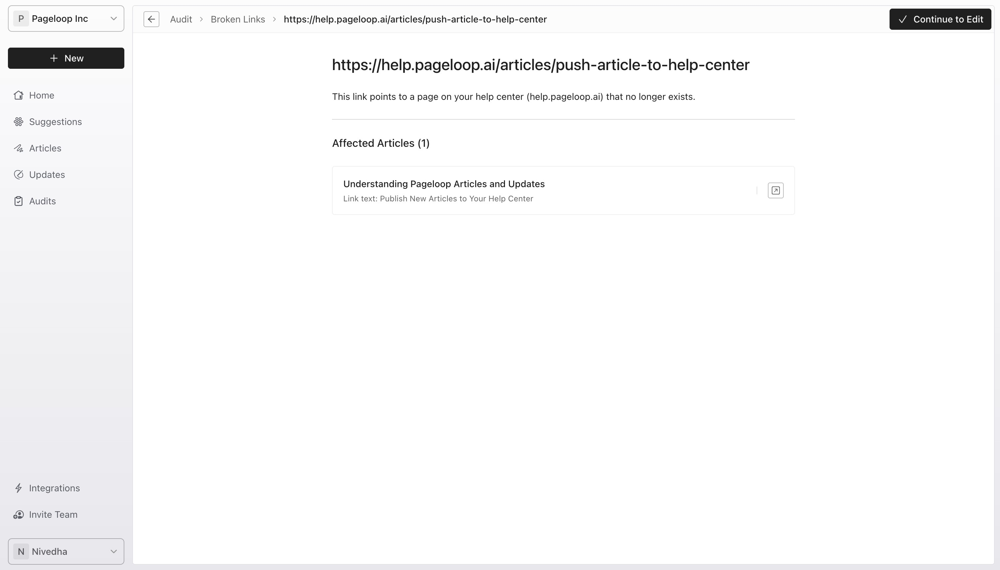
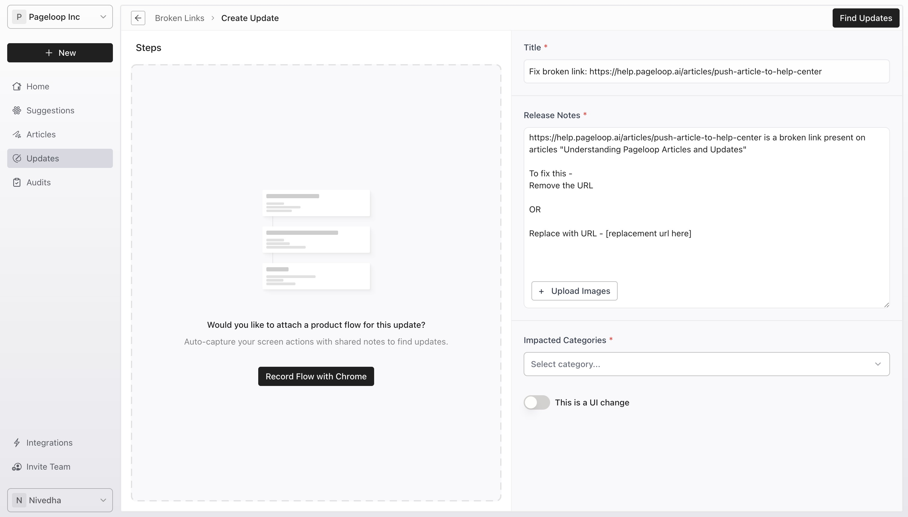
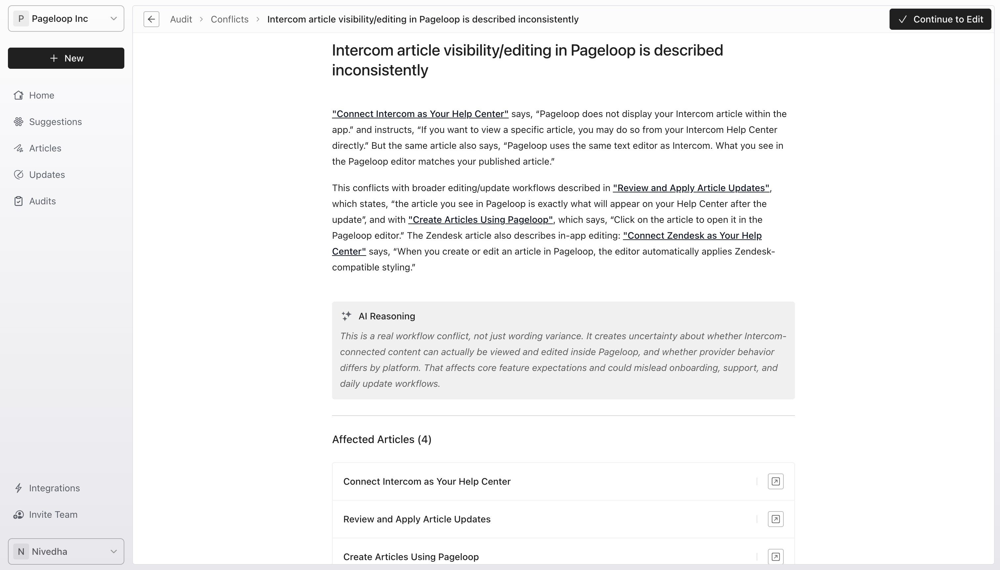
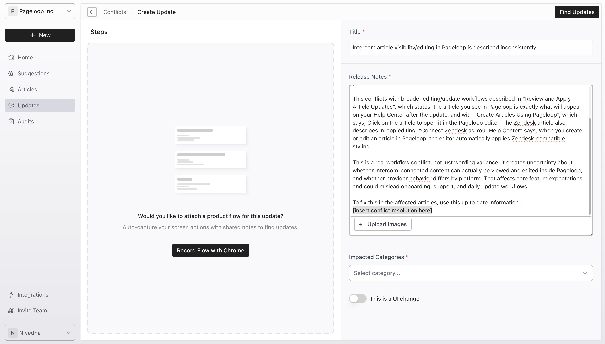

The Audits feature checks your articles for broken links and conflicting information. Run an audit at any time by clicking the **Run Audit** button. To view results, navigate to the **Audits** tab in the left sidebar and select a completed audit.

# Review and Fix Broken Links

When you open an audit, you see a list of broken links. Filter these links by Status and Type.

### Status

**Broken**: URL moved or content archived.

**Uncertain**: System could not verify existence.

**Unreachable**: Domains like Google, Bing, Intercom, or Zendesk with third-party blockers.

### Types

**Internal**: Routes back to your help center.

**External**: Routes outside, like YouTube or third-party docs.

Follow these steps to fix broken links:

1. Click a specific broken link to view details and affected articles.

   <Frame>
     
   </Frame>

2. Click **Continue to Edit** in the top right corner to open the update creation page. The **Release Title** and **Release Notes** fields are prefilled from the broken link context.

   <Frame>
     
   </Frame>

3. In the prefilled Release Notes, choose to replace or remove the URL. To replace, paste the correct URL over \[replacement url here] and delete the Remove the URL and OR text. To remove, delete the replacement instructions entirely.

4. Optionally, attach a flow recording using the [Pageloop Chrome extension](https://help.pageloop.ai/en/articles/13654464-using-the-pageloop-chrome-extension).

5. Proceed to [find updates](https://help.pageloop.ai/en/articles/13654507-find-updates-for-your-articles) across existing articles.

# Review and Resolve Conflicts

Conflicts occur when the same information exists in multiple articles but states slightly different versions, such as pricing inconsistencies or differing feature limits.

Follow these steps to resolve conflicts:

1. Switch to the **Conflicts** tab and click a specific conflict to view its title, description, AI reasoning, and affected articles.

   <Frame>
     
   </Frame>

2. Click **Continue to Edit** to open the Create Update page.

   <Frame>
     
   </Frame>

3. Scroll to the end of the Release Notes and replace \[insert conflict resolution here] with the correct information.

4. Select your impacted categories and run the update.

All Updates run through the Audit can be found under your Updates tab.

# Next Steps

After running your updates, learn how to [review and apply article updates](https://help.pageloop.ai/en/articles/13654536-review-and-apply-article-updates) to publish the corrections to your help center.

---

# Frequently Asked Questions

## Can I ignore an audit item?

At the moment, you can only run an update from a broken link or conflict type for Pageloop to help fix the issue.

## Where will I find the update once I have run the update?

As with all updates you run either from the Chrome Extension, manually or through Suggestions, even Updates run through the Audit will show up on your Updates tab.

## Can this also find duplicates and help merge articles?

The Audit can only find Broken Links and Conflicts at the moment. If you would like duplicates to be supported, please reach out to us on [hello@pageloop.ai](mailto:hello@pageloop.ai)
