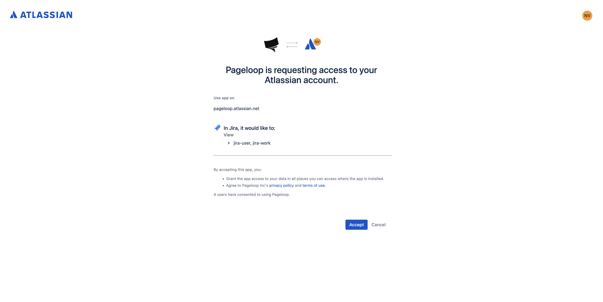
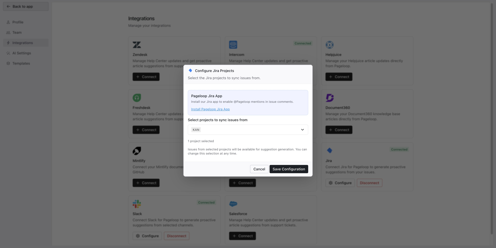

Pageloop connects directly to your Jira workspace to monitor completed issues for documentation updates. You can also trigger proactive suggestions by mentioning **@Pageloop** on specific issues or epics, even if they are not marked as completed.

# Connect Pageloop to Jira

To connect your Jira workspace and start generating proactive suggestions, follow these steps:

1. Click **Integrations** in the left sidebar and locate the Jira integration card.

2. Click the **Connect** button on the Jira card. You will be redirected to Atlassian to authorize workspace access. Review the permissions and click **Accept** to grant Pageloop read access to your Jira projects.\
   ​

   <Frame>
     
   </Frame>

3. After authorizing, you are redirected back to Pageloop. The **Configure Jira Projects** dialog automatically opens.

# Install the Pageloop Jira App (Optional)

At the top of the configuration dialog, you will see a section for the **Pageloop Jira App**. This optional app enables **@Pageloop** mentions directly in Jira issue comments, allowing anyone on your team to trigger a documentation suggestion from within Jira.

Click the **Install Pageloop Jira App** link to install the app on your Atlassian workspace. A Jira admin may need to approve the installation. Once installed, team members can mention @Pageloop in any issue comment, and Pageloop will use the issue context to generate either a Create Article or Find Updates suggestion.

If you skip this step, Pageloop will still generate suggestions automatically from completed issues, but direct @Pageloop mentions in Jira will not be available.

# Select Jira Projects

In the configuration dialog, use the project dropdown to select which Jira projects Pageloop should monitor:

1. Click the **Select projects...** dropdown to view your available Jira projects.

2. Use the search bar to find specific projects, or scroll through the list. Each project displays its name and project key (for example, "Pageloop Engineering (KAN)").

3. Select one or more projects by clicking the checkbox next to each project name. Issues from selected projects will be available for suggestion generation.

4. Click **Save Configuration**. A success notification appears, and the Jira card displays a green **Connected** badge.\
   ​

   <Frame>
     
   </Frame>

You can change which projects Pageloop monitors at any time by clicking the **Configure** button on the Jira integration card.

# How Pageloop Generates Suggestions

Once configured, Pageloop periodically scans for recently completed issues within your selected projects. It analyzes the issue title, description, labels, comments, and linked resources against your existing help center content.

Suggestions can come from completed issues identified automatically or from direct **@Pageloop** mentions on a Jira issue (if the Pageloop Jira App is installed).

Based on this analysis, Pageloop generates two types of suggestions:

- **Update suggestion:** Recommends changes to existing articles that may be outdated due to completed work.

- **Create a new article:** Recommends a new article when the completed issue covers undocumented functionality.

Pageloop generates suggestions for various scenarios, including:

- **Bug fixes:** Changes to existing behavior.

- **New feature releases:** New functionality marked as done.

- **UI redesigns:** Groups several completed issues to suggest updates to navigation or getting started guides.

- **API changes:** Identifies affected integration guides based on endpoint changes.

- **Performance improvements:** Evaluates if load speed changes impact customer-facing troubleshooting steps.

# Manage Your Suggestions

You can review newly detected suggestions in the **Suggestions** tab. Allow some time after initial setup for the first suggestions to appear, depending on your team's issue completion frequency.

Suggestions triggered from direct **@Pageloop** mentions in Jira also appear in the **Suggestions** tab.

Each suggestion includes a title, a summary of what changed, AI reasoning, and source logs describing the flagged issue. If Pageloop detects a completed issue related to an existing suggestion, it updates the existing suggestion with additional context rather than creating a duplicate.

# Next Steps

Now that you have connected Jira, learn how to review and apply these insights by [Working with Proactive Suggestions](https://help.pageloop.ai/en/articles/14071242-working-with-proactive-suggestions). You can also explore how to [Create Articles Using Pageloop](https://help.pageloop.ai/en/articles/13654529-create-articles-using-pageloop) to expand your knowledge base.

---

# Frequently Asked Questions

## Will Pageloop create suggestions for every completed issue?

No. Pageloop analyzes each completed issue and only generates a suggestion when it identifies a meaningful documentation gap or an outdated article. Routine maintenance tasks, internal tooling changes, and issues that do not affect customer-facing documentation are typically filtered out.

## Can I monitor multiple Jira projects?

Yes. Unlike Linear, the Jira integration supports selecting multiple projects during configuration. You can add or remove projects at any time by clicking the **Configure** button on the Jira integration card in **Settings >** **Integrations**.

## Why am I not seeing any suggestions from Jira?

There are a few reasons suggestions may not appear:

- **No recently completed issues:** Pageloop only analyzes issues that have moved to a completed state. If no issues have been completed recently, there is nothing to analyze.

- **No projects selected:** Make sure you have selected at least one project in the Jira configuration dialog. The integration remains inactive until a project is selected.

- **Allow time for processing:** After initial setup, allow some time for the first suggestions to appear as Pageloop needs to run its next scheduled scan.

- **Issues do not affect documentation:** If completed issues are primarily internal changes that do not impact your Help Center content, Pageloop may not generate suggestions.

## What Jira permissions does Pageloop require?

Pageloop requests read-only access to your Jira workspace during the Atlassian authorization step. This allows Pageloop to view project information and read completed issues. Pageloop does not modify any data in your Jira workspace.

## Do I need the Pageloop Jira App for suggestions to work?

No. The Pageloop Jira App is optional and only needed if you want to enable @Pageloop mentions in Jira issue comments. Without the app, Pageloop still automatically generates suggestions by scanning completed issues in your selected projects.

## Can I disconnect Jira and reconnect later?

Yes. You can disconnect the Jira integration from **Settings >** **Integrations** at any time. If you reconnect later, you will need to go through the Atlassian authorization and project selection process again.

]]>
