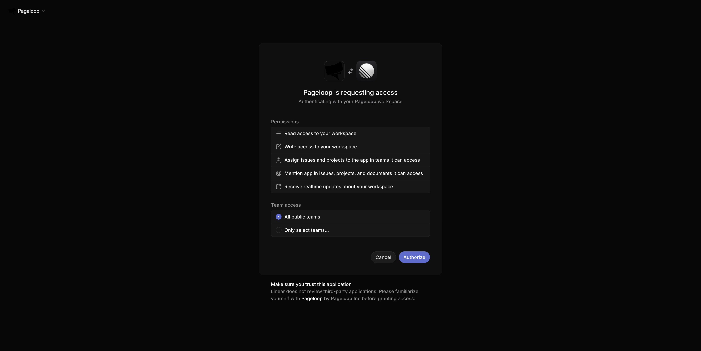
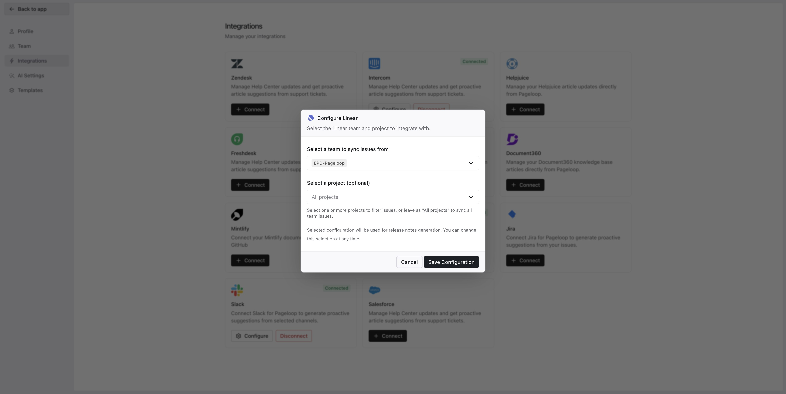

Pageloop connects to your Linear workspace to monitor completed engineering, product, and design tasks. When your team ships changes, Pageloop automatically generates proactive suggestions to keep your documentation up to date.

# Connect Pageloop to Linear

Follow these steps to connect your Linear workspace:

1. Navigate to the **Integrations** page using the sidebar menu and click **Connect** on the Linear card.

2. You are redirected to the Linear authorization page. Select **All public teams** and click **Authorize** to grant access.

   <Frame>
     
   </Frame>

3. Back in Pageloop, the **Configure Linear** modal appears. Click the team dropdown and select your team to track your engineering, product, and design tasks.

4. Leave the project selection set to **All projects** to ensure the integration tracks everything across the team.

   <Frame>
     
   </Frame>

5. Click **Save Configuration** to complete the setup.

# Next Steps

Now that Linear is connected, learn how to review and apply insights by reading about [Working with Proactive Suggestions](https://help.pageloop.ai/en/articles/14071242-working-with-proactive-suggestions).
