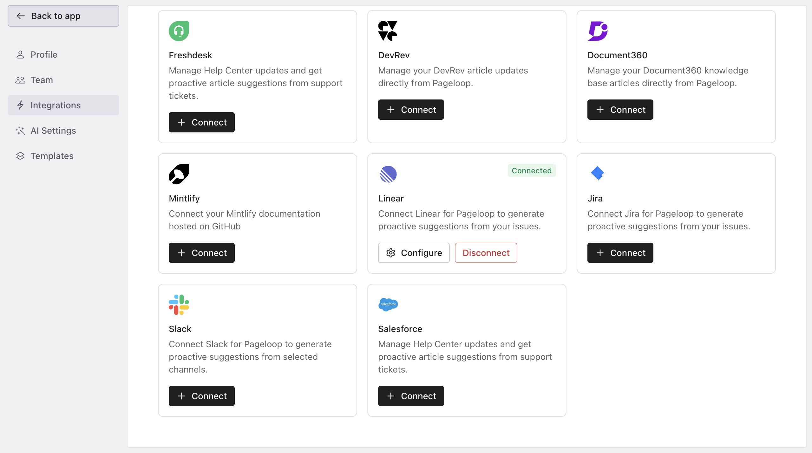
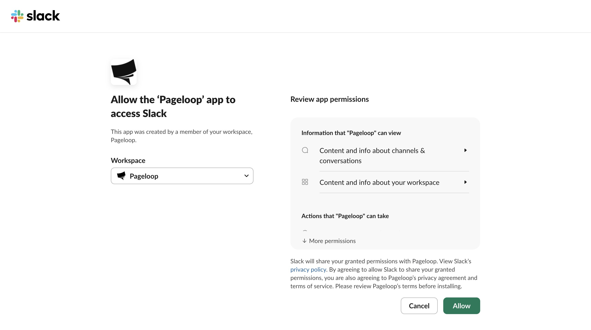
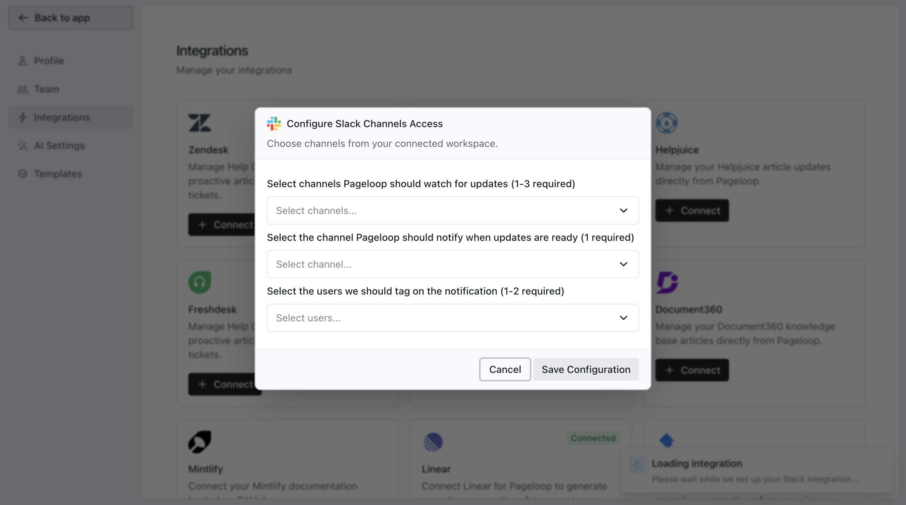
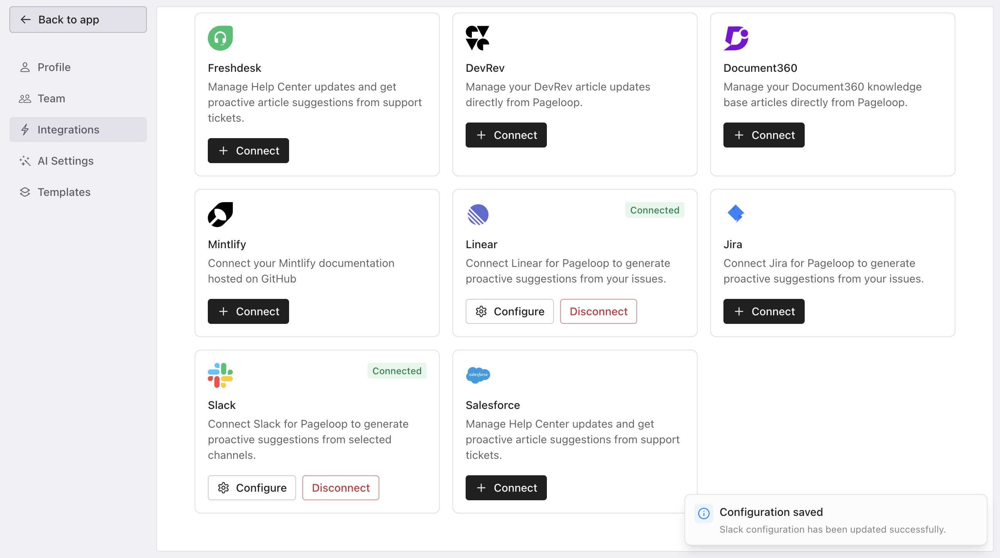
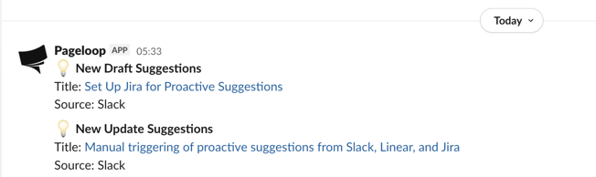

Pageloop monitors the selected Slack channels and automatically identifies documentation that needs fixing based on your team's conversations. You can also trigger proactive suggestions by mentioning `@Pageloop` in Slack channels or threads.

# Before You Begin

Ensure you have the following permissions before starting:

- Admin access to your Pageloop workspace to manage integrations.

- Permission to install apps in your Slack workspace, or the ability to request installation approval from a Slack admin.

# Connect Your Slack Workspace

Follow these steps to connect Slack to Pageloop:

1. Navigate to the **Integrations** tab in the left sidebar to view all available connections.

   <Frame>
     
   </Frame>

2. Locate the Slack integration card and click the **Connect** button. This takes you to a Slack authorization page to review the specific permissions Pageloop requires.

   <Frame>
     
   </Frame>

3. Click **Allow** to grant the necessary permissions. You are redirected back to Pageloop, where the Configure Slack Channels Access dialog automatically opens.

   <Frame>
     
   </Frame>

# Configure Slack Channels

In the configuration window, set up the following three components:

1. **Watch Channels (1-3 required):** Select the channels Pageloop should read to identify documentation needs. Product or engineering channels discussing releases are ideal. Support and customer feedback channels also help spot gaps. Avoid noisy, high-volume channels like social or general chats.

2. **Notification Channel (1 required):** Select the channel where Pageloop sends alerts when suggestions are ready. You do not need to be in the watched channels. A dedicated notification channel makes alerts easy to find.

3. **Users to Tag (1-2 required):** Select the team members who should be alerted whenever Pageloop sends a notification message. Once you make your selections, click **Save Configuration**. A success message appears, and the Slack card displays a green Connected status.

   <Frame>
     
   </Frame>

# Monitor Private Channels

To monitor a private channel, you must invite the Pageloop bot to it first. Open the private channel in Slack and type `/invite @pageloop` in the message field. Alternatively, open the channel settings and add the app under the Integrations tab. Once invited, the private channel appears in the configuration dropdown.

# What to Expect Next

Once configured, Pageloop begins monitoring your selected channels. The first set of suggestions typically takes 24 to 48 hours to appear. After that, Pageloop checks your channels on a regular schedule.

When suggestions are ready, Pageloop sends a notification to your configured Slack channel tagging your selected team members.

<Frame>
  
</Frame>

You can also mention `@Pageloop` in a Slack thread to trigger a suggestion based on that conversation context. If Pageloop is not on the channel, it will ask you to invite the bot for it to act on the tagged thread or message.

# Next Steps

Now that Slack is connected, learn how to manage your incoming recommendations by exploring our guide on [Working with Proactive Suggestions](https://help.pageloop.ai/en/articles/14071242-working-with-proactive-suggestions). You can also [Set Up Linear for Proactive Suggestions](https://help.pageloop.ai/en/articles/14734582-set-up-linear-for-proactive-suggestions) to capture updates directly from your engineering tasks.

---

# Frequently Asked Questions

## What type of conversations will generate a Suggestion?

Suggestions are typically triggered by conversations regarding product changes, bug fixes, customer-facing updates, and workflow changes.

You can also mention `@Pageloop` directly in Slack, and Pageloop uses the surrounding thread context to determine whether to suggest creating a new article or updating an existing one.

Pageloop can recommend either creating new articles for undocumented topics or updating existing outdated articles.

## Will Pageloop watch all my Slack channels in the workspace?

Pageloop will only watch the channels that were set up during the integration under the field **Watch Channels**. Other channels will not be tracked for proactive suggestions.
