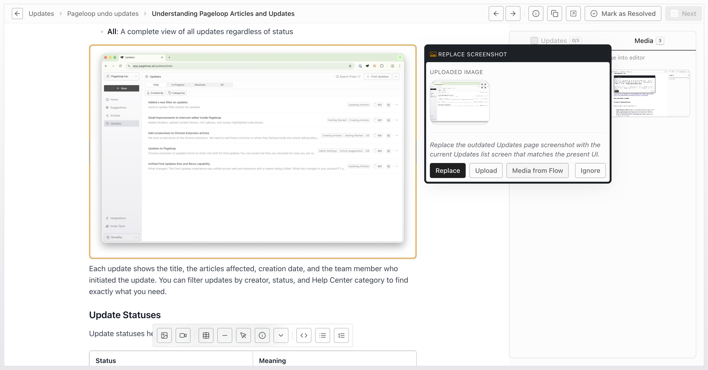

# Update Suggestions on Pageloop

When you use Pageloop to [find updates for your articles](https://help.pageloop.ai/en/articles/13654507-find-updates-for-your-articles), it analyzes your product changes and generates specific suggestions for both text and image updates.

## Text Update Suggestions

Pageloop suggests three types of text changes, each displayed with a different color to help you identify the type of update at a glance.

### Add Text

When Pageloop identifies information that should be added to your article, it displays the suggested new text with a **teal (green) background**. This indicates content that Pageloop recommends adding to make your documentation more complete or accurate based on your product changes.

**When you see this:** The highlighted text represents new content that does not currently exist in your article. The explanation will tell you why this information should be added.

**Visual indicator:** Teal/green highlighted text\
​\
​**Why Pageloop suggests add text:** Addition is suggested when your documentation is missing information that has become relevant due to recent product changes.

### Replace Text

When existing content needs to be updated with new information, Pageloop displays the change with a **purple background**. This indicates that the current text should be replaced with updated content.

**When you see this:** The purple highlighted text shows what will be replaced. During review, opening the highlight shows the proposed replacement and review actions. After an eligible suggestion is accepted or ignored, reopening it shows the original content under "Previously".

**Visual indicator:** Purple highlighted text

**Why Pageloop suggests replacement:** Replacement is suggested when existing documentation contains information that has changed but the overall context remains the same. For example, if a feature's name changed or a process step was updated, Pageloop suggests replacing the outdated text rather than deleting it entirely.

### Delete Text

When content has become outdated or is no longer accurate, Pageloop recommends removing it. Deleted text appears with a **red background and strikethrough formatting**.

**When you see this:** The red, struck-through text indicates content that Pageloop recommends removing from your article because it is no longer relevant or accurate.

**Visual indicator:** Red highlighted text with strikethrough

**Why Pageloop suggests deletion:** Deletion is suggested when content references features, options, or processes that no longer exist in your product.

## Image Update Suggestions

Pageloop can also suggest changes to screenshots and images in your articles. Image suggestions appear when you enable the "This is a UI change" toggle during the update process.

### Add Image

When Pageloop determines that a new image would improve your documentation, it suggests adding an image. Added images appear with a **green border** and are slightly faded until you accept the change.

**When you see this:** A new image has been suggested for inclusion in your article. This commonly occurs when you provide screenshots through a flow recording and Pageloop identifies where they would be most helpful.

**Visual indicator:** Green border around the image, semi-transparent appearance

### Replace Image

When an existing screenshot shows an outdated version of your UI, Pageloop suggests replacing it with an updated image. Images marked for replacement display with an **amber (orange) border**.

**When you see this:** The bordered image shows the current (outdated) screenshot. Click on the image or view the Details panel to see the suggested replacement image. The replacement may come from uploaded media, flow-recorded screenshots, or images already used in other articles in your knowledge base. You can also upload your own replacement image if you prefer a different screenshot.

**Visual indicator:** Amber/orange border around the image

**Why Pageloop suggests image replacement:** When you record a flow showing UI changes, Pageloop compares your new screenshots to the images in your existing articles. If a new screenshot appears to show an updated version of the same screen, Pageloop suggests replacing the old image. Pageloop can also recommend an image already present in another article when it appears to match the updated screen, which reduces the need to source a new asset.

<Frame>
  
</Frame>

To choose a different replacement, open the Media tab in the right sidebar to browse screenshots from your recorded flow and uploaded media, then select one and click **Replace Screenshot**.

<Frame>
  
</Frame>

### Delete Image

When a screenshot shows content that is no longer part of your product, Pageloop may suggest removing it. Images marked for deletion display with a **red border**.

**When you see this:** The bordered image shows a screenshot that Pageloop recommends removing because the UI element or feature it depicts no longer exists.

**Visual indicator:** Red border around the image

# Summary of Visual Indicators

Use this quick reference to identify suggestion types at a glance:

|                 |                                   |                                        |
| --------------- | --------------------------------- | -------------------------------------- |
| **Change Type** | **Visual Indicator**              | **Action**                             |
| Add Text        | Teal/green background             | New text will be inserted              |
| Replace Text    | Purple background                 | Existing text will be updated          |
| Delete Text     | Red background with strikethrough | Text will be removed                   |
| Add Image       | Green border, semi-transparent    | New image will be inserted             |
| Replace Image   | Amber/orange border               | Image will be swapped with new version |
| Delete Image    | Red border                        | Image will be removed                  |

---

# Frequently Asked Questions

## Why did Pageloop suggest replacing text instead of adding new text?

Pageloop uses replace when existing content needs to be updated while keeping the same context. For example, if a button was renamed from "Save" to "Save Changes," Pageloop suggests replacing that specific text rather than deleting the entire sentence and adding a new one. This preserves the surrounding content and makes the update more precise.

## Why are image suggestions not appearing?

Image update suggestions (add, replace, or delete) only appear when you enable the "This is a UI change" toggle when creating the update. If you did not enable this option, Pageloop will only suggest text changes. To get image suggestions, start a new update with the UI change toggle enabled.

## What does each color mean?

Pageloop uses consistent colors across all update types: **teal/green** indicates additions, **purple** indicates replacements, and **red** indicates deletions. For images, the same principle applies with colored borders: green for add, amber/orange for replace, and red for delete.
