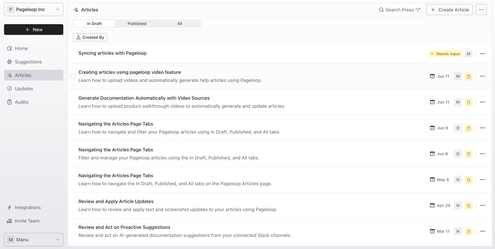
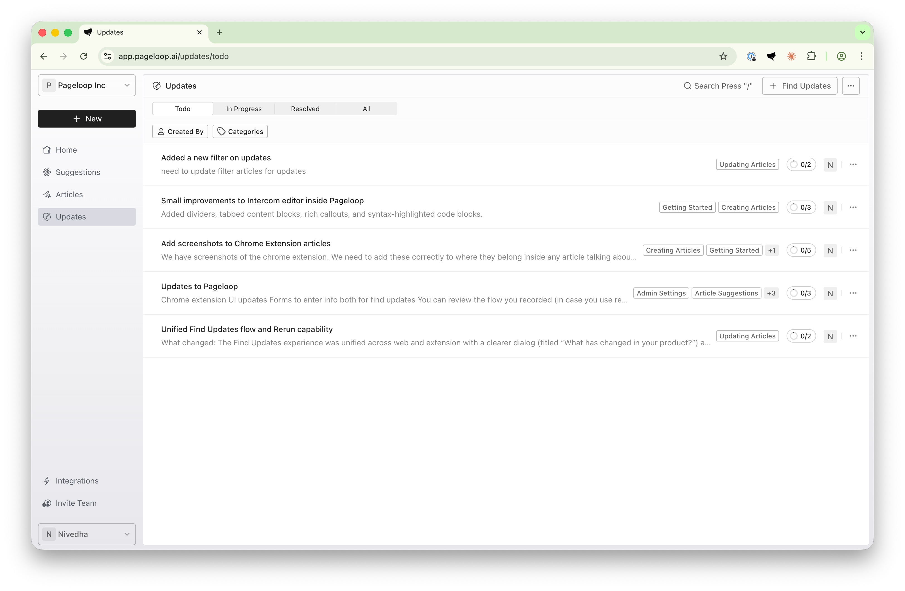

Keeping your Help Center accurate means both creating new documentation and updating what already exists. Pageloop organizes these two workflows into separate areas so you always know where to find your work, what needs attention, and what is in draft, scheduled, or published.

# Two Core Workflows in Pageloop

Pageloop separates your documentation work into two main areas, each accessible from the sidebar navigation:

- **Articles**: The Articles tab contains new documentation you create in Pageloop. These are articles that do not yet exist in your Help Center. Note that "Articles" is the name of the navigation tab in Pageloop, not a separate feature. Creating new articles is covered in [Create Articles Using Pageloop](https://help.pageloop.ai/en/articles/13654529-create-articles-using-pageloop).

- **Updates**: The Updates tab contains changes to articles that already exist in your Help Center. When Pageloop identifies outdated content, the recommended changes appear here for your review. For a step-by-step walkthrough of the update process, see [Find Updates for Your Articles](https://help.pageloop.ai/en/articles/13654507-find-updates-for-your-articles) and [Review and Apply Article Updates](https://help.pageloop.ai/en/articles/13654536-review-and-apply-article-updates).

# The Articles Tab

Select **Articles** from the sidebar navigation to view all documentation you have created in Pageloop. The Articles page organizes your work using three tabs:

- **In Draft**: Articles you have created that are not yet published to your Help Center

- **Published**: Articles that have been pushed to your Help Center

- **All**: A complete view of all your articles regardless of status

<Frame>
  
</Frame>

Each article entry shows the title, a description preview, creation date, and the team member who created it. Articles with the "In Draft" status display an amber page icon, while published articles display a green globe icon.

Article drafts that require your action display a yellow **Needs input** badge in the Articles list.

Scheduled articles display a clock icon and date badge so the publish time is visible in the Articles list.

From the Articles page, you can search for specific articles, filter by creator, archive articles you no longer need, or retry article generation if a previous attempt failed.

## Article Statuses

Understanding article statuses helps you track where each piece of documentation stands in your workflow:

|             |                                                                                                              |
| ----------- | ------------------------------------------------------------------------------------------------------------ |
| **Status**  | **Meaning**                                                                                                  |
| In Draft    | The article exists in Pageloop but has not been published to your Help Center                                |
| Published   | The article has been pushed to your Help Center                                                              |
| Processing  | Pageloop is currently generating the article content                                                         |
| Needs input | Pageloop is waiting for you to answer one or more questions before the article draft can continue generating |
| Failed      | Article generation encountered an error (click on 'Retry' next to the article)                               |

Scheduled articles remain visible in the Articles list with a clock icon and date badge.

When you create an article in Pageloop, it starts with the "In Draft" status until you publish it to your Help Center or schedule it for a future publish. For detailed publishing steps, see [Publish New Articles to Your Help Center](https://help.pageloop.ai/en/articles/13654534-publish-new-articles-to-your-help-center).

# The Updates Tab

Select **Updates** from the sidebar navigation to view all pending changes to your existing Help Center articles. The Updates page organizes your work using four tabs:

- **ToDo**: Updates that need your review

- **In Progress**: Updates you have started reviewing but not yet completed

- **Resolved**: Updates that have been reviewed and either accepted or dismissed

- **All**: A complete view of all updates regardless of status

<Frame>
  
</Frame>

Each update shows the title, the articles affected, creation date, and the team member who initiated the update. You can filter updates by creator, status, and Help Center category to find exactly what you need.

## Update Statuses

Update statuses help you manage your review workflow:

|             |                                                                            |
| ----------- | -------------------------------------------------------------------------- |
| **Status**  | **Meaning**                                                                |
| To-Do       | The update is awaiting your review                                         |
| In-Progress | You have started reviewing the update but have not completed all changes   |
| Resolved    | You have reviewed all changes and either accepted or dismissed them        |
| Needs input | Pageloop is waiting for you to answer one or more Pageloop Agent questions |
| Resuming... | You have submitted answers, and Pageloop is resuming the update            |

For a detailed guide on reviewing and applying updates, see [Review and Apply Article Updates](https://help.pageloop.ai/en/articles/13654536-review-and-apply-article-updates).

# Articles vs Updates: Quick Comparison

|                   |                                                        |                                                        |
| ----------------- | ------------------------------------------------------ | ------------------------------------------------------ |
| **Aspect**        | **Articles**                                           | **Updates**                                            |
| Purpose           | Create new documentation                               | Modify existing documentation                          |
| Location          | Articles tab in sidebar                                | Updates tab in sidebar                                 |
| Status Options    | In Draft, Published, Processing, Needs input, Failed   | To-Do, In-Progress, Resolved, Needs input, Resuming... |
| Action to Publish | Publish immediately, schedule publish, or create draft | Apply immediately and/or schedule update               |
| Result            | New article in Help Center                             | Modified existing article in Help Center               |

# Next Steps

Now that you understand what Article Creation and Updates look like on Pageloop, you can check out how to [Create Articles](https://help.pageloop.ai/en/articles/13654529-create-articles-using-pageloop) and [Update Articles](https://help.pageloop.ai/en/articles/13654507-find-updates-for-your-articles).
