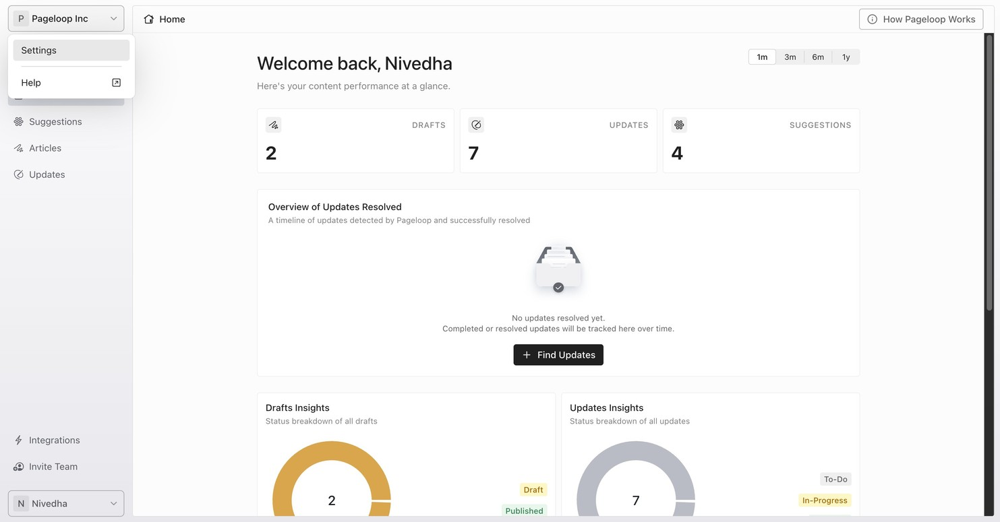
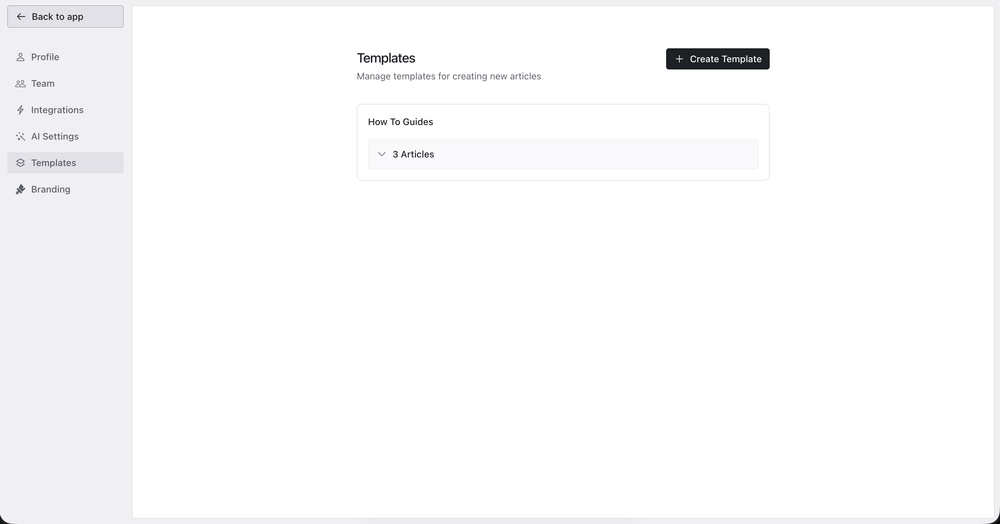
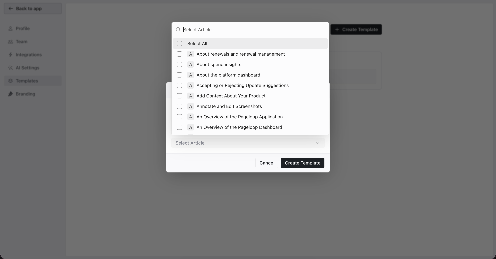

Article templates in Pageloop help you maintain a consistent style and format across your knowledge base. Pageloop analyzes the example articles in that template and generates new content that matches their layout and voice.

# Create a New Template

To create an article template in Pageloop, navigate to **Settings** > **Templates**. You can access Settings by clicking on your name at the bottom of the Pageloop sidebar and selecting **Settings** from the dropdown menu.

<Frame>
  
</Frame>

In the Settings sidebar, click **Templates**. The Templates page displays all your existing templates and lets you create new ones.

<Frame>
  
</Frame>

**To create a new template:**

1. Click the **+ Create Template** button in the top-right corner of the Templates page.

2. In the Create Template dialog, enter a descriptive name in the **Template Name** field. Choose a name that reflects the type of articles this template represents, such as "How-To Guides" or "Feature Reference."

3. Under **Select Article**, click the dropdown to see a list of articles from your connected Help Center. Select the articles you want to use as examples for this template. You can scroll through the list, use the search bar to find specific articles, or use **Select All** to choose all available articles.

   <Frame>
     
   </Frame>

4. Click **Create Template** to save your new template.

Your new template will now appear on the Templates page, where you can expand it to view the articles associated with it.

Once you have created a template, you can apply it when creating a new article. For details on how to select and use a template during the article creation process, see [Create Articles Using Pageloop](https://help.pageloop.ai/en/articles/13654529-create-articles-using-pageloop).

## Choose Good Example Articles

The quality of your template depends on the articles you select as examples. Pageloop uses up to 5 articles from a template to learn the desired structure and writing style. Here are some tips for selecting effective example articles:

- **Pick well-structured articles.** Choose articles that have clear headings, logical organization, and consistent formatting. These give Pageloop the best patterns to follow.

- **Select 3 to 5 articles.** This gives Pageloop enough examples to identify consistent patterns without being overwhelmed by too many variations.

- **Use articles of the same type.** If you are creating a "How-To" template, select how-to articles. If you want a reference template, use reference-style articles. Mixing article types can produce inconsistent results.

- **Choose articles with the right tone.** If your knowledge base has a friendly, conversational tone, select articles that exemplify that voice. Pageloop will replicate the tone it finds in the examples.

## View and Delete Templates

All your templates are listed on the **Settings** > **Templates** page. Each template shows its name and the number of associated articles. Click the expand arrow next to the article count to view the individual articles included in that template. You can also click the link icon next to any article to open it on your Help Center in a new tab.

To delete a template you no longer need, use the delete option on the Templates page. Deleting a template does not affect any articles that were previously created using it, and it does not remove the example articles from your Help Center.

---

# Frequently Asked Questions

## How many articles should I include in a template?

Pageloop recommends selecting 3 to 5 articles per template. This provides enough examples for Pageloop to identify consistent patterns in structure and style. Pageloop uses up to 5 articles from a template when generating new content.

## Can I use more than one template at a time?

No. You can select only one template per article during the creation process. If you need different styles for different types of content, create separate templates for each style.

## Will deleting a template affect articles I already created with it?

No. Deleting a template only removes it from your list of available templates. Any articles that were previously generated using that template remain unchanged.

## Do I need to be an admin to create templates?

No. The Templates option is available under Settings for all team members, regardless of role. Any user in your Pageloop workspace can create and manage templates.

## What if I do not use a template when creating an article?

The template field is optional. If you do not select a template, Pageloop will still generate an article based on your product notes and your configured [style guide](https://help.pageloop.ai/en/articles/13701235-getting-started-with-pageloop). Templates provide an additional layer of structural consistency on top of your general style settings.
