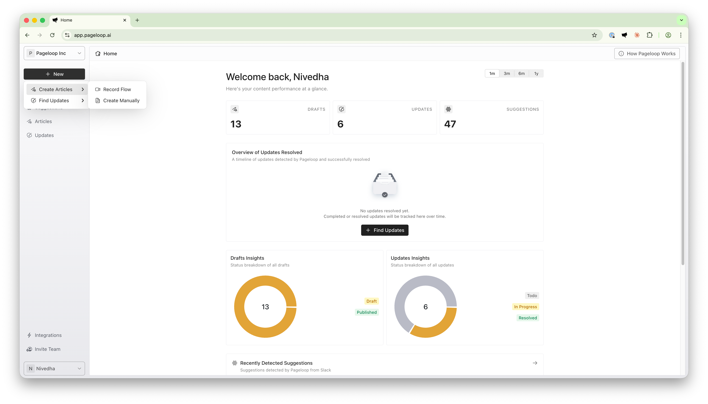
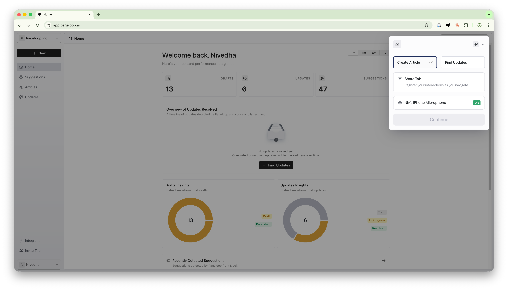
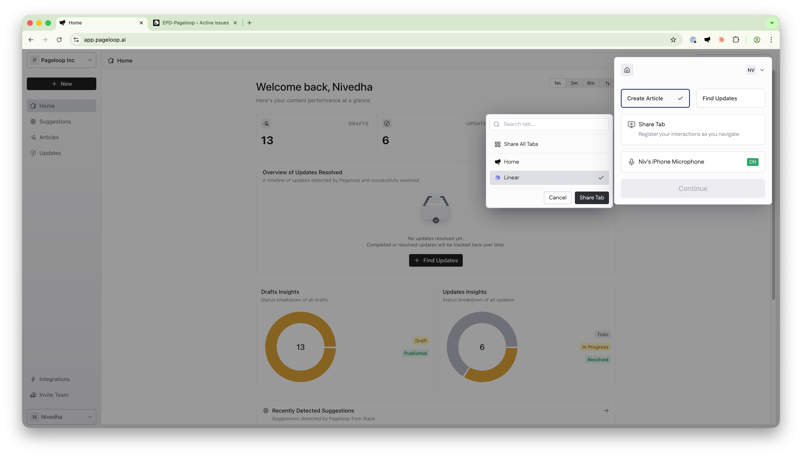
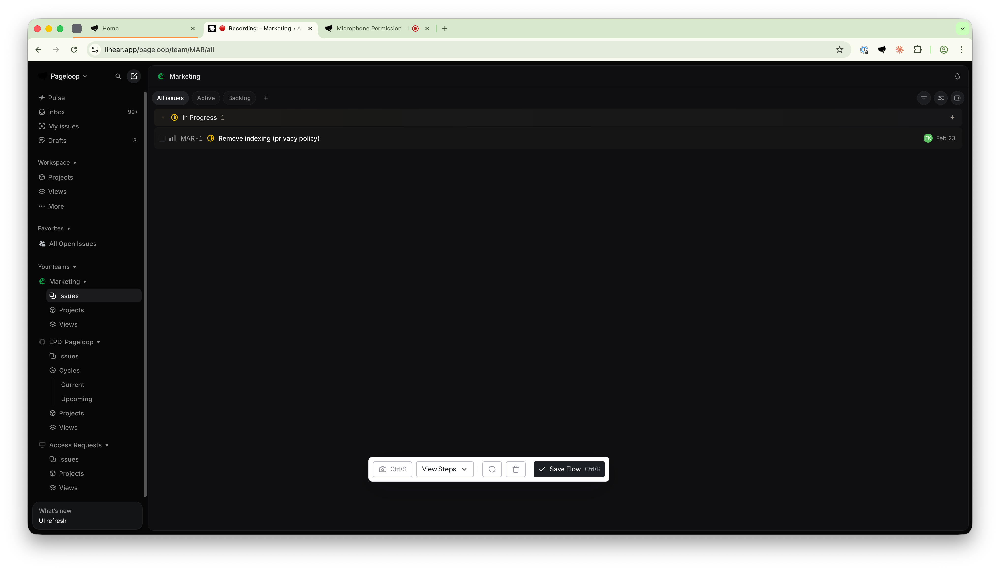

The Pageloop Chrome extension lets you record product workflows directly in your browser to generate or update documentation with accurate, step-by-step screenshots. Walk through your product while the extension tracks your clicks, captures screenshots on demand, and optionally records voice narration.

# What the Pageloop Chrome Extension Does

The Pageloop Chrome extension records your interactions with your product and uses those recordings to generate documentation. With the extension, you can:

- **Record flows** to capture step-by-step workflows, including clicks, navigation, and screenshots.

- **Create new articles** by recording a feature walkthrough that Pageloop turns into a complete article draft.

- **Find updates** for existing Help Center articles by recording how your product has changed.

- **Add voice narration** to provide additional context that gets transcribed and included in the generated content.

- **Capture multi-tab workflows** for features that span multiple browser tabs.

The extension does **not** record your screen continuously. It only captures your clicks, navigation, and any screenshots you explicitly take during a recording session.

# Install the Pageloop Chrome Extension

Follow these steps to install the extension and connect it to your Pageloop workspace.

1. Visit the [Pageloop listing on the Chrome Web Store](https://chromewebstore.google.com/detail/pageloop/akgokpgfgpmcefedhcadakkbeipnojlh).

2. Click the **Add to Chrome** button.

3. In the confirmation pop-up from the Chrome Web Store, click **Add Extension** to complete the installation.

4. After installation, pin the extension for easy access. Click the puzzle piece icon in your browser toolbar, find Pageloop in the list, and click the pin icon next to it.

The Pageloop Chrome extension shares your session with the Pageloop web app. If you are already signed in to the web app, the extension detects your session automatically and you do not need to sign in separately. If the extension shows a login screen, open the Pageloop web app, sign in there, and then return to the extension.

# Open the Pageloop Extension

To open the Pageloop extension, click the Pageloop icon in your browser toolbar. The extension dashboard shows the recording setup with two main options:

- **Create Article:** Record a flow to generate a new article from the captured workflow.

- **Find Updates:** Record a flow to identify existing Help Center articles that need updating based on product changes.

You can also start a recording directly from the Pageloop web app by clicking **+ New** from the left navigation bar, choosing between Creating Articles or Find Updates, and selecting **Record Flow**. This opens the extension with the recording setup ready to go.

<Frame>
  
</Frame>

# Record a Flow

Recording a flow captures your interactions with your product so that Pageloop can generate or update documentation. Here is how to set up and complete a recording.

## Step 1: Choose a Flow Type

When you open the Pageloop extension, the dashboard presents two options at the top:

- **Create Article:** Select this if you want to record a workflow and use it to generate a new article. After saving, you will be taken to the article creation form in the Pageloop web app.

- **Find Updates:** Select this if you want to record product changes and use them to find existing articles that need updating. After saving, you will be taken to the Find Updates form in the Pageloop web app.

<Frame>
  
</Frame>

Select the appropriate option before proceeding. The default selection is Create Article.

## Step 2: Select Which Tabs to Record

Below the flow type selection, you will see the **Share Tab** card. Click it to open the tab selection popover, where you can choose what to record.

- **Single tab:** Select an individual tab from the list to record only that tab. This is the best choice for simple, focused workflows.

- **Share All Tabs:** Select this option at the top of the list to record actions across all open browser tabs. Use this for workflows that span multiple tabs, such as documenting integrations or processes that require switching between different parts of your product.

You can search for a specific tab by name or URL using the search field at the top of the tab list. For best results when using multi-tab recording, close any unrelated tabs before starting.

When recording with **Share All Tabs**, Pageloop automatically captures tab switches as you navigate between tabs, so the generated documentation reflects the correct sequence of steps.

<Frame>
  
</Frame>

## Step 3: Set Up Your Microphone (Optional)

Voice narration is an optional feature that lets you speak as you walk through a workflow. Your voice is transcribed and used as additional context when Pageloop generates or updates articles. This is particularly helpful when the information you want to share is not visible on the screen.

To enable voice narration in the Pageloop Chrome extension:

1. Click the microphone card in the extension dashboard. It shows **No microphone** with an **OFF** indicator by default.

2. A popover appears listing available microphone devices. Select the microphone you want to use, or select **No Microphone** to keep voice recording disabled.

3. Once you select a microphone, the card updates to show the device name with a green **ON** indicator.

4. Your browser may prompt you to grant microphone permission. Approve this prompt to enable audio recording.

The microphone is only active during the recording session and turns off automatically when you save or delete the flow.

## Step 4: Start Recording

Once you have selected your flow type, tab, and microphone settings:

- If you have a microphone enabled, click the **Continue** button. A new tab opens briefly to set up microphone permissions, and then the recording begins on your selected tab.

- If no microphone is enabled, click the **Start Recording** button. The recording starts immediately.

A short countdown appears on screen before recording begins. You can click to skip the countdown. Once the countdown ends, the extension starts tracking your actions.

## Step 5: Navigate and Capture Screenshots

While recording, navigate through your product as a user would. The Pageloop extension captures your clicks, scrolls, and page navigation automatically.

To take a screenshot during the recording, press **Ctrl+S** (on both Windows and Mac). A camera shutter sound confirms the screenshot was captured. Take screenshots at key moments to include relevant visuals in the generated article.

<Callout type="warning">
  **Note:&#x20;**&#x4F;nly screenshots taken using the **Ctrl+S&#x20;**&#x73;hortcut will be used in the final article. Pageloop does not record a video of your screen when the extension is active.
</Callout>

### The Control Bar

During recording, a floating Control Bar appears at the bottom of your screen. It provides the following options:

- **Screenshot button (Ctrl+S):** Takes a screenshot of the current view.

- **View Steps:** Expands a drawer showing all recorded actions and screenshots captured so far. Use this to review your progress during the recording.

- **Reset:** Clears all recorded actions and screenshots, letting you start over without ending the recording session.

- **Delete:** Discards the entire recording. A confirmation dialog appears before the recording is deleted.

- **Save Flow (Ctrl+R):** Saves the recording and redirects you to the Pageloop web app to continue with article creation or finding updates.

You can drag the Control Bar to reposition it on your screen.

<Frame>
  
</Frame>

## Step 6: Save the Flow

When you have finished recording your workflow, save the flow by either:

- Clicking the **Save Flow** button in the Control Bar, or

- Pressing **Ctrl+R** (on both Windows and Mac).

After saving, the Pageloop extension redirects you to the Pageloop web app, where you continue with the next steps:

- If you selected **Create Article**, you are taken to the article creation form. Here you can review the captured steps, add product notes, select a template, and generate your article. For the full article creation process, see [Create Articles Using Pageloop](https://help.pageloop.ai/en/articles/13654529-create-articles-using-pageloop).

- If you selected **Find Updates**, you are taken to the Find Updates form. Here you can review the captured steps, enter release notes, select categories, and submit the update scan. For the full update process, see [Find Updates for Your Articles](https://help.pageloop.ai/en/articles/13654507-find-updates-for-your-articles).

After you click on Find Updates from the Flow review, Pageloop will show the update status, any Pageloop Agent questions in the Chat section, and article updates as they become ready for review. You may briefly see **Setting up your update...** while the update is being created.

# Keyboard Shortcuts

The Pageloop Chrome extension supports the following keyboard shortcuts during an active recording session. These shortcuts do not work when you are typing in an input field or text area.

|              |                                       |
| ------------ | ------------------------------------- |
| **Shortcut** | **Action**                            |
| **Ctrl+S**   | Take a screenshot of the current view |
| **Ctrl+R**   | Save the flow and go back to the app  |

On Mac, use **Ctrl** (not Cmd) for these shortcuts.

---

# Frequently Asked Questions

## What browsers does the Pageloop Extension work with?

The Pageloop Chrome extension works with Chrome and any Chromium-based browser, including:

- Google Chrome

- Arc

- Comet

- Other Chromium-based browsers

## Why is the Pageloop extension icon not visible in my toolbar?

After installing the Pageloop Chrome extension, you may need to pin it to your toolbar. Click the puzzle piece icon (Extensions) in your browser toolbar, find Pageloop in the list, and click the pin icon next to it. The Pageloop icon will then appear in your toolbar for easy access.

## Why does the extension show a login screen even though I am signed in to the web app?

The Pageloop Chrome extension detects your web app session automatically. If you recently cleared your browser cookies or storage, or if the Pageloop web app is not open in any tab, the extension may not find your session. Open the Pageloop web app, sign in, and then try opening the extension again.

## Why is my microphone not detected?

If the microphone selection list shows no available devices, check the following:

- Make sure your microphone is connected and recognized by your operating system.

- Ensure you have granted microphone permission to your browser. You can check this in your browser's site settings.

- If you previously denied microphone access for the extension, you may need to reset the permission. Go to your browser's extension settings, find Pageloop, and re-enable microphone access.

## Why are some tabs not appearing in the tab selection list?

The Pageloop extension only shows tabs with standard web URLs (http\:// or https\:// and file:// pages). Browser internal pages such as chrome:// settings pages, the Chrome Web Store, and other extension pages cannot be recorded and are excluded from the list.

## Why is multi-tab recording not capturing actions in certain tabs?

When using **Share All Tabs**, the extension needs its content script loaded in each tab. If a tab was opened after the extension was installed but before the page was loaded, the content script may not be present. Refresh the tab in question and try again. For best results, close unrelated tabs before starting a multi-tab recording.

## What happens after I save a flow?

After you save a flow, the Pageloop Chrome extension creates a recording session and redirects you to the Pageloop web app. If you chose **Create Article**, you land on the article creation page where you can add product notes and generate an article. If you chose **Find Updates**, you land on the Find Updates page where you can add release notes and scan for outdated articles. Your recorded actions and screenshots are automatically available in the web app.

## Can I stop and resume a recording?

You can use the **Reset** button in the Control Bar to clear recorded actions and start over within the same session. However, there is no pause-and-resume feature. If you need to start fresh, use Reset. If you want to discard the recording entirely, use the Delete button.

## What permissions does the Pageloop Extension require?

The Pageloop Chrome extension requires specific browser permissions. These are **_only_** used when you actively interact with the extension.

- **Active Tab and Tabs:** Allows the extension to detect which tabs are open and interact with the tab you are recording. This is necessary for capturing your workflow actions.

- **Scripting:** Lets the extension inject the recording and action tracker into browser tabs so it can capture your clicks and navigation.

- **Storage:** Stores your recording session data and extension preferences locally in your browser.

- **Microphone (optional):** If you choose to add voice narration, the extension requests microphone access. The microphone is only active during a recording session when you explicitly enable it.
