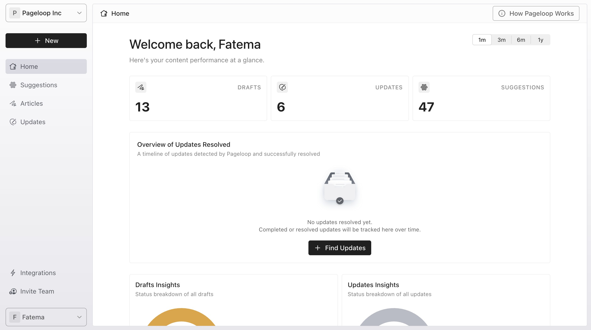
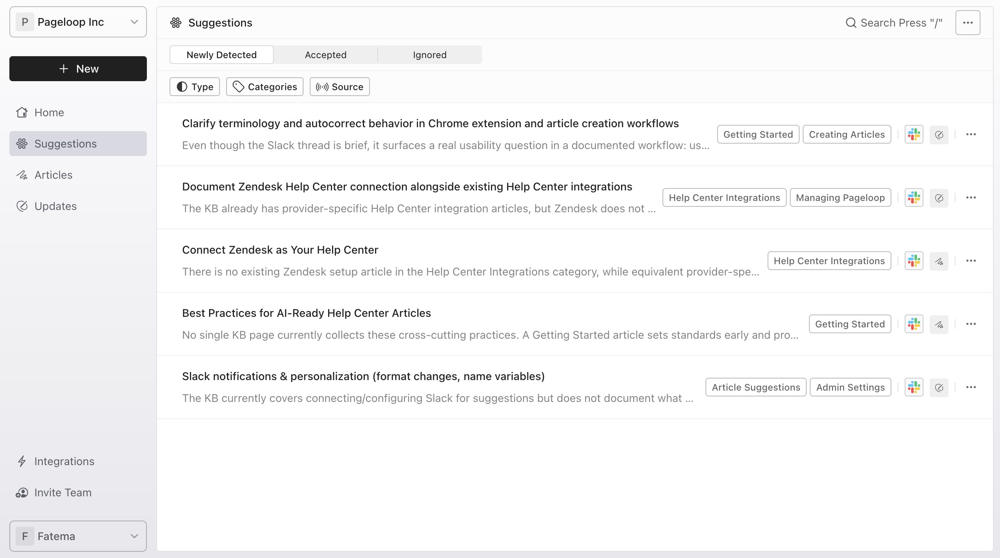
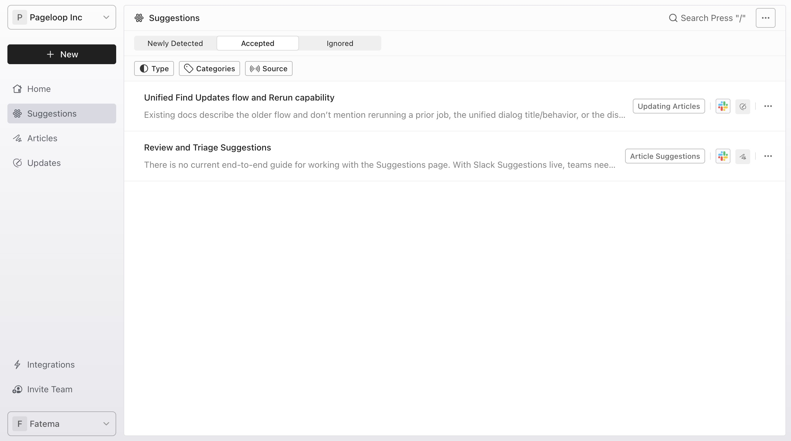
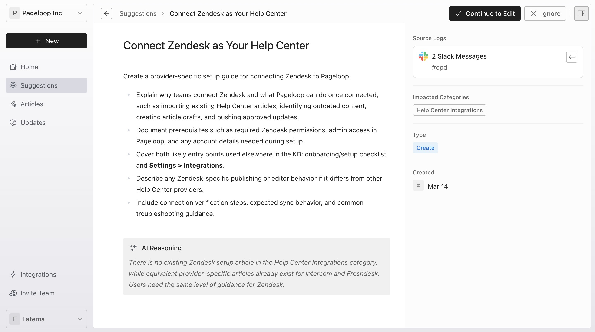
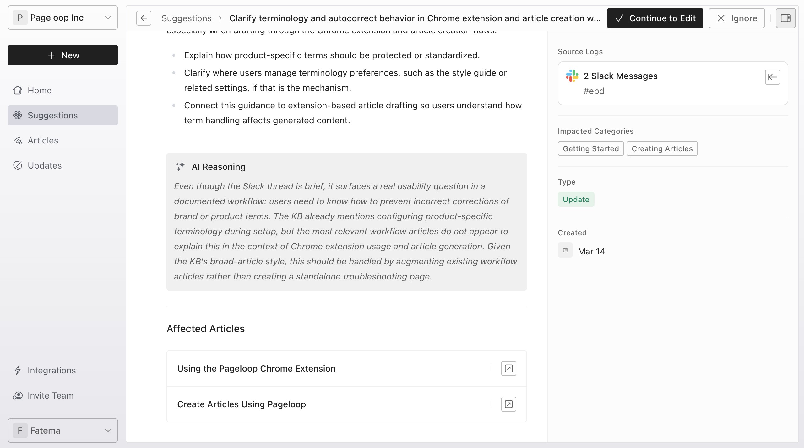
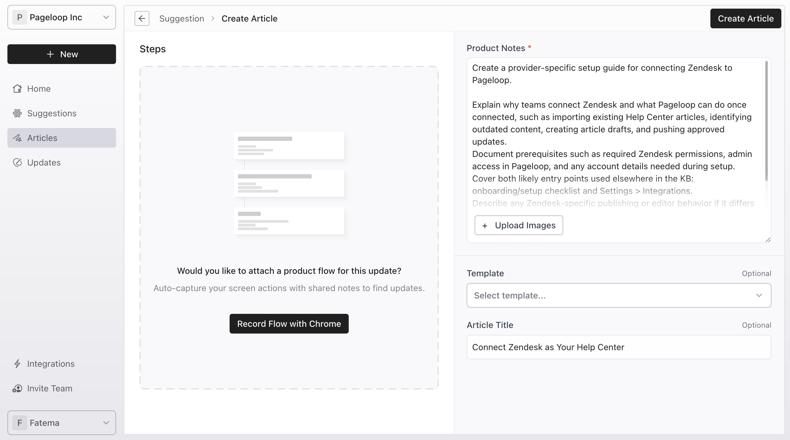
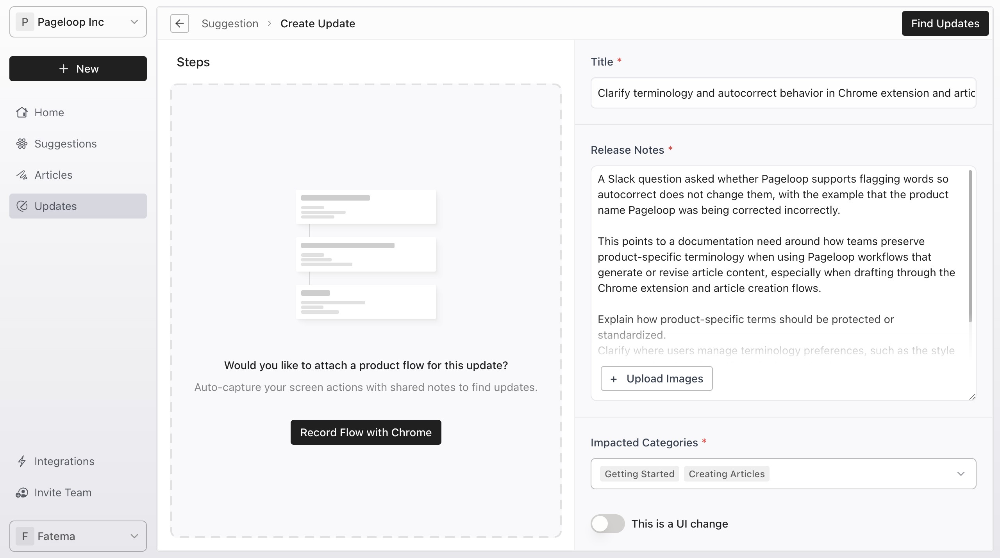

Keeping your help center accurate is challenging when product changes happen across multiple teams. Pageloop solves this by automatically monitoring your connected data sources and generating proactive suggestions to identify documentation gaps.

# Access Suggestions

Suggestions come in two types: **Create Article** or **Find Updates**. Pageloop periodically scans your connected data sources (like Intercom, Zendesk, Linear, and Slack) for signals that indicate documentation needs.

Suggestions can also start when someone mentions **@Pageloop** in a connected Slack channel, Linear issue, or Jira ticket. Pageloop uses the surrounding message, thread, issue, or story context to generate either a Create Article or Find Updates suggestion.

1. From the Home dashboard, click **Suggestions** in the left-hand sidebar.

   <Frame>
     
   </Frame>

2. This opens the Suggestions page, defaulting to the **Newly Detected** tab. If Pageloop encounters additional related information later, it updates the existing suggestion rather than creating a duplicate.

   <Frame>
     
   </Frame>

# Manage Suggestion Tabs and Filters

Suggestions are grouped into three main tabs to help you manage your pipeline:

<Frame>
  
</Frame>

- **Newly Detected:** New suggestions you have not acted on yet.

- **Accepted:** Suggestions you have started working on through the creation or update workflows.

- **Ignored:** Suggestions you have chosen to skip or delay.

Newly Detected tab will allow you to filter Suggestions by **Type**, **Categories**, and **Source**.

# Types of Suggestions

Direct mentions are supported in connected Slack, Linear, and Jira sources.

Pageloop can suggest to create a new article or to update existing articles. For each Suggestion, you will see the icon that matches either Articles or Updates as seen on the left navigation bar.

# Reviewing Suggestions

Clicking on a specific suggestion opens a detailed view with a description and a reason. The right-hand panel shows Source Logs, impacted help center categories, Type \[Create or Update], and creation date.

<Frame>
  
</Frame>

For an 'Update' type Suggestion, it will also show potentially **Affected Articles** identified for revision. The links will redirect to the article on your help center.

<Frame>
  
</Frame>

# Accept and Edit Suggestions

When you are ready to work on a Suggestion click on **Continue to Edit**. You will be taken to the workflow to either Create or Update article with pre-populated information, so you never start from scratch.

You will see the Create Article workflow when you accept a Create type suggestion. You can edit the Product Notes, upload images, select a template, and review or edit the Article Title before generating the draft.

<Frame>
  
</Frame>

You will see the Update Article workflow when you accept an Update type suggestion. You can refine the Release Notes, verify Impacted Categories, and proceed to find updates.

<Frame>
  
</Frame>

When you click on the Create Article or Find Updates button, the Suggestion moves to the Accepted tab and the article will show up on the Articles tab if it was a Create type or the Updates tab if it was an Update type of Suggestion.

If a Suggestion was not suitable, you can click on the Ignore button on the top-right corner of the details page. This will move the Suggestion to the Ignored tab.

# Next Steps

Now that you know how to manage suggestions, learn how to [Find Updates for Your Articles](https://help.pageloop.ai/en/articles/13654507-find-updates-for-your-articles) or [record a flow using the Chrome extension](https://help.pageloop.ai/en/articles/13654464-using-the-pageloop-chrome-extension) to add more context to your accepted suggestions.

---

# Frequently Asked Questions

## Why do some suggestions show multiple source icons?

When Pageloop detects related information from more than one data source, it updates the existing suggestion with the additional context rather than creating a duplicate. The source icons on each suggestion show all the data sources that contributed information to that suggestion.

## What happens to my suggestion after I accept it?

The suggestion moves to the Accepted tab, and you are taken to either the [Create Article](https://help.pageloop.ai/en/articles/13654529-create-articles-using-pageloop) or [Find Updates](https://help.pageloop.ai/en/articles/13654507-find-updates-for-your-articles) workflow, depending on the suggestion type. Nothing is published to your Help Center until you complete the full workflow and choose to publish.

## Can I undo ignoring or archiving a suggestion?

Yes. When you ignore a suggestion, it moves to the Ignored tab, and you can restore it at any time by opening it and selecting Restore Suggestion. When you archive a suggestion, a brief notification appears with an Undo option. You can also restore archived suggestions from the archive view.

## Why are no suggestions appearing?

Make sure you have at least one data source connected and configured. After initial setup, it may take 24 to 48 hours for the first suggestions to appear as Pageloop begins analyzing your data sources. If your [Linear](https://help.pageloop.ai/en/articles/14734582-set-up-linear-for-proactive-suggestions) integration is configured with selected projects, suggestions appear only for work completed in those projects. If suggestions still do not appear after this period, verify your data source configuration in Settings > Integrations.

## Why is the Suggestions tab greyed out for me?

The Suggestions feature is only available on the Pro plans and above. Please write to [hello@pageloop.ai](mailto:hello@pageloop.ai) to enable this.
