---

# The Basics

---

## 1. Configure Your MSP Profile

Start by setting up your MSP profile to personalize your SuperOps experience. Here’s how:

- Go to **Settings** > **My MSP** > **MSP Information**.

- Fill in the required details, including your MSP's name, address, preferred currency for invoicing and contracts, and timezone, date, and time format.

- Provide primary and secondary contact information.

- Remember to click **'Save'** to apply your changes.

<Frame>
  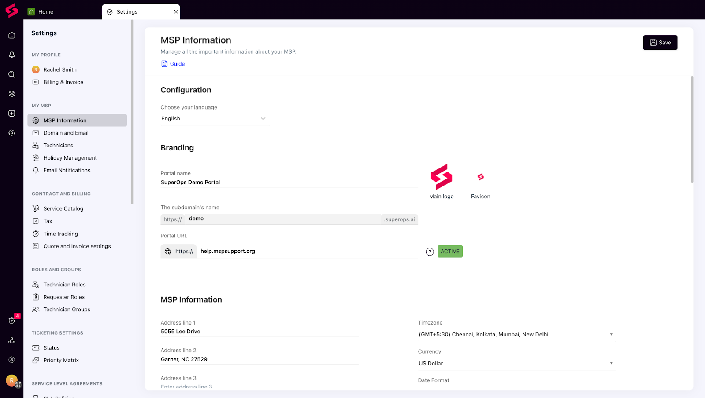
</Frame>

## 2. Configure your mailboxes

Next, set up communication channels with your clients. To set up default mailboxes in SuperOps,

- Go to **Settings** > **Domain and Email.**

- You'll find a default outgoing address and forwarding address. Customize these as needed.

- To add additional custom mail servers, click '**Add New Mailbox**.'

<Frame>
  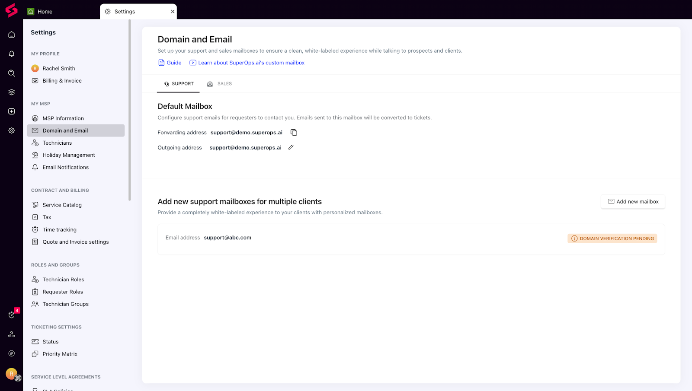
</Frame>

Check out this [article](https://support.superops.ai/en/articles/6963191-setting-up-and-using-mailboxes-in-superops-ai) for a detailed guide on setting up default and custom mailboxes.

## 3. Create or bring in your clients

You can create new clients or import existing clients into SuperOps with a few simple steps:

- To create new clients, navigate to **Create** > **Clients**.

- Enter all relevant client information in the corresponding fields and click **'Save**.'

<Frame>
  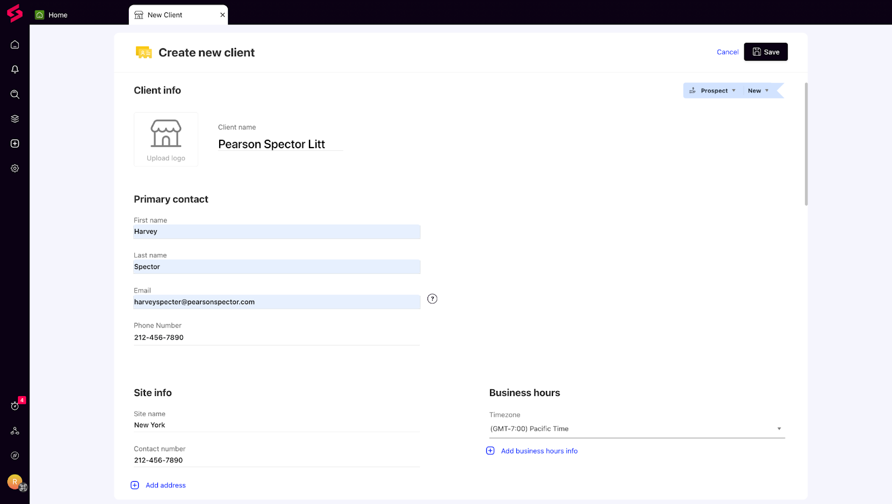
</Frame>

- To import existing clients, go to **Modules** > **Clients**.

- Select th&#x65;**&#x20;CSV import** option and upload a file or manually enter data in the provided spreadsheet.

<Frame>
  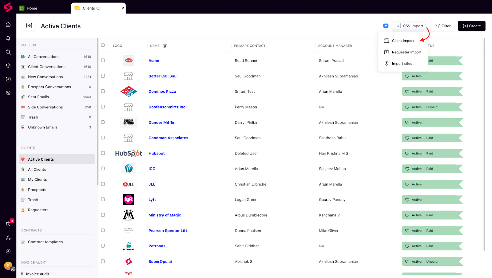
</Frame>

Alternatively, you can also bring in your clients from accounting tools like [QuickBooks](https://support.superops.ai/en/articles/7010868-how-to-integrate-quickbooks-desktop-with-superops-ai)/[Xero](https://support.superops.ai/en/articles/6632162-how-to-integrate-xero-with-superops-ai) by integrating with them.

Check this [article](https://support.superops.ai/en/articles/6717692-importing-clients-and-requesters) to learn more about Importing clients in SuperOps.

## 4. Downloading and deploying agents on your client’s assets

You’ll need agent files for each client and site to deploy and start monitoring client devices.

- Navigate to **Modules** > **Assets** >**&#x20;Download Agent**.

- Choose the client and site for which you want to deploy agents.

- The agents for Windows, Mac, and Linux devices will be generated.

- Download the corresponding agents and install them on the assets you wish to monitor.

<Frame>
  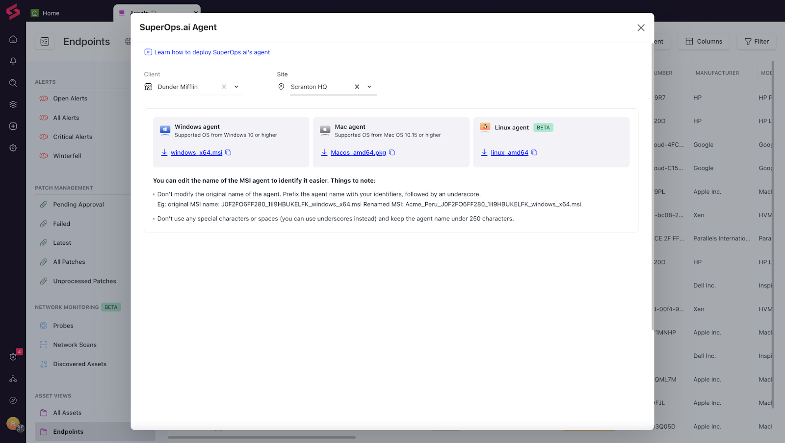
</Frame>

## 5. Set Up Passwords/SSO

Protect your platform and client data by configuring security measures:

- Navigate to **Settings** > **Security Management** > **Technician Login**.

- Choose between setting up passwords or Single Sign-On (SSO) based on your security preferences.

- Optionally, enable Two-Factor Authentication (TFA) for an additional layer of protection if required.

<Frame>
  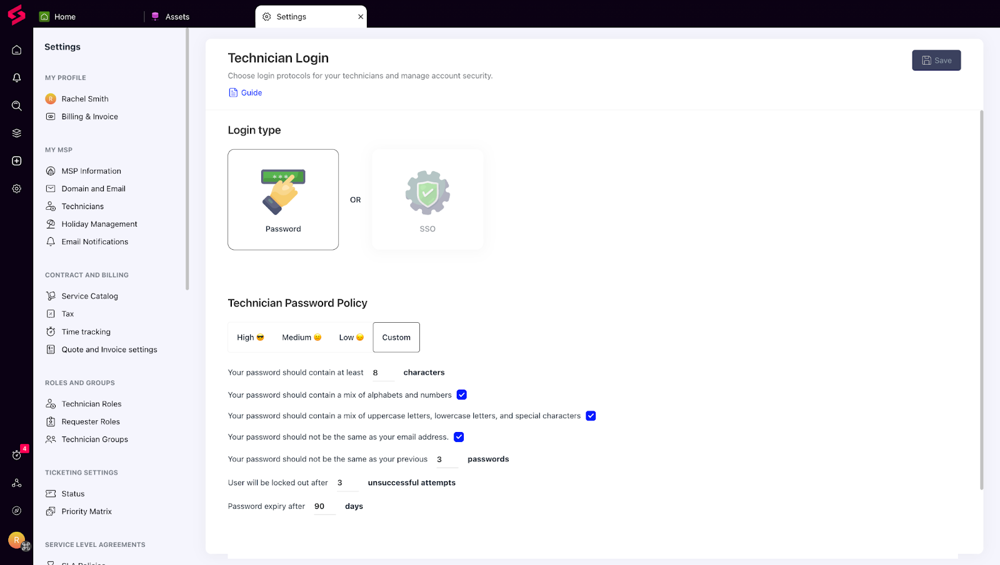
</Frame>

## 6. Manage Technician Permissions

Fine-tune your technician roles and permissions:

- Navigate to **Settings** > **Roles and Groups** > **Technician Roles**.

- Define the actions each technician can perform across platform modules.

<Frame>
  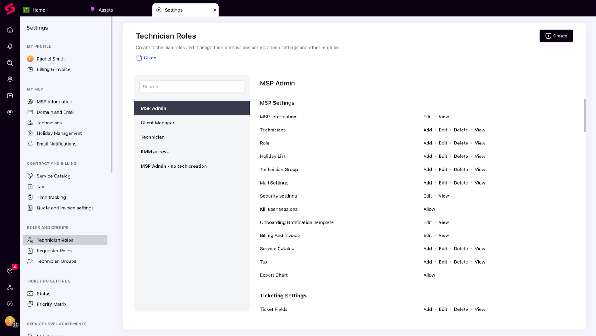
</Frame>

- You can also create technician groups based on expertise and associate them with specific clients by navigating to **Settings** >**&#x20;Roles and Groups** > **Technician Groups**.

By following these best practices, you can effectively set up SuperOps for your MSP, improving your client management, asset monitoring, and overall security.

---

# Setting up SuperOps’ PSA

---

##

## 1. Explore the Service Catalog

The service catalog is Square 1 of your invoicing process. Whether it's a product or a retainer fee, the services you provide have a home in the service catalog.

Add them on your own, or import them from bookkeeping tools like QuickBooks or Xero.

<Frame>
  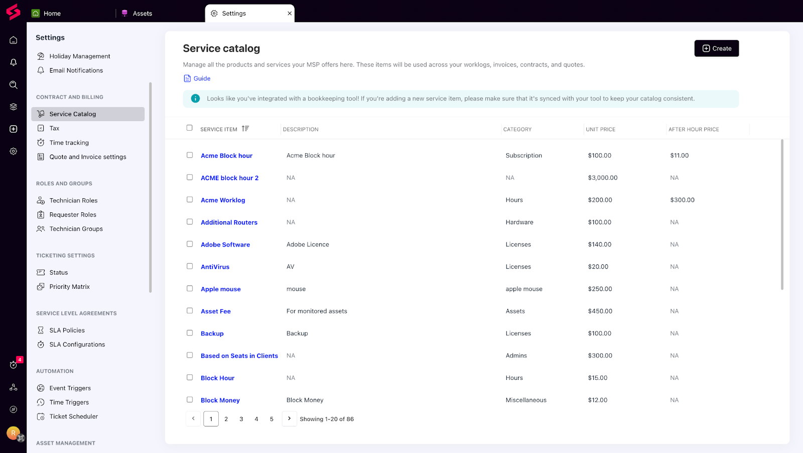
</Frame>

Check out this [article](https://support.superops.ai/en/articles/6642912-the-service-catalog-explained) to learn more about the different types of service items.

## 2. Integrate with Xero or Quickbooks

You can choose to integrate QuickBooks/Xero with SuperOps for seamless accounting across a multitude of clientele. Upon integration, these tools will remain the only source of truth from which information will be obtained and used in SuperOps for invoicing purposes.

- Navigate to **Marketplace**

- Scroll down to **Invoice and Billing**

- Choose QuickBooks/Xero and click Integrate.

- Map or Add customers/service items in QuickBooks/Xero to existing or new clients/service items in SuperOps

<Frame>
  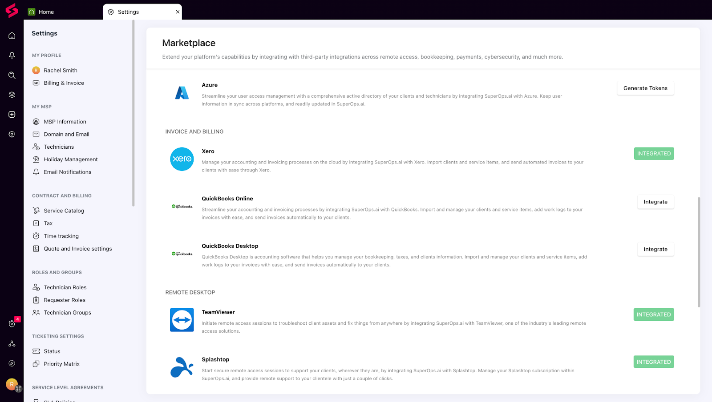
</Frame>

Check out the articles below to understand in detail how you can integrate your Bookkeeping tools with SuperOps:

- [Integrating Quickbooks Online with SuperOps](https://support.superops.ai/en/articles/6632156-how-to-integrate-quickbooks-online-with-superops-ai)

- [Integrating Quickbooks Desktop with SuperOps](https://support.superops.ai/en/articles/7010868-how-to-integrate-quickbooks-desktop-with-superops-ai)

- [Integrating Xero with SuperOps](https://support.superops.ai/en/articles/6632162-how-to-integrate-xero-with-superops-ai)

## 3. Set up Contracts

Set up recurring items through contracts, or just add items to invoices and bill clients for them if you're running a break-fix practice.

1. To add contracts, navigate to **Modules** > **Contract Templates**

2. Click +**create** to set up a new contract template.

3. Give a name and description for the Contract and add service items to the contract.

4. You can also set up SLAs for the contract and add blacklisted services to it.

<Frame>
  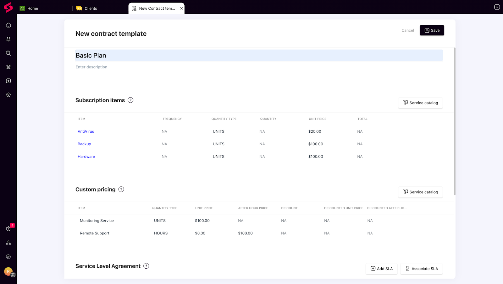
</Frame>

Check out this [article](https://support.superops.ai/en/articles/6642953-managing-contract-items) to learn all about setting up client contracts.

## 4. Manage your fields

Choose what information you'd like to collect for your tickets, clients, and requesters.

1. Navigate to **Settings** > **Advanced Configuration** > **Manage Fields**

2. Here you’ll see Ticket fields, Client fields, and Requester fields.

3. Under each tab, you’ll find **default and custom fields**.

4. You can also create custom fields by clicking on the **+Create** button.

5. You can make these fields mandatory on creation or while closing.

<Frame>
  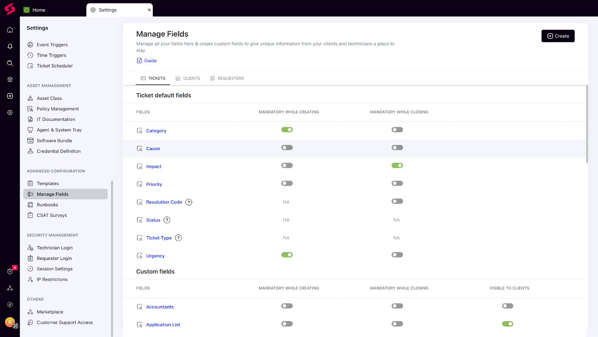
</Frame>

Check out this [article](https://support.superops.ai/en/articles/7872605-all-about-ticket-fields) to learn more about ticket fields.

## 5. Define your SLAs

Mutually agree on service expectations and exceed them at every turn.

1. To create new SLA policies, navigate to **Settings** > **Service Level Agreements** > **SLA policies**

2. Click “+**Create**”

3. Add a name and description to define your SLA policy and enable the toggle button to make the SLA active.

4. Under SLA configurations, choose the conditions for which the SLA policy applies.

5. Define the first response and escalation time.

6. As a final step, choose who should the ticket be:

- Escalated to if the SLA is breached.

- Assigned to if the SLA is breached

7\. Once you are done, click "**Save**."

<Frame>
  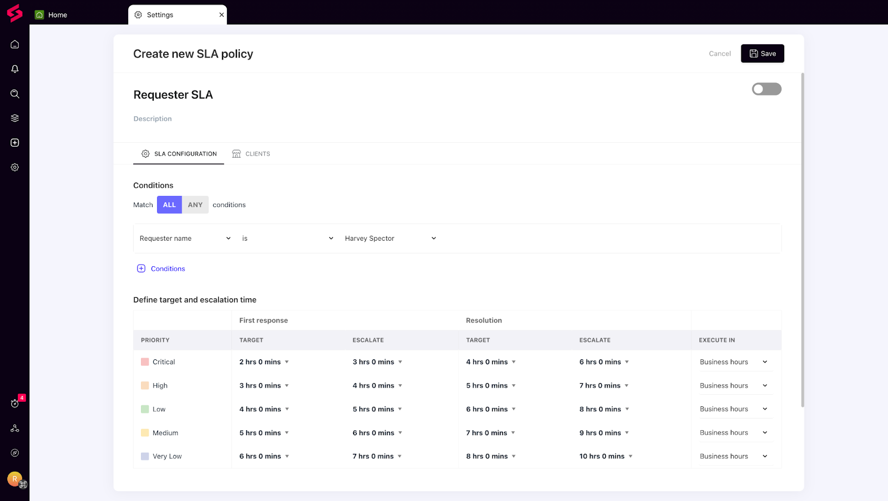
</Frame>

Check out this [article](https://support.superops.ai/en/articles/6648695-creating-an-sla) to learn more about SLAs

## 6. Set up automation

Let us do the heavy lifting for you. See how you can leverage powerful workflow automation to get work done faster. Automation in SuperOps is broadly split into three:

1. **Event Triggers**: Scan tickets for specific conditions and perform an action, like ‘set properties’ and ‘assign tech’.

Check out this [article](https://support.superops.ai/en/articles/6632292-setting-up-event-triggers) to learn more about event triggers.

**2. Time Triggers**: These automation rules execute actions based on time-related conditions

**3. Runbooks**: Automation that helps you execute SOPs for recurring issues.

## 7. Work with runbooks

If you have routine processes, runbooks can speed them up and bring your team on the same page. With runbooks, you can set a:

- Standardized process-based reply templates

- Detailed list of tasks to be completed

- Predefined flow for easy approvals

<Frame>
  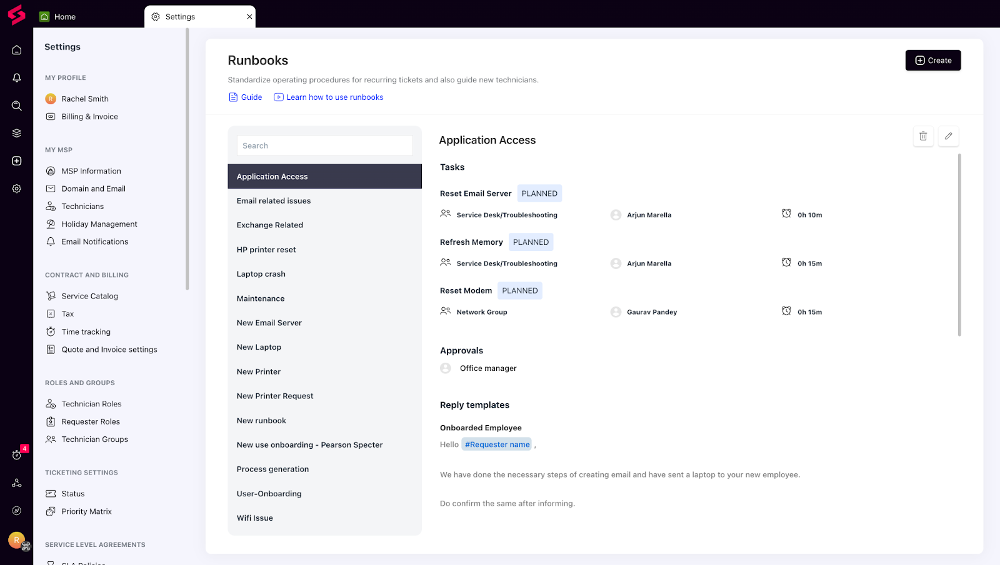
</Frame>

Check out this [article](https://support.superops.ai/en/articles/6648736-runbooks) to learn more about Runbooks.

## 8. Set up time-tracking

Time is money, isn't it? Track time precisely and convert it into revenue. The auto-timer ensures that you're capturing all the value your team's creating, so you're never leaving money on the table. Even if you're multi-tasking, zooming out and managing your timers is always just a click away.

1. Navigate to **Settings** > **Contracts and Billing** > **Time Tracking**

2. Choose a default service item to be shown on the timer tab.

3. Select the auto-timer checkbox to start time tracking. The auto-start timer works when the ticket is opened for the first time a ticket is assigned to a technician.

<Frame>
  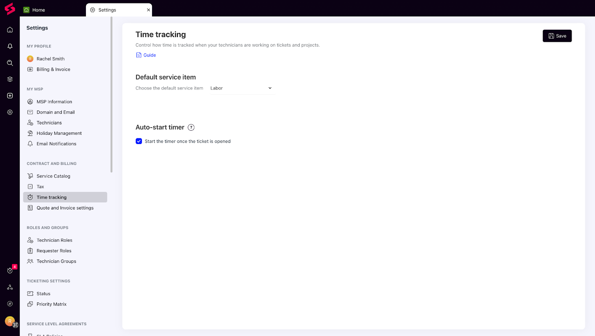
</Frame>

## 9. Quote and Invoice setting

Control your global quote and invoice preferences on a single page.

1. Navigate to **Settings** > **Contract and Billing** > **Quote and Invoice settings**

2. Schedule invoices, set payment terms, and customize quote and invoice settings right here.

<Frame>
  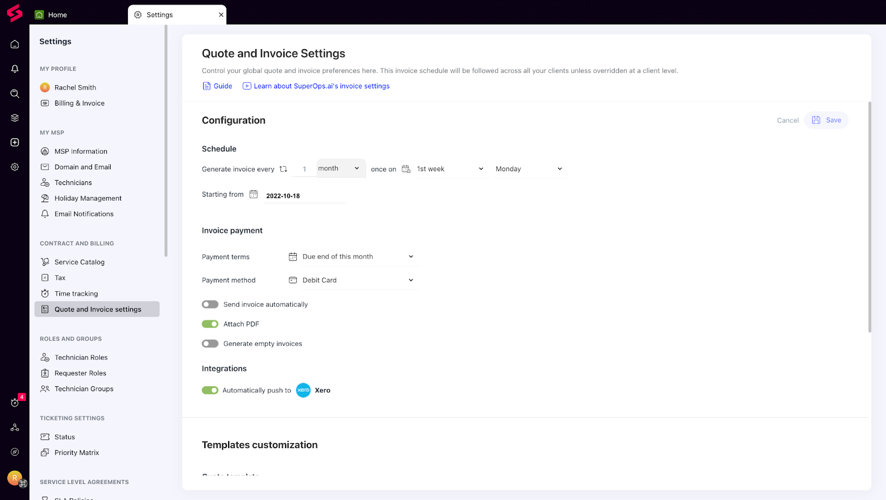
</Frame>

Click [here](https://support.superops.ai/en/articles/6642955-generating-an-invoice#h_2993e3e637) to learn more about Invoicing in SuperOps.

## 10. Billing and Invoice audit

It's important to have complete visibility into what is being added to your client's invoices. The invoice audit gives you a bird's eye view of all line items your team's added across your clients.

1. Navigate to **Modules** >**&#x20;Invoice Audit**

2. Here, you’ll see a list of worklog items that require your approval.

3. You can also revise the billable quantity and unit price of the work item and add some sweet discounts to a work item before you approve it to give clients a little surprise!

4. Once you’ve approved a worklog item, the item will then be moved to the billing queue.

5. Worklog items in the billing queue will be automatically added to the next scheduled invoice for the client.

<Frame>
  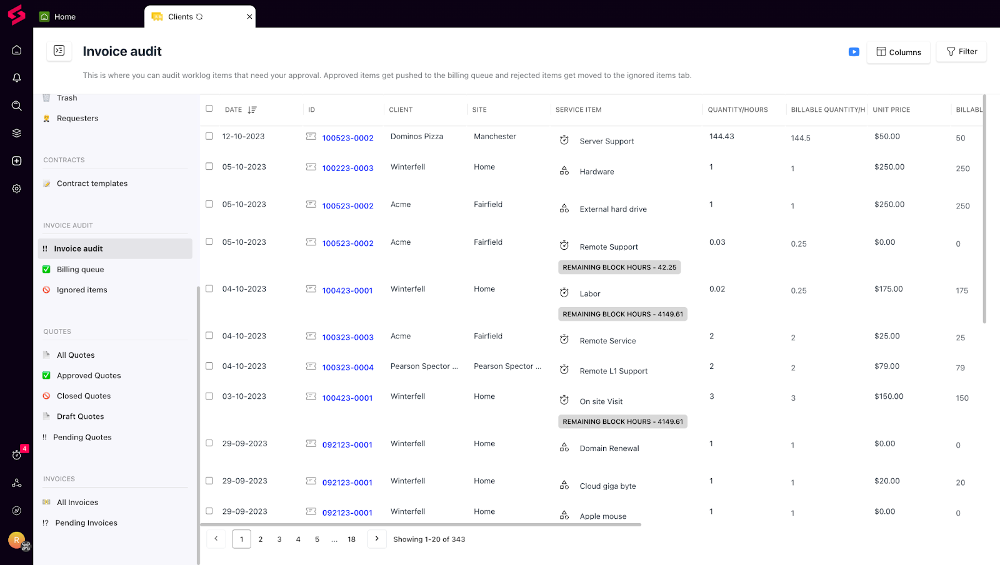
</Frame>

Check out this [article](https://support.superops.ai/en/articles/6642952-auditing-worklogs) to learn more about auditing worklogs.

---

# Setting up SuperOps’s RMM

---

## 1. Set up Policies

Set up policies for proactive asset monitoring and alert management. You can define these policies at a hierarchical level or an asset group level.

<Frame>
  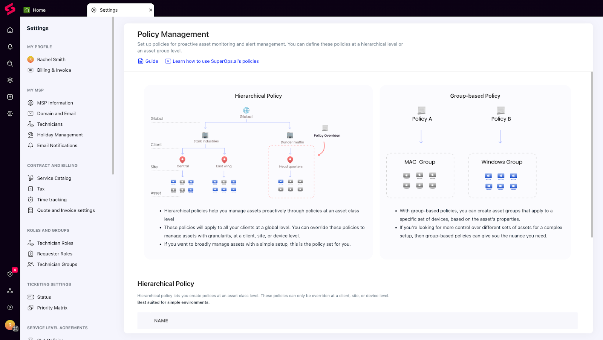
</Frame>

1. **Hierarchical Policies**

This is a type of policy that follows a hierarchy by deploying policies through distinct levels. The order of levels for the hierarchical policy is as follows: Global → Client → Site → Asset.

1. To set a new hierarchical policy, navigate to **Settings** > **Asset Management** > **Policy Management** and select a Mac, Windows, or Linux policy.

2. You can set up the following policies:

   - Alert Management

   - Intelligent Alerting

   - Patch Management

   - Schedule actions

   - Antivirus and Backup

   - Software management

Check out this [article](https://support.superops.ai/en/articles/6632384-setting-up-hierarchical-policies) for a detailed explanation of all of the above policies.

**2. Group-based Policies**

With group-based policies, you can create asset groups that apply to a specific set of devices, based on the asset's properties.

1. To set up group-based policies, navigate to **Settings** > **Asset Management** > **Group-based policies**

2. Click [here](https://support.superops.ai/en/articles/6632398-setting-up-group-based-asset-policies-in-superops-ai) to learn how you can set up asset groups and policy sets

## 2. Create software bundles

Curate software bundles with all the software available through Chocolatey for each client persona and deploy them automatically on your client's devices with ease.

1. To create a new software bundle, navigate to **Settings** > **Asset Management** > **Software Bundles**

2. On the software bundle page, you’ll be able to create and manage software bundles for your clients.

3. Click the + **Create** button on the top right to create a new software bundle.

4. Give the bundle a name, click the **+ Software**, search for the software you want, add them, and click **Save** to create the new bundle.

5. You can now install this software bundle on your client’s network of assets by adding it to an asset policy.

<Frame>
  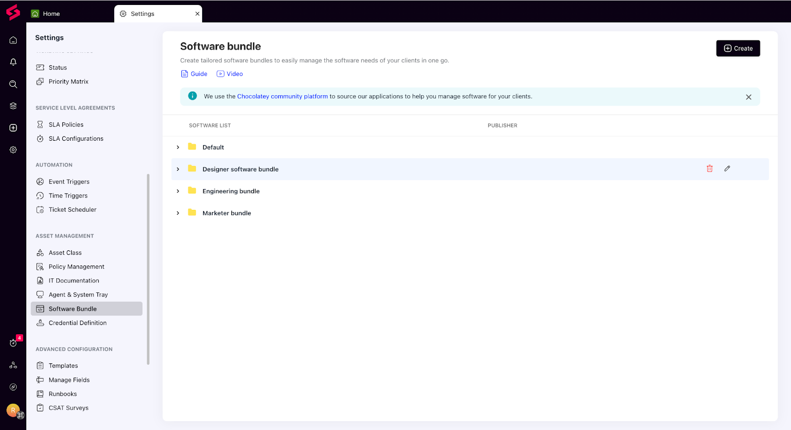
</Frame>

Check out this [article](https://support.superops.ai/en/articles/6632104-how-to-use-third-party-software-management-in-superops-ai) to learn more about Software bundles.

## 3. Configure the System Tray icon

Make frequent actions easily accessible to your clients. The system tray is an icon in the taskbar of your laptop or computer. This icon contains a list of actions that you can perform in a single click without opening up any applications.

<Frame>
  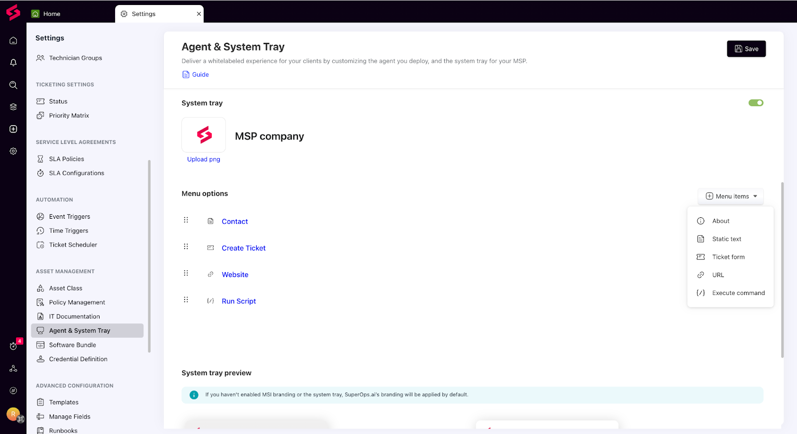
</Frame>

1. To set up the system tray icon, go to **Settings** > **Agent & System Tray**. Scroll down to the system tray section to start configuring your system tray.

2. Add a name for your system tray, and upload your MSP logo to reflect your brand.

3. Next, you can start including all the options you want to display on the system tray.

4. Once you’re done, you can preview the system tray and see how it looks on your Mac and Windows devices.

5. Click the **save** button to complete the configuration. The system tray, once enabled, will be automatically deployed to client devices in the network through the SuperOps agent.

Check out this [article](https://support.superops.ai/en/articles/6951521-managing-your-agent-and-system-tray) to learn more about Menu items in the System tray icon.

## 4. Reporting Module

At the end of the day, You can't improve what you can't measure. Our intuitive dashboards bring crucial insights to the limelight and empower you to make faster, more meaningful decisions.

<Frame>
  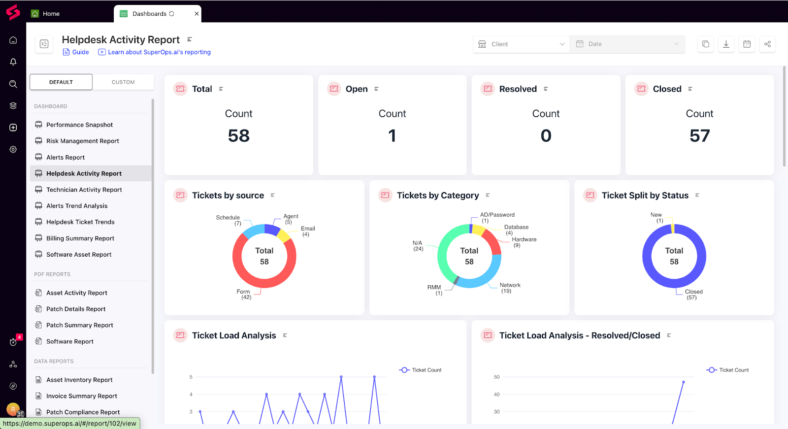
</Frame>

You have default dashboards that you can start using right away and you can also create customized dashboards.

1. To create a new dashboard, navigate to +**Create** > **Dashboard**.

2. Give the dashboard a title and description.

3. Drag and drop the widgets that you want to add to the report.

4. You can create a new widget from the dashboard page itself. To do that, click on the **+ icon** near All Widgets.

5. Once you are done, click "**Save**."

Check out this [article](https://support.superops.ai/en/articles/7021882-using-default-reports) to get an overview of the default reports available in SuperOps
