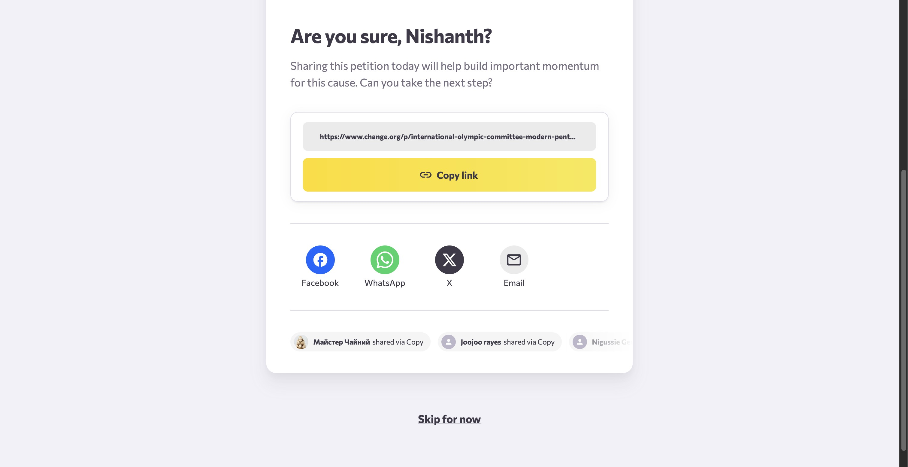

Signing a petition is a powerful way to support causes you care about. This guide explains how to add your signature while managing your privacy preferences and navigating the post-signing steps.

# Signing the petition

1. Navigate to the petition page you wish to support. You will see the signature form located on the right-hand side of the page.

   <Frame>
     
   </Frame>

2. To maintain your privacy, select the radio button labeled **No, I don't want to hear about this petition's progress or other relevant petitions**.

3. Check the box for **Do not display my name and comment on this petition**.

4. Click the yellow **Sign petition** button to submit your signature.

# Completing the process

After signing, you may be asked to sponsor the petition. To proceed without contributing financially, scroll down and click **Sorry, I can’t do anything right now**.

Next, you will be prompted to share the petition to help build momentum. You can use the provided options to copy the link or share via social media platforms.

<Frame>
  
</Frame>

If you prefer not to share at this time, scroll to the bottom of the page and click **Skip for now** to complete the process.

# Summary

Your signature has now been added to the petition with your selected privacy settings. You can view your signed petitions and manage your activity from your account dashboard.
