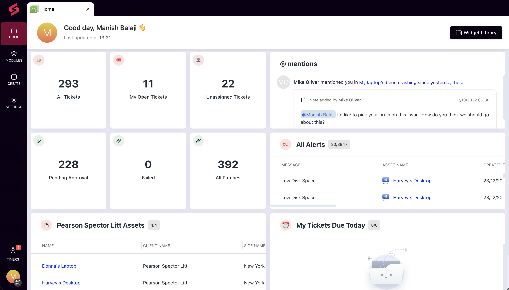
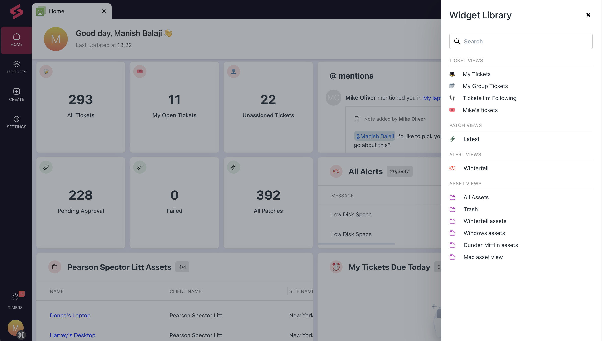
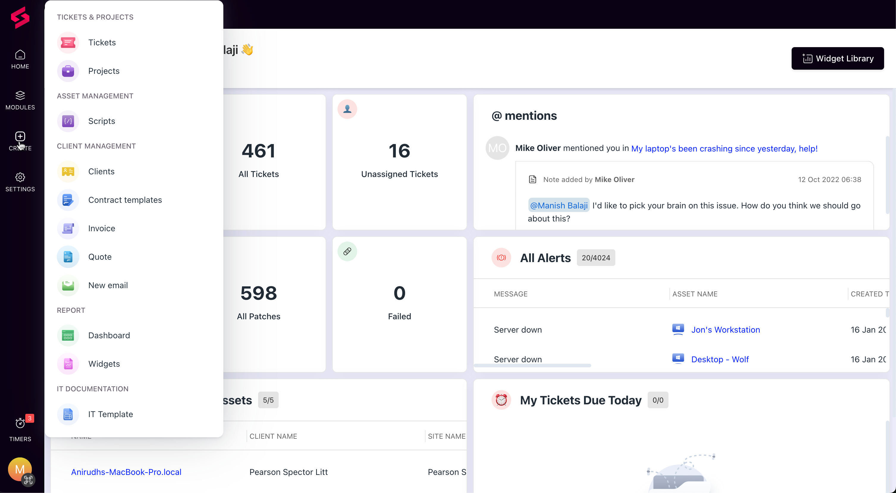

The home screen in [SuperOps](http://superops.ai/) is very similar to your mobile phone’s home screen. It’s your gateway into our platform—it’s built to give you context about information you care about, and give you an overview of your workload at a glance.

Technicians can quickly understand the general status of the ticket volume, spot critical tickets at a glance and waste no time in resolving them.

##

## Customizing your home screen

You can customize your home screen to give you context about your workload for the day, as soon as you log in to [SuperOps](http://superops.ai/).

You can add widgets from the widget library to get information about ticket views you care about. You can drag and drop them to rearrange the widgets based on priority, and click them to open the ticket view and start working right away.

## **Here’s how:**

1. Log in to [SuperOps](http://superops.ai/) and open up the home tab.

   <Frame>
     
   </Frame>

2. Click the widget library button on the top right of the screen to open up a list of available widgets you can add to your home screen.

   - Select the ticket views you’d like to add, and close the library.

   - Your home screen will now contain all of the widgets you’ve selected. Now, all that’s left is to move them around, so that your most important widgets are at the top.

   - Drag your most important widgets and drop them at the top of your home screen.

   <Frame>
     
   </Frame>

3. You can use the **Create** option on the left to create new tickets, projects, invoices etc. from the home screen.

   <Frame>
     
   </Frame>

   Your home screen is now set! You can click the widget at any time to jump into the ticket view, and start working on tickets right away.
