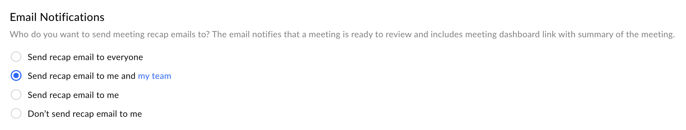
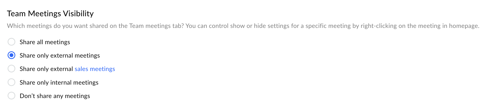
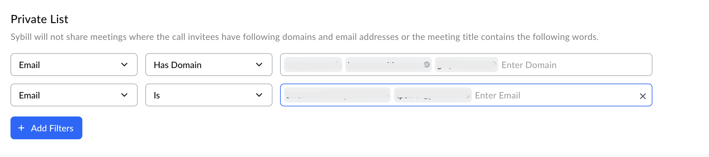

Email Notifications

Every meeting you have, Sybill captures the key aspects of it as Magic Summaries, which are then sent across through email to the participants of the call. If you have had an external meeting or internal meeting, and you would like only a certain set of people to receive the summary on email, this is where you can customize these preferences.

- **Send recap email to everyone:&#x20;**&#x57;ill send the summary of the call to everyone present on it, irrespective of their domain (internal or external). This will ensure everyone is aware of the next steps, ensuring easy collaboration, especially with external stakeholders.

- **Send recap email to me and my team:&#x20;**&#x49;n this case, meeting summaries are sent only to people with the same domain as you (internal).

- **Send recap email to me:&#x20;**&#x41; summary email will be sent only to your email.

- **Don't send recap email to me:&#x20;**&#x49;n this case, nobody receives any email communication after a meeting. Although, if you have an integrated Slack account with a dedicated channel to receive call summaries, you can always use the same to send in an email.

<Frame>
  
</Frame>

## Team Meetings Visibility

Determine how meetings recorded by Sybill are shared with your team on the Team meetings tab. These settings provide flexibility in managing the visibility of your recorded meetings across your team, ensuring alignment with privacy and collaboration goals.

- **Share all meetings**: Makes all recorded meetings accessible on the Team meetings tab, fostering transparency and collaboration across all discussions.

- **Share only external meetings**: Limits sharing to meetings that involve participants from outside your organization, useful for tracking client interactions or external partnerships.

- **Share only external sales meetings**: Further narrows sharing to external meetings specifically related to sales, focusing team visibility on client engagement and sales efforts.

- **Share only internal meetings**: Share meetings that involve only team members or participants within your organization, promoting internal collaboration and knowledge sharing.

- **Don’t share any meetings**: Opt for maximum privacy by not automatically sharing any meetings. Meetings can still be shared manually on a case-by-case basis.

<Frame>
  
</Frame>

## Control Specific Meeting Visibility

You can further control the visibility of individual meetings by right-clicking on the meeting in the homepage and adjusting the settings. This feature allows for granular management of meeting sharing based on the specific context or sensitivity of the information discussed.

​

<Frame>
  
</Frame>

## Private List

To ensure the confidentiality of certain meetings, Sybill provides the option to automatically exclude specific meetings from being shared based on the criteria you set.

## Add Filters

You can define filters based on domains, email addresses, or keywords within the meeting title to prevent certain meetings from being shared. This is particularly useful for maintaining the privacy of meetings that may involve sensitive topics, confidential projects, or select individuals.

**Examples of Filters**: Adding filters such as specific company domains, email addresses, or keywords like "Confidential" or "Private" ensures that meetings meeting these criteria are not shared, aligning with your privacy and confidentiality standards.
