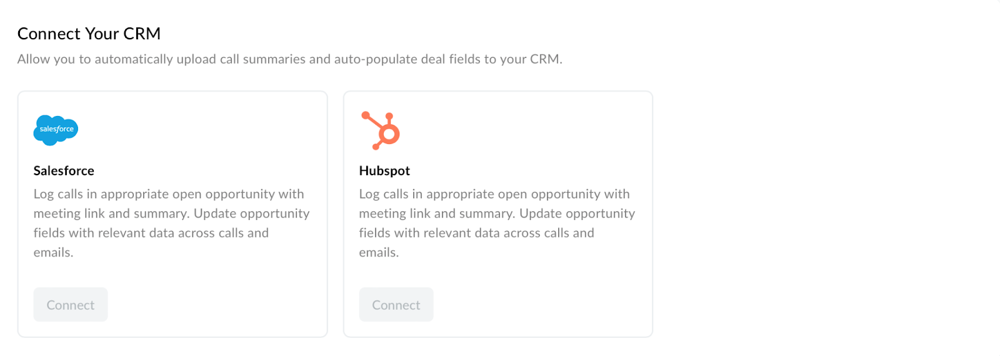

Connect Your CRM

Sybill offers robust integration options with leading Customer Relationship Management (CRM) systems. By connecting your CRM, you can automate the upload of call summaries and the auto-population of deal fields, ensuring that valuable insights from your conversations are directly reflected in your CRM records.

<Frame>
  
</Frame>

## CRM Settings Before CRM is Connected to Sybill

## Salesforce Integration

Salesforce, one of the most popular CRM platforms, can be integrated directly with Sybill to enhance your sales team's efficiency.

Features and Benefits

- **Log Calls**: Automatically logs calls in the appropriate open opportunity within Salesforce, including a comprehensive summary of the discussion.

- **Update Opportunity Fields**: Sybill updates opportunity fields with relevant data collected across calls and emails, providing a richer, more detailed view of each sales prospect.

How to Connect

- Click the "Connect" button under the Salesforce section.

- Follow the on-screen instructions to authorize Sybill to access your Salesforce account.

- Once connected, customize your integration preferences to align with your sales team's workflow and data management practices.

## HubSpot Integration

HubSpot, another leading CRM solution, can also be seamlessly integrated with Sybill to optimize your sales operations.

Features and Benefits

- **Log Calls**: Similar to Salesforce, calls are automatically logged within the appropriate open opportunity in HubSpot, including links to the meeting and detailed summaries.

- **Update Opportunity Fields**: Enhances your HubSpot opportunities with up-to-date information from your communications, ensuring all relevant data is easily accessible and actionable.

How to Connect

- Click the "Connect" button under the HubSpot section.

- Follow the step-by-step process to allow Sybill to interface with your HubSpot account.

- Tailor the integration settings to best suit your team's needs, ensuring a smooth flow of information between Sybill and your CRM.

## CRM Settings after CRM is Connected to Sybill

Once connected, your CRM section will allow you to configure the amount of detail you want pushed into CRM. Some of these fields are shown in the image below:

You can also check this [loom](https://www.loom.com/share/faf2337934234244b14b23c4ef9e6132?sid=3bd1f705-cead-4e5a-805b-edb94e9e3c71) for a deep understanding of how the CRM integration works.
