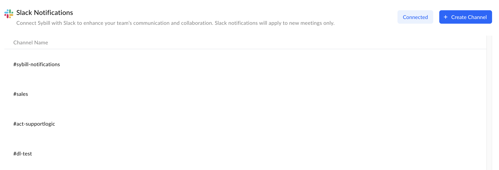

Slack Preferences

<Frame>
  
</Frame>

For teams using Slack for communication, Sybill offers direct integration to send notifications into specific Slack channels. This feature enhances the visibility of meeting recaps and makes it easy for teams to access and discuss insights from their conversations.

## Current Configuration

- **Status**: Indicates whether Slack notifications are currently enabled and connected to your Sybill account.

- **Channel**: Shows the Slack channel (e.g., #sybill-notifications) where meeting notifications are posted. This ensures that updates are delivered to a dedicated space for easy access by the team.

## Manage Slack Settings

- **Edit**: Adjust which Slack channel receives notifications or modify notification settings.

- **Archive**: Temporarily disable notifications to the selected channel without removing the integration.

- **Add Channel**: Connect additional Slack channels to receive meeting notifications, allowing you to customize notification delivery based on team structure or meeting topics and trackers.

<Callout type="info">
  **The #sybill-notifications channel doesn’t need to be manually created in advance. If this is done, the slack integration may not be able to fully establish a connection. If the channel already exists, please make sure that it is set as a public channel.**
</Callout>
