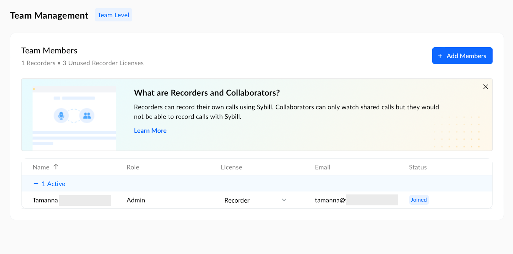

This section provides an overview of your team's composition within Sybill. It includes the number of active members and details regarding their licenses.

<Frame>
  
</Frame>

## Team Members

Here, you can see a detailed list of all team members, along with critical information such as their roles, the type of license they hold, their email addresses, and their current status with your Sybill account.

## X Recorders • Y Unused Recorder Licenses

This indicates that X number of team members are designated as a Recorder, capable of recording their calls using Sybill. There are also Y additional Recorder licenses available, which you can assign to other team members as needed.

## Add Members

This option allows you to invite new members to your team on Sybill. You can assign them roles and licenses during the invitation process, ensuring they have the appropriate access and capabilities from the start.

Once you add a new seat or account, you can choose to make the account a 'Member' or 'Admin' account under 'Role' column.

## Understanding Recorders and Collaborators

An informational section to help distinguish between the roles within Sybill:

- **Recorders**: Team members who have the capability to record their own calls using Sybill. This role is suitable for sales representatives or any team member who needs to document their interactions with clients or team members.

- **Collaborators**: These team members can view calls shared within the team but cannot record their own calls. This role is ideal for team members who need to stay informed about client interactions or for coaching and training purposes.

## Team Member Details

For each team member, you can view and manage:

- **Name**: The full name of the team member.

- **Role**: The role assigned to the team member within Sybill, such as Admin or Member

- **License**: Indicates whether the team member holds a Recorder license.

- **Email**: The email address associated with the team member's Sybill account.

**Status**: Shows whether the team member has joined and is active within Sybill. "Joined" indicates that the team member has accepted the invitation and is actively using Sybill.
